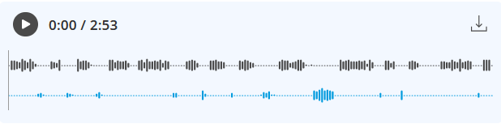

import { Aside } from "@astrojs/starlight/components";

Reviewing your Phone Booking recordings can provide valuable information on guest preferences, such as preferred services or times slots. This allows you to identify gaps in your current setup and make adjustments to better facilitate successful bookings.

---

## Managing Phone Booking Recordings and Transcripts

Navigate to **Activities** in the left-hand menu and select **Phone Calls**.

Once you select a Phone Call activity, the following capabilities are provided to analyze the conversation:

- **Transcript Summary:** A high level summary of the call’s outcome, including its success status and details on scheduling results or messages left. 
- **Recording Playback:** A two-channel recording with a visual display of the phone call audio that distinguishes between the AI assistant and the caller. 
- **Transcript Sync:** As you play the recording, the activity pane highlights the corresponding transcript text in real-time.
- **.OGG Export:** You can download any recording in a standard .ogg format for external review or training purposes.
