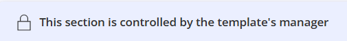

import { Aside } from '@astrojs/starlight/components';

**Centralized Control** allows Administrators to enforce uniform settings across all associated **Booking Calendars**. Enabling it for a specific section such as the Booking Form or Notifications etc., locks those fields, preventing users from making unauthorized changes and ensuring organizational standards are met at scale.

If **Centralized Control** is toggled **ON**, any updates made to the templates are **automatically pushed** to all linked Booking Calendars.

## How to Enable Centralized Control

Follow these steps to enable centralized control within a template:

1.  Click the **gear icon** in the top right corner.
2.  Select **Booking Calendar Templates** from the dropdown menu to open the **Booking Calendar Templates Lobby**.
3.  Click the **three-dot menu** next to the template you wish to edit and select **Edit**.
4.  Select the tab you wish to lock (e.g., **Booking Form** or **Notifications** etc.).
5.  Turn the **Centralized control** toggle **ON**.
6.  Review the confirmation message and click **Enable centralized control** to confirm.

Once enabled, a **lock icon** along with information banner stating **_This section is controlled by the template's manager_** will appear on the associated Booking Calendar.

* * *

Establishing a **Centralized Control** template follows a simple, three-step process:

## Step 1: Administrator Locks the Configuration

The Administrator defines which settings are mandatory for the organization to ensure a professional, uniform image that cannot be altered by individual users.

*   **Locking Critical Settings:** The Administrator enables the **Centralized control** toggle **ON** specific tabs (e.g., Notifications or Page Designer).
*   **Establishing the Standard:** The Administrator configures the master settings, such as a mandatory legal disclosure or specific brand logos. Once locked, these fields become read-only for users.

* * *

## Step 2: User Creates the Booking Calendar

Users create their Booking Calendars using pre-configured templates.

*   **Guided Setup:** When a user creates a Booking Calendar from this template, the locked fields are pre-populated and can not be edited.
*   **Visual Indicators:** Users will see a lock icon and an information banner stating, **_This section is controlled by the template's manager_**, clearly identifying which settings are managed centrally.
*   **Hybrid Flexibility:** Users can still customize any settings that the Administrator has left **unlocked** (e.g., individual availability or meeting location).

* * *

## Step 3: Automatic Updates & Synchronization

Whenever a template is updated, it pushes changes to all linked Booking Calendars and keeps them in sync. This eliminates the risk of manual errors and ensures that the entire organization remains up-to-date whenever the template is updated by the Administrator.

*   **Instant Updates:** When an Administrator modifies a locked setting in the template (e.g., updating a legal disclosure), the changes are **automatically pushed** to every linked Booking Calendar.
*   **Zero Manual Intervention:** Users do not need to take any action; their Booking Calendars are updated in the background without manual effort.