import { Aside } from '@astrojs/starlight/components';

## How to use the image gallery

1.  To download an image in this article, right click it and select **Save image as...** from the menu.
2.  Save the image on your computer so that you can use it when selecting an image for your OnceHub product features.

  

**Note**All images in this gallery are property of OnceHub and are protected under copyright law. Use is permitted for your OnceHub product features only.

* * *

## Image gallery

<table bgcolor="white"><tbody><tr bgcolor="white"><td colspan="6" bgcolor="white"><strong>Duration</strong></td><td> </td></tr><tr bgcolor="white"><td></td><td></td><td></td><td> </td><td>
 
 </td><td> </td><td> </td></tr><tr><td>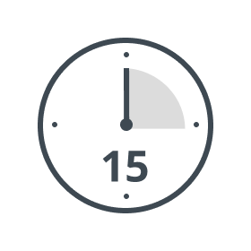</td><td></td><td>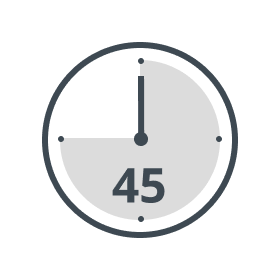</td><td>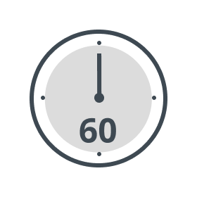</td><td>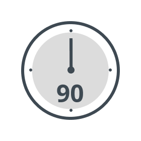</td><td>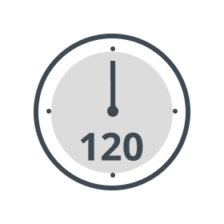</td><td> </td></tr><tr><td></td><td>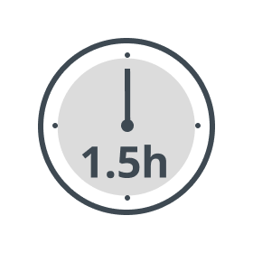</td><td></td><td></td><td>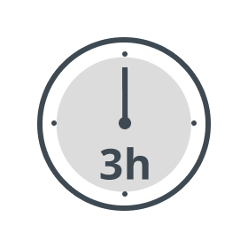</td><td> </td><td> </td></tr></tbody></table>

<table bgcolor="white"><tbody><tr bgcolor="white"><td colspan="5" bgcolor="white"><strong>Location</strong> </td><td> </td><td> </td></tr><tr bgcolor="white"><td></td><td></td><td></td><td></td><td></td><td></td><td></td></tr><tr><td></td><td></td><td></td><td></td><td></td><td></td><td></td></tr><tr><td></td><td></td><td></td><td></td><td></td><td></td><td></td></tr><tr><td></td><td></td><td></td><td></td><td></td><td></td><td> </td></tr><tr><td></td><td></td><td></td><td></td><td> </td><td> </td><td> </td></tr></tbody></table>

<table bgcolor="white"><tbody><tr bgcolor="white"><td colspan="7" bgcolor="white"><strong>Business</strong></td></tr><tr bgcolor="white"><td></td><td></td><td></td><td></td><td></td><td></td><td></td></tr><tr><td></td><td></td><td></td><td></td><td></td><td></td><td> </td></tr><tr><td></td><td></td><td></td><td></td><td></td><td></td><td> </td></tr><tr><td></td><td></td><td></td><td></td><td> </td><td> </td><td> </td></tr></tbody></table>

<table bgcolor="white"><tbody><tr bgcolor="white"><td colspan="7" bgcolor="white"><strong>Services</strong></td></tr><tr bgcolor="white"><td></td><td></td><td></td><td>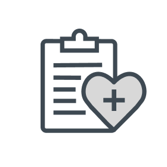</td><td>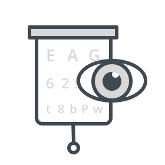</td><td> </td><td> </td></tr><tr><td></td><td></td><td>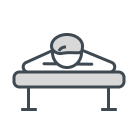</td><td>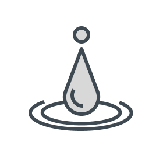</td><td>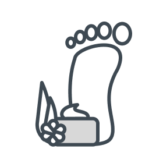</td><td>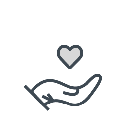</td><td> </td></tr><tr><td></td><td></td><td></td><td></td><td></td><td> </td><td> </td></tr><tr><td></td><td></td><td></td><td></td><td> </td><td> </td><td> </td></tr><tr><td></td><td></td><td></td><td> </td><td> </td><td> </td><td> </td></tr></tbody></table>

<table bgcolor="white"><tbody><tr bgcolor="white"><td colspan="7" bgcolor="white"><strong>Support</strong></td></tr><tr bgcolor="white"><td></td><td></td><td></td><td></td><td></td><td></td><td> </td></tr><tr><td> </td><td> </td><td> </td><td> </td><td> </td><td> </td><td> </td></tr></tbody></table>

<table bgcolor="white"><tbody><tr bgcolor="white"><td colspan="6" bgcolor="white"><strong>Queries</strong></td><td> </td></tr><tr bgcolor="white"><td></td><td></td><td></td><td></td><td></td><td></td><td></td></tr></tbody></table>

<table bgcolor="white"><tbody><tr bgcolor="white"><td colspan="7" bgcolor="white"><strong>General</strong></td></tr><tr bgcolor="white"><td></td><td></td><td></td><td></td><td></td><td> </td><td> </td></tr><tr><td></td><td>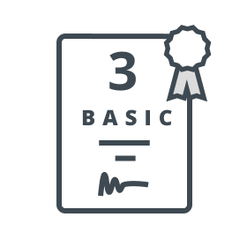</td><td></td><td></td><td>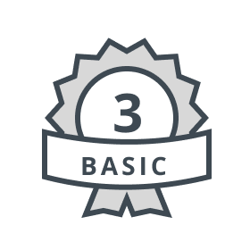</td><td></td><td> </td></tr><tr><td></td><td></td><td></td><td></td><td></td><td></td><td></td></tr><tr><td></td><td></td><td></td><td></td><td></td><td></td><td></td></tr><tr><td></td><td></td><td></td><td></td><td></td><td></td><td> </td></tr></tbody></table>

  

Are you looking for other icons? Please [let us know](https://scheduleonce.atlassian.net/servicedesk/customer/portal/7/group/10/create/170).