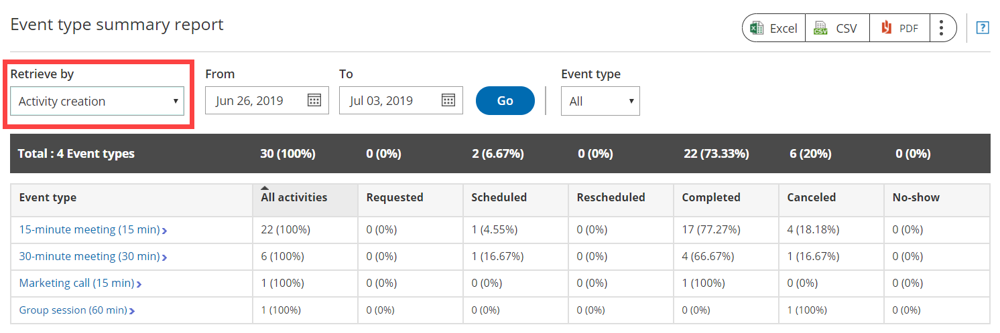

import { Aside } from '@astrojs/starlight/components';

Reports cover all booking activity. Reports can be generated based on different dimensions: [by Customer](/customer-reports/ "Customer Reports"), [by Booking page](/booking-page-reports/ "Booking page Reports"), [by Event type](/event-type-reports/ "Event Type Reports"), [by Master page](/master-page-reports/ "Master page Reports"), and [by User](/user-reports/ "User Reports"). [Account reports](/account-reports/ "Account Reports") and [Revenue reports](/revenue-reports/ "Revenue Reports") can be used to see a global view of all account activity and all revenue details.

You do not need an assigned product license to access reports, though you do need to be an Administrator. [Learn more](/common-use-cases-for-users-without-a-scheduleonce-license/)

Reports can be found by going in the top navigation menu **Booking pages** in the bar on the left → **Reports** on the left.

```
&lt;script id="snippet-prepend">
$(function()&#123;
  
  /*disable in widget*/
  if($('.w-documentation-article').length === 0)&#123;

     var ToC =
  "&lt;nav role='navigation' class='table-of-contents toc-top'><h4>In this article:" + "<ul>";
     var el,     title, link, header;
      //Define the heading levels you want to use in ascending order. Can add extra or remove unneeded.
     $(".hg-article-body h1, .hg-article-body h2, .hg-article-body h3, .hg-article-body h4").each(function() &#123;
              el = $(this);
              title = el.text();
                 if(title != '')&#123;
                anchorTitle = el.text().replace(/([~!@#$%^&*()_+=`&#123;&#125;\[\]\|\\:;'&lt;>,.\/\? ])+/g, '-').toLowerCase();
                link = "#" + anchorTitle;
                //Set all headers to a 0-nesting level.
                header = 'header-nesting-0';
                //Adjust header-nesting layers so that they point to the correct html tag. header-nesting-1 should match the second .hg-article-body h# listed above; header-nesting-2 should match the third, etc.
                if($(this).is('h2'))&#123;
                    header = 'header-nesting-1';
                &#125;else if($(this).is('h3'))&#123;
                    header = 'header-nesting-2'
                &#125;
                el.html('<a id="'+anchorTitle+'" class="toc-anchor">' + el.html());
                newLine =
      "<li class='"+header+"'>" +
        "<a class='article-anchor' href='" + link + "'>" +
          title +
        "" +
      "";


                ToC += newLine;
              &#125;
              &#125;);
     ToC +=
   "" +
  "";
    $("#snippet-prepend").before(ToC);
  &#125;
&#125;);

&lt;/script>
```

```
&lt;style>
/* CSS to style the TOC as it displays and the auto-created anchors
.toc-top styles the box for the TOC; adjust styles here to tweak look and feel */
  
.toc-top &#123;
  background-color: #FAFAFA; /* set to #fff or delete entirely for no background */
  border: 1px solid #C8C8C8; /* adjust the color hex here to change border color */
  box-shadow: 0 1px 1px rgba(0, 0, 0, 0.05) inset;
  margin-top: 24px;
  margin-bottom: 36px;
  min-height: 20px;
  padding: 13px 20px;
  max-width: 75%;
&#125;
.toc-top h4 &#123;
  font-size: 18px;
  line-height: 26px;
  margin: 0 0 8px;
  font-weight: 400;
&#125;
.toc-top ul &#123;
  padding: 0 0 0 15px !important;
  margin-bottom: 0;	
&#125;
.toc-top > ul &#123;
  margin-bottom: 13px!important;
&#125;
.toc-anchor &#123;
  display: block;
  height: 90px; 
  margin-top: -90px; 
  visibility: hidden;
&#125;

/* Set the indentation for the nesting levels. May need to be edited to match changes above. Increase or decrease the margin-left to get your desired level of indentation. */
.header-nesting-1 &#123;
    margin-left: 14px;
&#125;
.header-nesting-1:before &#123;
	background-image: url(https://dyzz9obi78pm5.cloudfront.net/app/image/id/5d31bcc88e121c9b25ba22c4/n/bulletv2.svg)!important;
&#125;
.header-nesting-2 &#123;
    margin-left: 28px;
&#125;
.header-nesting-2:before &#123;
	background-image: url(https://dyzz9obi78pm5.cloudfront.net/app/image/id/5d31be536e121cf22b0cc6ae/n/bulletv3.svg)!important;
&#125;
&lt;/style>
```

# Types of reports

There are two types of reports:

*   **Summary reports** provide a high level overview by [booking activity lifecycle phase](/understanding-activity-statuses/ "Understanding activity statuses").
*   **Detail reports** provide detailed information. These reports can be customized using [System fields](/editing-system-fields/ "Editing System fields") and any [Custom field](/creating-and-editing-custom-fields/ "Creating and editing Custom fields") that you create in the [Fields library](/the-fields-library/ "The Fields library").

Each report can be exported as Excel, PDF, or CSV files. [Branded printouts](/report-header/ "Report header") can also be provided to all stakeholders. 

**Note** When you export a report in Excel or CSV format, the date and time format is based on the User's [personal date and time format settings](/managing-your-profile-in-oncehub#datetime/ "Profile: Date and time section"). 

# Retrieving activities

Activities can be retrieved according to **Meeting time** or **Activity creation** date by using the **Retrieve by** drop-down menu (Figure 1).

Figure 1: Retrieve by drop-down menu

When you select a date range, OnceHub retrieves all activities that **were started** during the reporting period and displays their states at the time that the report is run. This means that if the report is run on different days, it may show the same activities in different states.

**Note** When you retrieve activities by **Meeting time**, activities in **Requested** status will not be displayed as they are not confirmed bookings.

For example, 100 activities were started during the last month. If you run the report one day after the month's end, you would see the following:

*   12 activities are in **Requested** status
*   60 activities are in **Scheduled** status
*   4 activities are in **Rescheduled** status
*   8 activities are in **Completed** status
*   5 activities are in **No-show** status
*   11 activities are in **Canceled** status  
    \---------------------------------------------------  
    **Total: 100 activities**

The total number of activities is 100, and if we generate the same report two days later, the total will still be 100. However, the distribution of the numbers between the statuses may change, since activities can change their state. For example, 10 of the **Scheduled** status activities may now be in **Completed** status. 

[Learn more about Activity statuses](/understanding-activity-statuses/ "Understanding activity statuses")

# General report rules

*   The **Creation date** and **Last updated** date are always based on the default time zone in the [User profile date and time section](/managing-your-profile-in-oncehub#datetime/ "Profile: Date and time section"), regardless of the Booking page time zone. 
*   You can always change a parameter without affecting other parameters. For example, you can set a date range and then drill into a specific Customer activity. The date range will not change.
*   Any column can be sorted by clicking on its header. One click sorts down and the second click sorts up.
*   You can add custom columns to [Detail reports](/complete-list-of-detail-report-columns/ "Complete list of Detail report columns") and create customized reports with the exact data that you need. There are two types of fields that can be added to any detail report:
    *   **System fields:** These are fields defined by the system, such as **Location**, **Cancellation reason**, and **Duration**. More than 30 system fields can be added to any Detail report.
    *   **Custom fields:** These are fields that you create and use in your [Booking forms](/introduction-to-the-booking-forms-editor/ "Introduction to the Booking Forms Editor") based on your business needs. Custom fields are created in the Custom fields library and all library fields can be added to Detail reports as additional report columns.
*   If the Customer or the Owner reschedules, it will count as a rescheduled activity only. The canceled activity will not show in the reports and the new rescheduled activity will replace it. This is done to avoid double-counting.
*   Reports are only for Customer self-scheduling activities and do not cover Group scheduling activities.
*   When you change an Activity status from **Completed** to **No-show**, the change will be reflected in the next report update cycle which takes place daily at 7:00am and 7:00pm Eastern time. [Learn more about tracking and reporting of No-shows](/tracking-and-reporting-no-shows/ "Tracking and Reporting No-Shows")