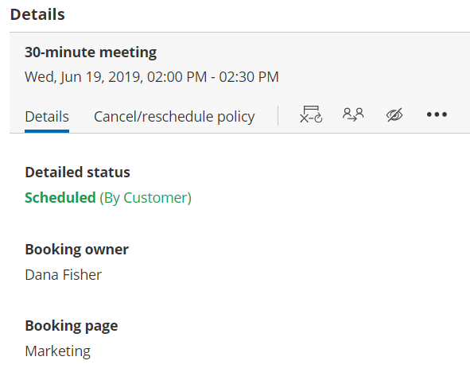

import { Aside } from '@astrojs/starlight/components';

OnceHub allows you to use [System fields](/editing-system-fields/ "Editing System fields") and [Custom fields](/creating-and-editing-custom-fields/ "Creating and editing Custom fields") to create [Booking forms](/booking-form/ "Introduction to Booking forms") customized for your needs. The data you collect can be used to learn more about your Customers and enhance their overall scheduling experience.

The information collected from Booking forms is available in [reports](/introduction-to-scheduleonce-reports/ "Introduction to reports"), the [Activity stream](/introduction-to-the-activity-stream/ "Introduction to the ScheduleOnce Activity stream"), calendar events, and in [Dynamic fields](/dynamic-fields/ "Dynamic fields") which can be used in [Custom email and SMS templates](/how-to-create-a-custom-email-or-sms-template/ "How to create a Custom email or SMS template"). 

```
&lt;iframe allowfullscreen="" height="360" src="https://www.youtube-nocookie.com/embed/l2IEDRLvyds?rel=0&amp;rel=0&amp;modestbranding=1" width="640" class="fr-draggable">&lt;/iframe>
```

# Reports

[Detail reports](/introduction-to-scheduleonce-reports/ "Introduction to ScheduleOnce reports") can be customized with the exact data that you collected from your Booking forms. For example, if your Booking form includes a [Custom field](/creating-and-editing-custom-fields/ "Creating and editing Custom fields") where the Customer fills out their location, you can analyze your geographic reach with a [Customer report](/customer-reports/ "Customer reports") that includes the location information. 

All reports can be exported as Excel, CSV, or PDF files. This allows you to further analyze the data and share professional reports with your stakeholders. 

For example, you can export a list of your scheduled Customers with their emails and phone numbers. Alternatively, if you're running an event, you can provide attendees with a [branded PDF report](/report-header/ "Report header") that includes their meetings for the day and all of the relevant details they filled out at the time of booking.

# The Activity stream

The [Activity stream](/introduction-to-the-activity-stream/ "Introduction to the ScheduleOnce Activity stream") is where you have access to all of the activities in your OnceHub account. When you select an activity, you can see information collected from the Booking form in the **Details** pane on the right-hand side (Figure 1). The bottom section displays the information collected via the Custom fields. 

Figure 1: Details pane

# Notifications by email and SMS

[User notification emails](/introduction-to-user-notifications/ "Introduction to User notifications section"), [Customer notification emails](/introduction-to-customer-notifications/ "Introduction to the Customer notifications section"), and [SMS notifications](/sms-notifications/ "SMS notifications") are automated messages sent by the system when scheduling events are triggered. These events can be booking requests, scheduled bookings, reminders, rescheduled bookings, requests to schedule a new time, and cancellations. 

The templates include the scheduling details, calendar invitation and information gathered via the Booking form. 

[Learn more about email and SMS templates](/introduction-to-the-notification-templates-editor/ "Introduction to the Notification templates editor")