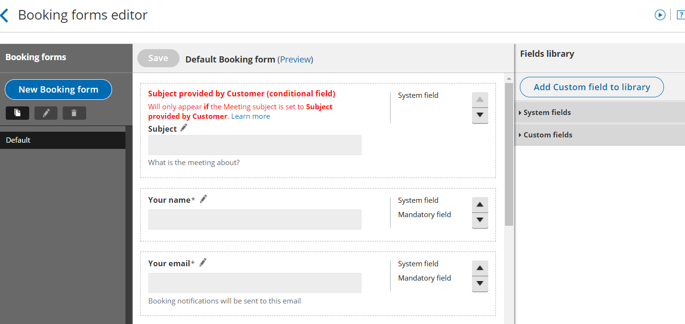
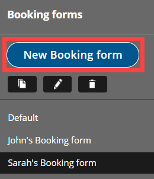
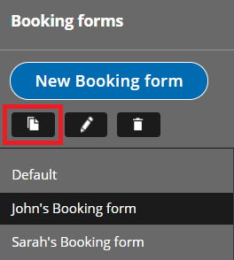
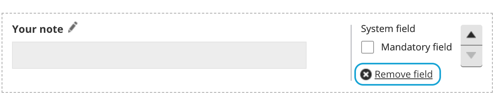
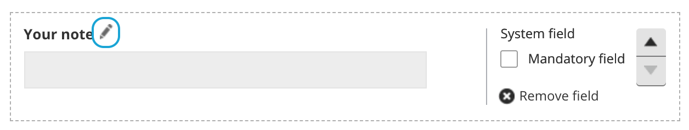
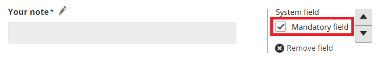
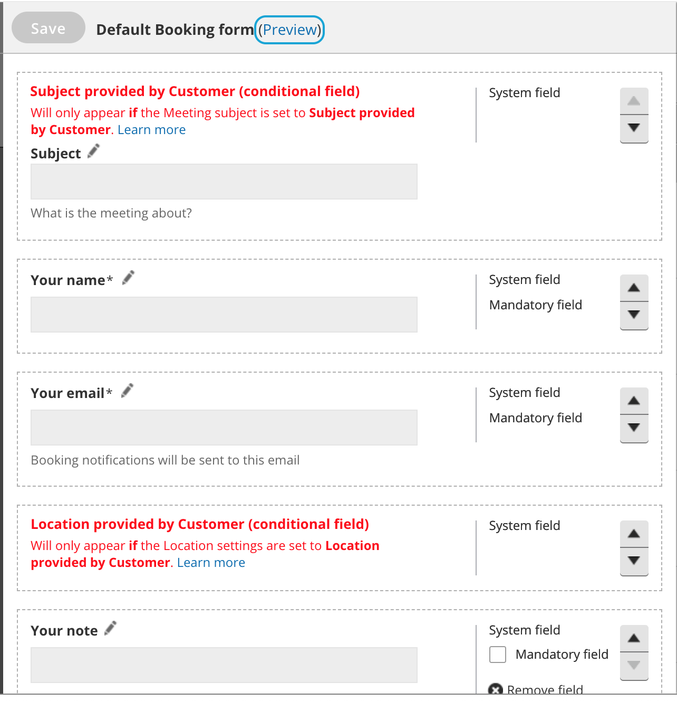
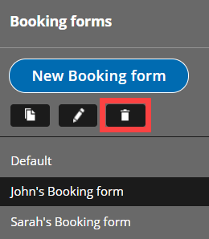

import { Aside } from '@astrojs/starlight/components';

You can use the [Booking forms editor](/introduction-to-the-booking-forms-editor/ "Introduction to the Booking forms editor") to customize the information that you want to collect from your Customers during the booking process. You can choose the questions on the Booking form and the order that they're presented in.

If you are working with multiple [Booking pages](/introduction-to-booking-pages/ "Introduction to Booking pages"), you can create a different Booking form for each Booking page. If your business needs are the same for all of your Booking pages, or if you're only using one Booking page, you can create one Booking form. 

In this article, you'll learn about creating and editing a Booking form. 

```
&lt;script id="snippet-prepend">
$(function()&#123;
  
  /*disable in widget*/
  if($('.w-documentation-article').length === 0)&#123;

     var ToC =
  "&lt;nav role='navigation' class='table-of-contents toc-top'><h4>In this article:" + "<ul>";
     var el,     title, link, header;
      //Define the heading levels you want to use in ascending order. Can add extra or remove unneeded.
     $(".hg-article-body h1, .hg-article-body h2, .hg-article-body h3, .hg-article-body h4").each(function() &#123;
              el = $(this);
              title = el.text();
                 if(title != '')&#123;
                anchorTitle = el.text().replace(/([~!@#$%^&*()_+=`&#123;&#125;\[\]\|\\:;'&lt;>,.\/\? ])+/g, '-').toLowerCase();
                link = "#" + anchorTitle;
                //Set all headers to a 0-nesting level.
                header = 'header-nesting-0';
                //Adjust header-nesting layers so that they point to the correct html tag. header-nesting-1 should match the second .hg-article-body h# listed above; header-nesting-2 should match the third, etc.
                if($(this).is('h2'))&#123;
                    header = 'header-nesting-1';
                &#125;else if($(this).is('h3'))&#123;
                    header = 'header-nesting-2'
                &#125;
                el.html('<a id="'+anchorTitle+'" class="toc-anchor">' + el.html());
                newLine =
      "<li class='"+header+"'>" +
        "<a class='article-anchor' href='" + link + "'>" +
          title +
        "" +
      "";


                ToC += newLine;
              &#125;
              &#125;);
     ToC +=
   "" +
  "";
    $("#snippet-prepend").before(ToC);
  &#125;
&#125;);

&lt;/script>
```

```
&lt;style>
/* CSS to style the TOC as it displays and the auto-created anchors
.toc-top styles the box for the TOC; adjust styles here to tweak look and feel */
  
.toc-top &#123;
  background-color: #FAFAFA; /* set to #fff or delete entirely for no background */
  border: 1px solid #C8C8C8; /* adjust the color hex here to change border color */
  box-shadow: 0 1px 1px rgba(0, 0, 0, 0.05) inset;
  margin-top: 24px;
  margin-bottom: 36px;
  min-height: 20px;
  padding: 13px 20px;
  max-width: 75%;
&#125;
.toc-top h4 &#123;
  font-size: 18px;
  line-height: 26px;
  margin: 0 0 8px;
  font-weight: 400;
&#125;
.toc-top ul &#123;
  padding: 0 0 0 15px !important;
  margin-bottom: 0;	
&#125;
.toc-top > ul &#123;
  margin-bottom: 13px!important;
&#125;
.toc-anchor &#123;
  display: block;
  height: 90px; 
  margin-top: -90px; 
  visibility: hidden;
&#125;

/* Set the indentation for the nesting levels. May need to be edited to match changes above. Increase or decrease the margin-left to get your desired level of indentation. */
.header-nesting-1 &#123;
    margin-left: 14px;
&#125;
.header-nesting-1:before &#123;
	background-image: url(https://dyzz9obi78pm5.cloudfront.net/app/image/id/5d31bcc88e121c9b25ba22c4/n/bulletv2.svg)!important;
&#125;
.header-nesting-2 &#123;
    margin-left: 28px;
&#125;
.header-nesting-2:before &#123;
	background-image: url(https://dyzz9obi78pm5.cloudfront.net/app/image/id/5d31be536e121cf22b0cc6ae/n/bulletv3.svg)!important;
&#125;
&lt;/style>
```

# Accessing the Booking forms editor

To access the Booking forms editor, go to **Booking pages** in the bar on the left. On the left, select **Booking forms editor**.

Default Booking form settings

When you open the Booking forms editor for the first time, you'll see the **default Booking form** (Figure 1).

Figure 1: Default Booking form

The default Booking form includes the following fields:

*   Subject ([Conditional field](/conditional-fields/ "Conditional fields"))
*   Your name
*   Your email
*   Your mobile phone
*   Location ([Conditional field](/conditional-fields/ "Conditional fields"))
*   Your note

When you create a new Booking form, these six fields will be included. You can remove most of these fields and add others as needed. 

**Note**

Accounts created before July 23, 2020 include eight fields in their default Booking form, rather than six. The additional fields are:

*   Your company
*   Your phone

# Creating a new Booking form

There are three ways to customize the Booking form: Editing the Default Booking form, creating a new Booking form, or copying and editing an existing Booking form. 

## Editing the Default Booking form

If you want every Booking page on your account to use the same Booking form, this is a good option. This ensures that Users will not accidentally select the wrong Booking form.

## Creating a new Booking form

To create a new Booking form, click the **New Booking form** button (Figure 2) in the **Booking forms** menu on the left hand side of the page. The new Booking form will have the Default Booking form settings. This is a good option if you want to start from scratch.

Figure 2: New Booking form button

## Copying an existing Booking form

To copy an existing Booking form, click the **Copy** button (Figure 3) in the **Booking forms** menu on the left hand side of the page. The new Booking form will be an exact copy, which you can customize further as needed. This is a good option if you've already created a Booking form that you like and want to edit it slightly.

Figure 3: Copy an existing Booking form

# Editing a Booking form

You can edit, add, and remove the content of your Booking forms in the middle editing pane.

## Adding fields to your Booking form

To add a field to the Booking form, click the arrow icon on the specific field in the [Fields library](/the-fields-library/ "The Fields library") (Figure 4).

Figure 4: Add fields to your Booking form

## Removing fields from your Booking form

To remove a field from the Booking form, click **Remove field** next to the specific field (Figure 5).

Figure 5: Remove a field from your Booking form

**Note**The **Email** and **Name** fields cannot be removed because OnceHub needs this basic information in order to confirm the booking with your Customer.

## Editing text

 To edit the **Field title** and **subtext**, click the **Edit** icon next to the Field name (Figure 6). 

Figure 6: Edit icon The **Edit field** pop-up will appear (Figure 7).

Figure 7: Edit field pop-up

*   **Field title:** This is the title that will be displayed to Customers.
*   **Subtext:** Check the **Add subtext** box to add subtext to the field. Subtext can help explain the information being collected in the field, or why you are asking your Customers for this information. 

 Click the **Link** icon to add a link to any of the text you edit. 

[Learn more about editing System fields](/editing-system-fields/ "Editing System fields")

[Learn more about creating and editing Custom fields](/creating-and-editing-custom-fields/ "Creating and editing Custom fields")

## Choosing the order of your fields

To change the order in which your fields appear, click the up or down arrow on the right side of each field to move it. 

## Choosing which fields will be mandatory

Check the **Mandatory field** box to make the field mandatory (Figure 8). The Customer must fill out all Mandatory fields in order to make a booking. Uncheck the **Mandatory field** box to make a field optional.

Figure 8: Mandatory field box

## Previewing your Booking form

You can review your Booking form anytime by clicking the **Preview** link at the top of the Editing pane (Figure 9). 

Figure 9: Click Preview to see a preview of your Booking form

When you're done editing your Booking form, click **Save**.

# Managing Booking forms

In the **Booking forms** menu on the left hand side of the page, you will see a list of the Default Booking form provided by OnceHub and any custom Booking forms that you or other Users have created.

*   **Rename:** To rename the selected Booking form, click the **Rename** button (Figure 10). The Default Booking form cannot be renamed.  
    
    
    Figure 10: Rename button
    
*   **Delete:** To delete the selected Booking form, click the **Delete** button (Figure 11). This action cannot be undone. The Default Booking form cannot be deleted.  
    
    
    Figure 11: Delete button
    

# Adding a Booking form to a Booking page

Once you've created a Booking form, you'll need to add it to your [Booking page](/introduction-to-booking-pages/ "Introduction to Booking pages"). If your Booking page is [associated with at least one Event type](/adding-event-types-to-booking-pages/ "Adding Event types to Booking pages"), then the **Booking form and redirect** section will be on the Event type. [Learn more about the location of the Booking form and redirect section](/event-type-sections/ "Location of the Booking form and the Customer notifications sections")

1.  Go to **Booking pages** in the bar on the left.
2.  Select the relevant Event type in the **Event types** pane.
3.  In the **Booking form and redirect** section, select the Booking form you've just created from the **Booking form** drop-down menu.

If your Booking page is not associated with any Event types, the **Booking form and redirect** section will be on the Booking page. 

1.  Go to **Booking pages** in the bar on the left.
2.  Select the relevant Booking page in the **Booking pages** pane.
3.  In the [Booking form and redirect section](/introduction-to-the-booking-form-redirect-section/ "Introduction to the Booking form and redirect section"), select the Booking form you've just created from the **Booking form** drop-down menu.