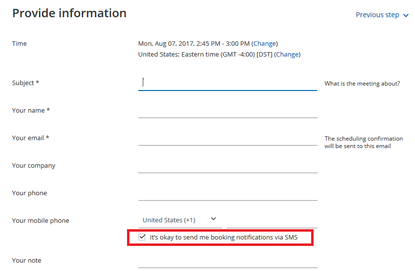

import { Aside } from '@astrojs/starlight/components';

System fields are seven standardized fields. Four are included in every new [Booking form](/introduction-to-the-booking-forms-editor/ "Introduction to the Booking forms editor") by default.

In this article, you'll learn about editing System fields. 

```
&lt;script id="snippet-prepend">
$(function()&#123;
  
  /*disable in widget*/
  if($('.w-documentation-article').length === 0)&#123;

     var ToC =
  "&lt;nav role='navigation' class='table-of-contents toc-top'><h4>In this article:" + "<ul>";
     var el,     title, link, header;
      //Define the heading levels you want to use in ascending order. Can add extra or remove unneeded.
     $(".hg-article-body h1, .hg-article-body h2, .hg-article-body h3, .hg-article-body h4").each(function() &#123;
              el = $(this);
              title = el.text();
                 if(title != '')&#123;
                anchorTitle = el.text().replace(/([~!@#$%^&*()_+=`&#123;&#125;\[\]\|\\:;'&lt;>,.\/\? ])+/g, '-').toLowerCase();
                link = "#" + anchorTitle;
                //Set all headers to a 0-nesting level.
                header = 'header-nesting-0';
                //Adjust header-nesting layers so that they point to the correct html tag. header-nesting-1 should match the second .hg-article-body h# listed above; header-nesting-2 should match the third, etc.
                if($(this).is('h2'))&#123;
                    header = 'header-nesting-1';
                &#125;else if($(this).is('h3'))&#123;
                    header = 'header-nesting-2'
                &#125;
                el.html('<a id="'+anchorTitle+'" class="toc-anchor">' + el.html());
                newLine =
      "<li class='"+header+"'>" +
        "<a class='article-anchor' href='" + link + "'>" +
          title +
        "" +
      "";


                ToC += newLine;
              &#125;
              &#125;);
     ToC +=
   "" +
  "";
    $("#snippet-prepend").before(ToC);
  &#125;
&#125;);

&lt;/script>
```

```
&lt;style>
/* CSS to style the TOC as it displays and the auto-created anchors
.toc-top styles the box for the TOC; adjust styles here to tweak look and feel */
  
.toc-top &#123;
  background-color: #FAFAFA; /* set to #fff or delete entirely for no background */
  border: 1px solid #C8C8C8; /* adjust the color hex here to change border color */
  box-shadow: 0 1px 1px rgba(0, 0, 0, 0.05) inset;
  margin-top: 24px;
  margin-bottom: 36px;
  min-height: 20px;
  padding: 13px 20px;
  max-width: 75%;
&#125;
.toc-top h4 &#123;
  font-size: 18px;
  line-height: 26px;
  margin: 0 0 8px;
  font-weight: 400;
&#125;
.toc-top ul &#123;
  padding: 0 0 0 15px !important;
  margin-bottom: 0;	
&#125;
.toc-top > ul &#123;
  margin-bottom: 13px!important;
&#125;
.toc-anchor &#123;
  display: block;
  height: 90px; 
  margin-top: -90px; 
  visibility: hidden;
&#125;

/* Set the indentation for the nesting levels. May need to be edited to match changes above. Increase or decrease the margin-left to get your desired level of indentation. */
.header-nesting-1 &#123;
    margin-left: 14px;
&#125;
.header-nesting-1:before &#123;
	background-image: url(https://dyzz9obi78pm5.cloudfront.net/app/image/id/5d31bcc88e121c9b25ba22c4/n/bulletv2.svg)!important;
&#125;
.header-nesting-2 &#123;
    margin-left: 28px;
&#125;
.header-nesting-2:before &#123;
	background-image: url(https://dyzz9obi78pm5.cloudfront.net/app/image/id/5d31be536e121cf22b0cc6ae/n/bulletv3.svg)!important;
&#125;
&lt;/style>
```

# System fields

*   Your name
*   Your email
*   Your company (not included in the default Booking form)
*   Your phone (not included in the default Booking form)
*   Your mobile phone
*   Your note
*   [Customer guests](/multiple-attendee-scenario-can-customers-invite-guests-to-a-booking/ "Can Customers Invite Guests to a Booking?") (not included in the default Booking form)

**Note**If you want to ask for information that is not included in the System fields or Custom fields, you can create your own Custom field. [Learn more about Custom fields](/creating-and-editing-custom-fields/ "Creating and editing Custom fields")

# Editing System fields

1.  Go to **Booking pages** in the bar on the left.
2.  On the left, select **Booking forms editor**.
3.  Click the **Edit** icon next to the field name you want to edit in the Booking form (Figure 1). Figure 1: Click the Edit icon to edit a field
4.  The **Edit system field** pop-up will appear (Figure 2). Here, you can edit the **Field title** and **Add subtext**. Figure 2: Edit system field pop-up

When you edit a System field, you are editing that field only for the specific Booking form you are working on at that time. If you close the Booking form and edit the same field in a different Booking form, the changes you make are applied to only this new Booking form.

In contrast, Custom fields are edited in the Fields library, so any change made to the field is applied to every Booking form which includes the field. [Learn more about Custom fields](/creating-and-editing-custom-fields/ "Creating and editing Custom fields")

**Note**You cannot edit the options in a System field drop-down menu. To customize drop-down menu options, [create a Custom field](/creating-and-editing-custom-fields/ "Creating and editing Custom fields"). 

## Field title

The **Field title** is the name of the field as it will appear to Customers on the Booking form. For example, you can change the “Your name” field to say “First and last name." If you don't enter any text for the **Field title**, the **Field name** will be used. 

**Important**You should not use a System field to collect information other than what it is intended for. For example the “Your name” field should only be used to ask for the Customer’s name and the “Your phone” field should only be used to ask for a phone number. 

Using these fields to collect information other than what is intended can break the scheduling process. For example, if you change the Field title of the email field to ask for something else, your Customer will not receive [email notifications](/customer-notification-scenarios/ "Customer notification scenarios") about the booking they made.

## Add subtext

To add subtext to a field, check the **Add subtext** box. Then, enter a description of the field or explain why you are asking for the information. 

For example, if you are asking for the Customer’s phone number, you can use this space to explain how you are going to use the phone number. You can also hyperlink text. For example, you could link to your Terms of service.

## Require email verification for the email System field

If you are worried about Customers mistyping their email address when making a booking, you can turn on the **Email verification** option in the email **Edit system field** pop-up for the **Emai**l field (Figure 3). 

When enabled, the Customer will be asked to enter their email address a second time and allow OnceHub to verify that both email addresses match.  
  
Figure 3: Require email verification for the email System field

## Enable SMS notifications for the Mobile phone System field

If you want to send booking-related SMS notifications to your Customers, you must provide them with an option to opt out of this service. 

To do this, check the **Enable SMS** box in the **Booking forms editor**. Check the **OK to send me booking notifications via SMS** checkbox. The default is that the customer has to opt out of SMS notifications.

Figure 3: Enable SMS notifications for the Mobile phone System field

When you enable this option, your Customers will be asked to opt-in to receiving SMS notifications in the Booking form.

Figure 4: Customers opt-in to receiving SMSs in the Booking form

When this option is enabled and your Booking form is skipped, the checkbox will appear in the date and time selection step.

Figure 4: Opt-in to receive booking notifications via SMS