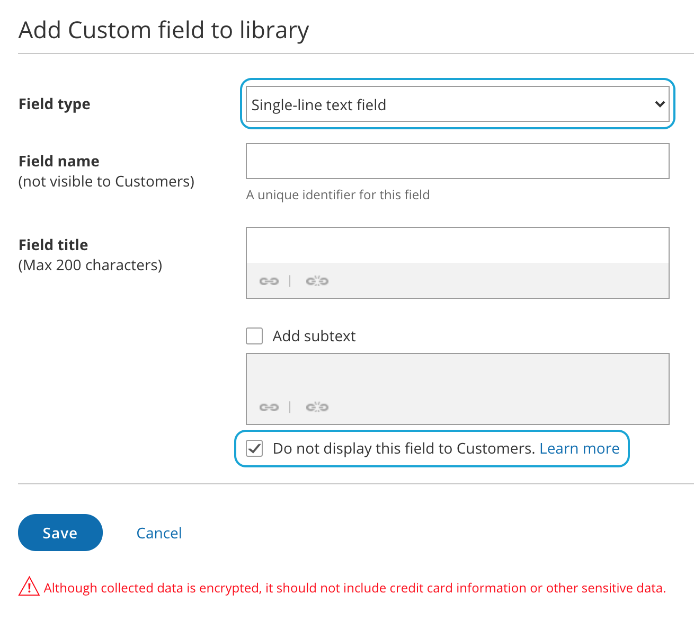

import { Aside } from '@astrojs/starlight/components';

When you add a [Custom field](/creating-and-editing-custom-fields/ "Creating and editing Custom fields") to your [Booking form](/introduction-to-the-booking-forms-editor/ "Introduction to the Booking forms editor"), the field is visible by default. You can choose to hide the field, so that it will not be displayed on the Booking form.

In this article, you'll learn about hiding fields on the Booking form.

```
&lt;script id="snippet-prepend">
$(function()&#123;
  
  /*disable in widget*/
  if($('.w-documentation-article').length === 0)&#123;

     var ToC =
  "&lt;nav role='navigation' class='table-of-contents toc-top'><h4>In this article:" + "<ul>";
     var el,     title, link, header;
      //Define the heading levels you want to use in ascending order. Can add extra or remove unneeded.
     $(".hg-article-body h1, .hg-article-body h2, .hg-article-body h3, .hg-article-body h4").each(function() &#123;
              el = $(this);
              title = el.text();
                 if(title != '')&#123;
                anchorTitle = el.text().replace(/([~!@#$%^&*()_+=`&#123;&#125;\[\]\|\\:;'&lt;>,.\/\? ])+/g, '-').toLowerCase();
                link = "#" + anchorTitle;
                //Set all headers to a 0-nesting level.
                header = 'header-nesting-0';
                //Adjust header-nesting layers so that they point to the correct html tag. header-nesting-1 should match the second .hg-article-body h# listed above; header-nesting-2 should match the third, etc.
                if($(this).is('h2'))&#123;
                    header = 'header-nesting-1';
                &#125;else if($(this).is('h3'))&#123;
                    header = 'header-nesting-2'
                &#125;
                el.html('<a id="'+anchorTitle+'" class="toc-anchor">' + el.html());
                newLine =
      "<li class='"+header+"'>" +
        "<a class='article-anchor' href='" + link + "'>" +
          title +
        "" +
      "";


                ToC += newLine;
              &#125;
              &#125;);
     ToC +=
   "" +
  "";
    $("#snippet-prepend").before(ToC);
  &#125;
&#125;);

&lt;/script>
```

```
&lt;style>
/* CSS to style the TOC as it displays and the auto-created anchors
.toc-top styles the box for the TOC; adjust styles here to tweak look and feel */
  
.toc-top &#123;
  background-color: #FAFAFA; /* set to #fff or delete entirely for no background */
  border: 1px solid #C8C8C8; /* adjust the color hex here to change border color */
  box-shadow: 0 1px 1px rgba(0, 0, 0, 0.05) inset;
  margin-top: 24px;
  margin-bottom: 36px;
  min-height: 20px;
  padding: 13px 20px;
  max-width: 75%;
&#125;
.toc-top h4 &#123;
  font-size: 18px;
  line-height: 26px;
  margin: 0 0 8px;
  font-weight: 400;
&#125;
.toc-top ul &#123;
  padding: 0 0 0 15px !important;
  margin-bottom: 0;	
&#125;
.toc-top > ul &#123;
  margin-bottom: 13px!important;
&#125;
.toc-anchor &#123;
  display: block;
  height: 90px; 
  margin-top: -90px; 
  visibility: hidden;
&#125;

/* Set the indentation for the nesting levels. May need to be edited to match changes above. Increase or decrease the margin-left to get your desired level of indentation. */
.header-nesting-1 &#123;
    margin-left: 14px;
&#125;
.header-nesting-1:before &#123;
	background-image: url(https://dyzz9obi78pm5.cloudfront.net/app/image/id/5d31bcc88e121c9b25ba22c4/n/bulletv2.svg)!important;
&#125;
.header-nesting-2 &#123;
    margin-left: 28px;
&#125;
.header-nesting-2:before &#123;
	background-image: url(https://dyzz9obi78pm5.cloudfront.net/app/image/id/5d31be536e121cf22b0cc6ae/n/bulletv3.svg)!important;
&#125;
&lt;/style>
```

# Why hide fields on the Booking form?

Hiding fields is typically done to pass internal company information through the booking process, without exposing it to the Customer. 

For example, you might have an ID for a particular marketing source that you need to track with the booking information. The ID is internal and Customers should not see it when they book. With hidden fields, you can include the ID in the URL parameters and pass it to a third party CRM integration, add it to a calendar event, or include it in [User notifications](/communicating-with-users-and-stakeholders/ "Communicating with Users and stakeholders").

Customers are not able to input a value for hidden fields, and hidden fields cannot be made into mandatory fields. To use a hidden field, you should provide a value with [URL parameters](/scheduleonce-url-parameters-and-processing-rules/ "ScheduleOnce URL parameters and processing rules"). 

Hidden fields should not be used to pass sensitive information because the data is still visible and editable in the Booking page URL.

**Important** Data from hidden fields will be added to the default calendar event in the User's connected calendar. If the Customer is included as a guest on the calendar event they will see the hidden field data in the event details. 

To prevent this you can [remove the Customer from the calendar event](/customer-calendar-event-options/ "Customer Calendar Event options") or [you can create a custom event template](/how-to-create-a-custom-email-or-sms-template/ "How to create a Custom email or SMS template").

# Creating a hidden Custom field

1.  Go to **Booking pages** in the bar on the left. 
2.  On the left, select **Booking forms editor**. 
3.  In the **Fields library** section on the right of the page, click the **Add Custom field to library** button.
4.  Select **Single line text field** as the **Field type** (Figure 1).
    
    Figure 1: Creating a hidden Custom field
    
5.  At the bottom of the Field editor, check the **Do not display this field to Customers** box. 
6.  Click **Save**.

To use a hidden Custom field, [add it to your booking form](/creating-a-booking-form/ "Creating and editing a Booking form"). 

**Note**Hidden fields do not show in the Booking form previews.

# Hidden field example

You may want to pass a marketing campaign ID in the URL and pass it to a Custom field in your CRM.  To do this, you would follow these steps:

1.  Create a hidden [Custom field](/creating-and-editing-custom-fields/ "Creating and editing Custom fields") for the marketing campaign ID and add it to your Booking form.
2.  In the CRM integration setup, map the hidden OnceHub field to the Custom field in your CRM.
3.  In the marketing campaign add the link to your Booking page with the marketing campaign ID in the URL. For example, [go.oncehub.com/example?marketing-campaign-ID=1234](http://go.oncehub.com/example?marketing-campaign-ID=1234)

When a booking is made using this link, the marketing campaign ID (1234) will be mapped to the Customer record in your CRM.

**Note** If you are using UTM codes, you can enable [source tracking](/using-oncehub-with-source-tracking-utm-tags/ "Using ScheduleOnce with source tracking (UTM tags)") to pass UTM tags that you have added to your personalized links. The following five source tracking field names are reserved for source tracking, and cannot be used as Custom field names:

*   utm_source = used for identifying the traffic source
*   utm_medium = used for identifying the delivery method
*   utm_campaign = used for keeping track of different campaigns
*   utm_term = used for identifying keywords
*   utm_content = used for split testing or separating two ads that go to the same URL