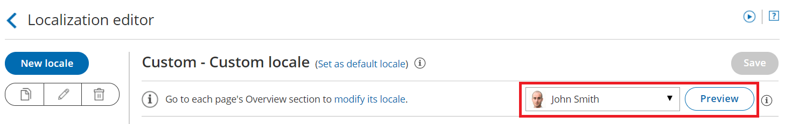

import { Aside } from '@astrojs/starlight/components';

If you want to have more control over Customer-facing text in your [Booking page](/introduction-to-booking-pages/ "Introduction to Booking pages"), you can use the [Localization editor](/the-localization-editor/ "The Localization editor") to change every line of Customer interface text.

In this article, you'll learn how to edit Customer interface text. 

# Editing Customer interface text

1.  Go to Booking pages in the bar on the left. 
2.  On the left, select the **Localization editor.**
3.  Click the **New locale** button (Figure 1). Figure 1: New locale button 
4.  In the **Custom locale** pop-up, add a name for your locale and select an existing locale to duplicate as a basis for your new locale (Figure 2).  
    Figure 2: Custom locale pop-up
    
    **Note** Dynamic values including time zones, countries, states, locations, country codes, months, and days of the week will always reflect the parent locale from which they were duplicated.
    
5.  Edit the text in the field in the right column (Figure 3) corresponding to the string in the **English text** column on the left. Some words may appear in multiple strings, so make sure you edit the correct string.  
    If you want to edit a specific string, use the browser search function (Ctrl + F on Windows or ⌘ + F on Mac) to find it.Figure 3: Custom locale text column 
    
    **Note**Parameters in double square brackets \[\[ \]\] can be moved within the string.  
      
    It's important to keep the brackets intact as they will be replaced with live data when viewed by the Customer.
    
6.  To preview a locale on a [Booking page](/introduction-to-booking-pages/ "Introduction to Booking pages") or [Master page](/introduction-to-master-pages/ "Introduction to Master pages") with your Custom locale, use the drop-down menu at the top right of the editor screen to select the Booking page or Master page. Then, click **Preview.** Figure 4: Locale Preview button
    
    **Note** Previewing a locale does not apply the locale to the page.
    
7.  When you've made all the necessary changes, click **Save**.

Finally, apply the Custom locale to your pages on the Overview section of the [Booking page](/booking-page-overview-section/ "Booking page: Overview section") or [Master page](/master-page-overview-section/ "Master Page: Overview section"). 

[Learn more about the steps to fully localize the Customer scheduling experience](/step-by-step-localization/ "Step-by-step localization")