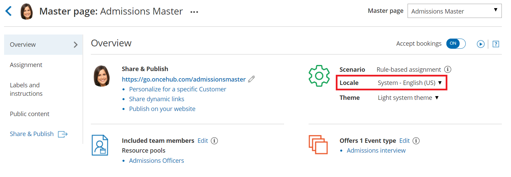

import { Aside } from '@astrojs/starlight/components';

You can localize your scheduling process from start to finish, including the first page your Customer sees, the Confirmation page, [cancel/reschedule](/reschedule-the-customer-cancelreschedule-page/ "The Customer Cancel/reschedule page") process, and the [notifications](/notification-scenarios/ "Notification scenarios") they will receive. This provides your Customers with a fully localized experience. 

In this article, you'll learn how to localize the Customer scheduling experience. 

```
&lt;script id="snippet-prepend">
$(function()&#123;
  
  /*disable in widget*/
  if($('.w-documentation-article').length === 0)&#123;

     var ToC =
  "&lt;nav role='navigation' class='table-of-contents toc-top'><h4>In this article:" + "<ul>";
     var el,     title, link, header;
      //Define the heading levels you want to use in ascending order. Can add extra or remove unneeded.
     $(".hg-article-body h1, .hg-article-body h2, .hg-article-body h3, .hg-article-body h4").each(function() &#123;
              el = $(this);
              title = el.text();
                 if(title != '')&#123;
                anchorTitle = el.text().replace(/([~!@#$%^&*()_+=`&#123;&#125;\[\]\|\\:;'&lt;>,.\/\? ])+/g, '-').toLowerCase();
                link = "#" + anchorTitle;
                //Set all headers to a 0-nesting level.
                header = 'header-nesting-0';
                //Adjust header-nesting layers so that they point to the correct html tag. header-nesting-1 should match the second .hg-article-body h# listed above; header-nesting-2 should match the third, etc.
                if($(this).is('h2'))&#123;
                    header = 'header-nesting-1';
                &#125;else if($(this).is('h3'))&#123;
                    header = 'header-nesting-2'
                &#125;
                el.html('<a id="'+anchorTitle+'" class="toc-anchor">' + el.html());
                newLine =
      "<li class='"+header+"'>" +
        "<a class='article-anchor' href='" + link + "'>" +
          title +
        "" +
      "";


                ToC += newLine;
              &#125;
              &#125;);
     ToC +=
   "" +
  "";
    $("#snippet-prepend").before(ToC);
  &#125;
&#125;);

&lt;/script>
```

```
&lt;style>
/* CSS to style the TOC as it displays and the auto-created anchors
.toc-top styles the box for the TOC; adjust styles here to tweak look and feel */
  
.toc-top &#123;
  background-color: #FAFAFA; /* set to #fff or delete entirely for no background */
  border: 1px solid #C8C8C8; /* adjust the color hex here to change border color */
  box-shadow: 0 1px 1px rgba(0, 0, 0, 0.05) inset;
  margin-top: 24px;
  margin-bottom: 36px;
  min-height: 20px;
  padding: 13px 20px;
  max-width: 75%;
&#125;
.toc-top h4 &#123;
  font-size: 18px;
  line-height: 26px;
  margin: 0 0 8px;
  font-weight: 400;
&#125;
.toc-top ul &#123;
  padding: 0 0 0 15px !important;
  margin-bottom: 0;	
&#125;
.toc-top > ul &#123;
  margin-bottom: 13px!important;
&#125;
.toc-anchor &#123;
  display: block;
  height: 90px; 
  margin-top: -90px; 
  visibility: hidden;
&#125;

/* Set the indentation for the nesting levels. May need to be edited to match changes above. Increase or decrease the margin-left to get your desired level of indentation. */
.header-nesting-1 &#123;
    margin-left: 14px;
&#125;
.header-nesting-1:before &#123;
	background-image: url(https://dyzz9obi78pm5.cloudfront.net/app/image/id/5d31bcc88e121c9b25ba22c4/n/bulletv2.svg)!important;
&#125;
.header-nesting-2 &#123;
    margin-left: 28px;
&#125;
.header-nesting-2:before &#123;
	background-image: url(https://dyzz9obi78pm5.cloudfront.net/app/image/id/5d31be536e121cf22b0cc6ae/n/bulletv3.svg)!important;
&#125;
&lt;/style>
```

# Requirements 

To edit locales and modify [Notification templates](/introduction-to-the-notification-templates-editor/ "Introduction to the Notification templates editor"), you must be a [OnceHub Administrator](/user-type-member-vs-admin-team-manager/ "Differences between Administrator and Member").  

All account Users, including [Members](/user-type-member-vs-admin-team-manager/ "Differences between Administrator and Member"), can localize the pages that they own using existing locales, [Booking forms](/introduction-to-the-booking-forms-editor/ "Introduction to the Booking forms editor"), and Notification templates.

# Step-by-step localization

To localize the Customer scheduling experience from start to finish, follow the steps below.

**Note**

The information in this article is only relevant if you are have added [added Event types to Booking pages](/adding-event-types-to-booking-pages/ "Adding Event types to Booking pages"). If you are using Booking pages only, the Booking form section and Cancel/reschedule policy section are located on your Booking page. 

[Learn more about the location of the Booking form section](/event-type-sections/ "Location of the Booking form and the Customer notifications sections") 

## Localizing Event types and Booking pages 

1.  Go to **Booking pages** in the bar on the left.
2.  Select **Localization editor** on the left.
3.  Select a [System locale](/system-and-custom-locales/ "System and Custom locales") to edit or [create a Custom locale](/editing-customer-interface-text/ "Editing Customer interface text").
4.  **Booking pages** in the bar on the left → select the **Booking page** that you want to edit. 
5.  In the [Booking page Overview section](/booking-page-overview-section/ "Booking page: Overview section"), select your edited System locale or your Custom locale (Figure 3).  
    Figure 1: Selecting a Locale in the Booking page Overview section
6.  In the [Public content section](/booking-page-public-content-section/ "Booking page: Public content section"), add Customer-facing text in the appropriate language.
7.  Go to **Booking pages** in the bar on the left. Select [Booking forms editor](/introduction-to-the-booking-forms-editor/ "Introduction to the Booking forms editor") on the left.
8.  Edit the text of each field so that it appears in the appropriate language.
    
    **Note**Dynamic values such as **Country** will be shown in English in the editor, and will be translated automatically when viewed by your Customers.
    
9.  Go to **Booking pages** in the bar on the left. Select the Event type that you want to edit.
10.  In the [Booking form section](/introduction-to-the-booking-form-redirect-section/ "Introduction to the Booking form and redirect section"), select the booking [Booking form](/booking-form/ "Introduction to Booking forms") that you previously edited (Figure 2) [](https://oncehub.knowledgeowl.com/help/introduction-to-the-booking-form-redirect-section "Introduction to the Booking form and redirect section").Figure 2: Selecting the edited Booking form
11.  In the [Payment and cancel/reschedule policy section](/event-type-payment-and-cancelreschedule-policy-section/ "Event type: Payment and cancel/reschedule policy section"), select the **Custom text** option and enter your policy in the appropriate language (Figure 3).Figure 3: Entering Custom text for the Payment and cancel/reschedule policy
12.  In the [Public content section](/event-type-public-content-section/ "Event type: Public content section"), add Customer-facing text in the appropriate language.

**Tip**If you use [Categories](/so-introduction-to-categories/ "Introduction to Categories") or [Tags](/using-booking-page-tags-in-master-pages/ "Using Booking page tags in Master Pages") for Event types or Booking pages, you should ensure that their labels and titles are written in the appropriate language.

## Localizing Master pages

1.  In the [Master page Overview section](/master-page-overview-section/ "Master Page: Overview section"), select your Custom locale or select the same System locale you selected in the Localization editor (Figure 4).Figure 4: Selecting a Locale in the Master page Overview section
    
    **Note**The locale selected for the Master page will override the locale selected on any of the included Booking pages.
    
2.  In the [Labels and instructions section](/master-page-event-types-and-assignment-section/ "Master Page: Assignment section"), add labels and instructions in the appropriate language.
3.  In the [Public content section](/master-page-public-content-section/ "Master Page: Public Content section"), add Customer-facing text in the appropriate language.

Your localized Booking page or Master page is now ready to be [shared with Customers](/how-to-share-links-in-emails-and-other-apps/ "How to share links in emails and other apps") or [published on your website](/website-embed/ "How to publish Booking pages on websites").

**Tip**If you have Customers in different countries, or Customers who speak a variety of languages, you can use a Booking page or Master page for each Customer segment. Repeat the same process for each page based on the target culture, language, country, or geographic location. 

To ensure that each of your Customer segments experiences their localized scheduling process, you must share or publish the correct link or page with the corresponding audience.

## Localizing Customer notifications

1.  Go to **Booking pages** in the bar on the left.
2.  On the left, select the [Notification templates editor](/introduction-to-the-notification-templates-editor/ "Introduction to the Notification templates editor").
3.  [](https://oncehub.knowledgeowl.com/help/introduction-to-the-notification-templates-editor "Introduction to the Notification Templates Editor")[Create a Custom notification template](/how-to-create-a-custom-email-or-sms-template/ "How to create a Custom email or SMS template") and translate it into the appropriate language.  
4.  Go to **Booking pages** in the bar on the left and select the Event type that you want to edit.
5.  In the [Customer notifications section](/introduction-to-customer-notifications/ "The Customer notifications section"), select the Custom template you previously created.

**Note**In the Notification templates editor, Dynamic fields are shown in English only in the editor. These fields will be translated into the set locale when Custom notifications are sent to the Customer. 

User notifications are always sent in English.