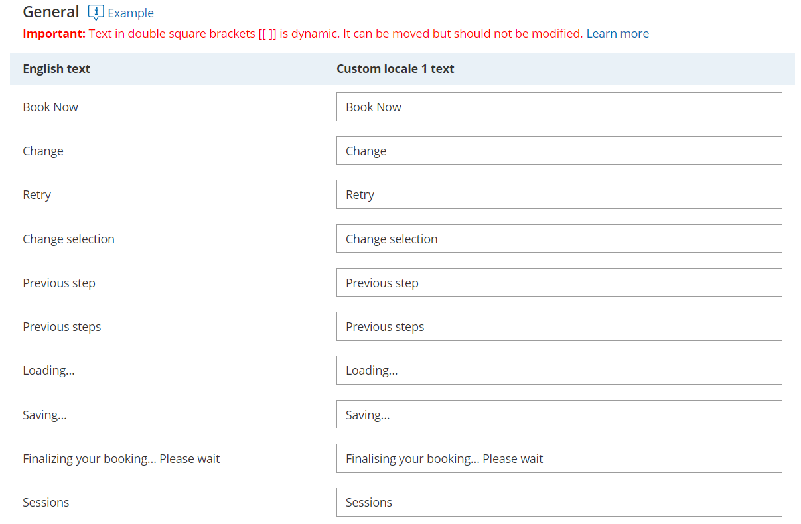

import { Aside } from '@astrojs/starlight/components';

A locale is a collection of settings that define the Customer interface language and the date/time formats of your pages. A locale defines every line of text on your Booking pages, including instructions, tooltips, buttons, and more. 

You can use System locales provided out of the box or create Custom locales, which allow you to edit Customer interface text. System and Custom locales are managed in the [Localization editor](/the-localization-editor/ "The Localization editor"), and can be applied to [Booking pages](/introduction-to-booking-pages/ "Introduction to Booking pages") and [Master pages](/introduction-to-master-pages/ "Introduction to Master pages"). 

In this article, you'll learn about the differences between System locales and Custom locales.

```
&lt;script id="snippet-prepend">
$(function()&#123;
  
  /*disable in widget*/
  if($('.w-documentation-article').length === 0)&#123;

     var ToC =
  "&lt;nav role='navigation' class='table-of-contents toc-top'><h4>In this article:" + "<ul>";
     var el,     title, link, header;
      //Define the heading levels you want to use in ascending order. Can add extra or remove unneeded.
     $(".hg-article-body h1, .hg-article-body h2, .hg-article-body h3, .hg-article-body h4").each(function() &#123;
              el = $(this);
              title = el.text();
                 if(title != '')&#123;
                anchorTitle = el.text().replace(/([~!@#$%^&*()_+=`&#123;&#125;\[\]\|\\:;'&lt;>,.\/\? ])+/g, '-').toLowerCase();
                link = "#" + anchorTitle;
                //Set all headers to a 0-nesting level.
                header = 'header-nesting-0';
                //Adjust header-nesting layers so that they point to the correct html tag. header-nesting-1 should match the second .hg-article-body h# listed above; header-nesting-2 should match the third, etc.
                if($(this).is('h2'))&#123;
                    header = 'header-nesting-1';
                &#125;else if($(this).is('h3'))&#123;
                    header = 'header-nesting-2'
                &#125;
                el.html('<a id="'+anchorTitle+'" class="toc-anchor">' + el.html());
                newLine =
      "<li class='"+header+"'>" +
        "<a class='article-anchor' href='" + link + "'>" +
          title +
        "" +
      "";


                ToC += newLine;
              &#125;
              &#125;);
     ToC +=
   "" +
  "";
    $("#snippet-prepend").before(ToC);
  &#125;
&#125;);

&lt;/script>
```

```
&lt;style>
/* CSS to style the TOC as it displays and the auto-created anchors
.toc-top styles the box for the TOC; adjust styles here to tweak look and feel */
  
.toc-top &#123;
  background-color: #FAFAFA; /* set to #fff or delete entirely for no background */
  border: 1px solid #C8C8C8; /* adjust the color hex here to change border color */
  box-shadow: 0 1px 1px rgba(0, 0, 0, 0.05) inset;
  margin-top: 24px;
  margin-bottom: 36px;
  min-height: 20px;
  padding: 13px 20px;
  max-width: 75%;
&#125;
.toc-top h4 &#123;
  font-size: 18px;
  line-height: 26px;
  margin: 0 0 8px;
  font-weight: 400;
&#125;
.toc-top ul &#123;
  padding: 0 0 0 15px !important;
  margin-bottom: 0;	
&#125;
.toc-top > ul &#123;
  margin-bottom: 13px!important;
&#125;
.toc-anchor &#123;
  display: block;
  height: 90px; 
  margin-top: -90px; 
  visibility: hidden;
&#125;

/* Set the indentation for the nesting levels. May need to be edited to match changes above. Increase or decrease the margin-left to get your desired level of indentation. */
.header-nesting-1 &#123;
    margin-left: 14px;
&#125;
.header-nesting-1:before &#123;
	background-image: url(https://dyzz9obi78pm5.cloudfront.net/app/image/id/5d31bcc88e121c9b25ba22c4/n/bulletv2.svg)!important;
&#125;
.header-nesting-2 &#123;
    margin-left: 28px;
&#125;
.header-nesting-2:before &#123;
	background-image: url(https://dyzz9obi78pm5.cloudfront.net/app/image/id/5d31be536e121cf22b0cc6ae/n/bulletv3.svg)!important;
&#125;
&lt;/style>
```

# System locales

Every account is created with the following seven **System locales** out-of-the-box:

*   English (US)
*   English (UK)
*   French
*   German
*   Spanish
*   Portuguese (Brazil)
*   Dutch

Each System locale comes with its own set of language-appropriate and culture-appropriate Dynamic values which are automatically translated when viewed by the Customer.

# Custom locales

You can create **Custom locales** which allow for both date/time format modification and [Customer interface text editing](/editing-customer-interface-text/ "Editing Customer interface text"). Custom locales are created by duplicating an existing locale.

Custom locales enable you to [modify any Customer interface text](/editing-customer-interface-text/ "Editing Customer interface text"). All texts are editable and can be found by using the browser search function (Ctrl + F on Windows or ⌘ + F on Mac). Find the string in **English text** in the left column and edit the translation of it in the right column according to the selected locale (Figure 1).

Figure 1: General section of the Localization editor

# Comparison of System and Custom locales

<table class="table-bordered"><tbody><tr><td><br /></td><td><strong>System locale</strong></td><td><strong>Custom locale</strong></td></tr><tr><td>Translation of Dynamic values including: <ul><li>Time zones</li><li>Countries</li><li>States</li><li>Locations </li><li>Country codes</li><li>Months</li><li>Days of the week</li></ul></td><td>Dynamic values will be automatically translated into the selected language when viewed by the Customer.<br />Note: To prevent conflicts, these values are fixed and cannot be edited.<br /></td><td>Dynamic values will always reflect the parent locale from which they were duplicated.<br />Note: To prevent conflicts, these values are fixed and cannot be edited.</td></tr><tr><td>Date and time format</td><td>Each System locale is preconfigured with date/time formats to match the target locale.<br /><br />You can customize these formats if your Customers expect them to be different.</td><td>The date/time formats will always reflect the parent locale from which they were duplicated.<br /><br />You can customize these formats if your Customers expect them to be different.</td></tr><tr><td>Customer interface strings</td><td>Screen text, tooltips, button, and links for each part of the Customer scheduling process are automatically translated for each locale. This text cannot be edited.<br /><p>To edit any Customer interface text, you will need to <a href="https://oncehub.knowledgeowl.com/help/the-localization-editor" title="The Localization editor">create a Custom locale</a>. </p></td><td>You can <a href="https://oncehub.knowledgeowl.com/help/editing-customer-interface-text" title="Editing Customer interface text">modify any Customer interface text</a>. </td></tr></tbody></table>