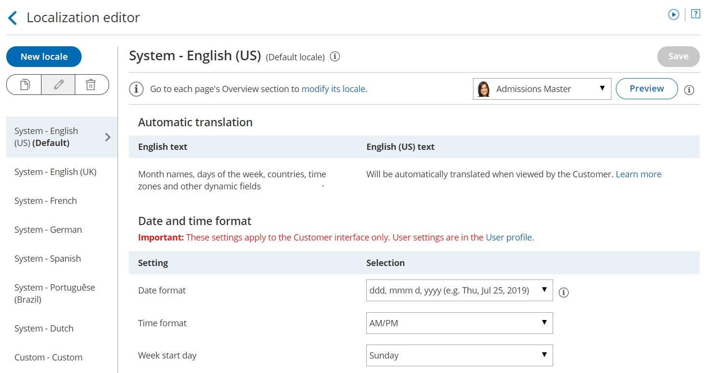
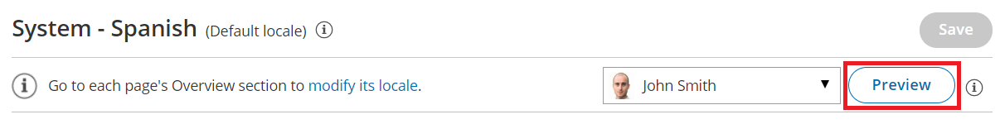
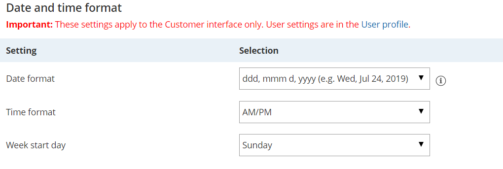

import { Aside } from '@astrojs/starlight/components';

The Localization editor allows you to localize the customer scheduling experience by applying different languages and date and time formats to your Booking pages.

In this article, you'll learn about the Localization editor. 

```
&lt;script id="snippet-prepend">
$(function()&#123;
  
  /*disable in widget*/
  if($('.w-documentation-article').length === 0)&#123;

     var ToC =
  "&lt;nav role='navigation' class='table-of-contents toc-top'><h4>In this article:" + "<ul>";
     var el,     title, link, header;
      //Define the heading levels you want to use in ascending order. Can add extra or remove unneeded.
     $(".hg-article-body h1, .hg-article-body h2, .hg-article-body h3, .hg-article-body h4").each(function() &#123;
              el = $(this);
              title = el.text();
                 if(title != '')&#123;
                anchorTitle = el.text().replace(/([~!@#$%^&*()_+=`&#123;&#125;\[\]\|\\:;'&lt;>,.\/\? ])+/g, '-').toLowerCase();
                link = "#" + anchorTitle;
                //Set all headers to a 0-nesting level.
                header = 'header-nesting-0';
                //Adjust header-nesting layers so that they point to the correct html tag. header-nesting-1 should match the second .hg-article-body h# listed above; header-nesting-2 should match the third, etc.
                if($(this).is('h2'))&#123;
                    header = 'header-nesting-1';
                &#125;else if($(this).is('h3'))&#123;
                    header = 'header-nesting-2'
                &#125;
                el.html('<a id="'+anchorTitle+'" class="toc-anchor">' + el.html());
                newLine =
      "<li class='"+header+"'>" +
        "<a class='article-anchor' href='" + link + "'>" +
          title +
        "" +
      "";


                ToC += newLine;
              &#125;
              &#125;);
     ToC +=
   "" +
  "";
    $("#snippet-prepend").before(ToC);
  &#125;
&#125;);

&lt;/script>
```

```
&lt;style>
/* CSS to style the TOC as it displays and the auto-created anchors
.toc-top styles the box for the TOC; adjust styles here to tweak look and feel */
  
.toc-top &#123;
  background-color: #FAFAFA; /* set to #fff or delete entirely for no background */
  border: 1px solid #C8C8C8; /* adjust the color hex here to change border color */
  box-shadow: 0 1px 1px rgba(0, 0, 0, 0.05) inset;
  margin-top: 24px;
  margin-bottom: 36px;
  min-height: 20px;
  padding: 13px 20px;
  max-width: 75%;
&#125;
.toc-top h4 &#123;
  font-size: 18px;
  line-height: 26px;
  margin: 0 0 8px;
  font-weight: 400;
&#125;
.toc-top ul &#123;
  padding: 0 0 0 15px !important;
  margin-bottom: 0;	
&#125;
.toc-top > ul &#123;
  margin-bottom: 13px!important;
&#125;
.toc-anchor &#123;
  display: block;
  height: 90px; 
  margin-top: -90px; 
  visibility: hidden;
&#125;

/* Set the indentation for the nesting levels. May need to be edited to match changes above. Increase or decrease the margin-left to get your desired level of indentation. */
.header-nesting-1 &#123;
    margin-left: 14px;
&#125;
.header-nesting-1:before &#123;
	background-image: url(https://dyzz9obi78pm5.cloudfront.net/app/image/id/5d31bcc88e121c9b25ba22c4/n/bulletv2.svg)!important;
&#125;
.header-nesting-2 &#123;
    margin-left: 28px;
&#125;
.header-nesting-2:before &#123;
	background-image: url(https://dyzz9obi78pm5.cloudfront.net/app/image/id/5d31be536e121cf22b0cc6ae/n/bulletv3.svg)!important;
&#125;
&lt;/style>
```

# Requirements

To access the Localization editor, you must be a [OnceHub Administrator](/user-type-member-vs-admin-team-manager/ "Differences between Administrator and Member"). However, you do not need an assigned product license. [Learn more](/common-use-cases-for-users-without-a-scheduleonce-license/)

# Location of the Localization editor

To access the Localization editor, go to **Booking pages** in the bar on the left. Select **Localization editor** on the left (Figure 1).

Figure 1: The Localization editor

# Locales list

All the locales of the account are managed in the left column. A locale defines the language and the date/time formats that are seen by Customers. Each locale is a collection of settings that define the following aspects of the customer experience:

*   Language and wording of the [Customer interface text](/editing-customer-interface-text/ "Editing Customer interface text").
*   Dynamic values, including time zone names, days of the week, month names, and countries.
*   Date format
*   Time format
*   Week start day

Locales are centrally managed in the **Localization editor**. To view the properties of a locale, click on it in the locales list. 

## Duplicate locale

You can duplicate any locale. To duplicate a locale, select it from the list on the left hand side of the screen and then click the **Duplicate** icon (Figure 2).

Figure 2: Click the Duplicate icon to duplicate a locale

## Create a custom locale

 You can create custom locales by duplicating and then editing existing locales. To create a custom, click the **New locale** button (Figure 3). In the **Custom locale** pop-up, enter a name and select which locale you would like to duplicate from. 

Figure 3: New Locale button

## Rename a locale

To rename a locale, select a locale from the list on the left hand side of the screen and then click the **Rename locale** icon (Figure 4).

Figure 4: Rename locale button

## Delete a locale

To delete a locale, select a locale from the list on the left hand side of the screen and then click the **Delete** icon (Figure 5).

Figure 5: Delete locale button

**Note**

System locales cannot be renamed or deleted. To customize a locale, you'll need to duplicate it first. 

# Set a default locale

Any locale can be set as the account default. To set a locale as your default locale, select the desired locale from the locale list and then click **Set as default locale** at the top of the page (Figure 6). 

Figure 6: Set your default locale

The default locale will be automatically applied to any newly created page, but existing pages will not be affected. To modify the locale of an existing page, go the pages Overview section. [Learn more about applying a locale](/applying-a-locale/ "Applying a Locale")

# Preview a locale on a Booking page or Master page

You can preview a locale on any Booking page or Master page. Previewing a locale does not apply the locale to the page.

1.  To preview a locale, use the drop-down menu to select the Booking page or Master page you want to preview the locale on. 
2.  Then, click the **Preview** button (Figure 7). 

Figure 7: Preview button

## Automatic translation

Each System locale comes with its own set of language- and culture-appropriate Dynamic values. This includes time zones, countries, states, locations, country codes, months, and days of the week. These values will be automatically translated when viewed by the Customer. 

**Note** These values are fixed and cannot be edited, to prevent conflicts.

## Date and time format

You can set the date/time format and week start day. Default settings are pre-selected for each language, but you can update them further to match your target audience preferences.

Figure 8: Date and time format settings

**Note** Changes you make to the date and time format settings in the Localization editor only apply to the Customer interface. To edit User date and time settings, go to the [User profile](/editing-user-profile/ "Editing other User profiles").

## Customer interface strings

You can customize screen text, tooltips, button and links for each part of the Customer scheduling process. 

*   General 
*   Time-zone-confirmation pop-up
*   Duration pop-up
*   Date and time step
*   Booking form step
*   Confirmation page
*   Cancel/reschedule process
*   Payment process
*   No times available
*   Deleted Booking page

This text can't be edited in System locales. To edit this text, you'll need to [create a custom New locale](/editing-customer-interface-text/ "Editing Customer interface text").