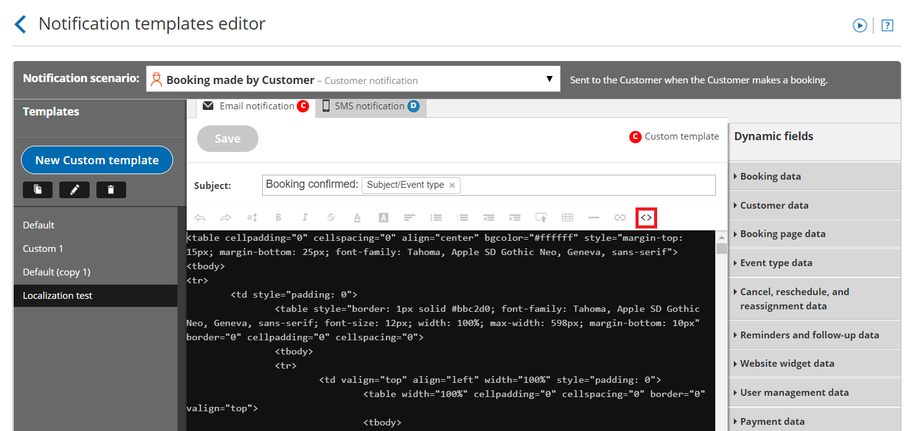

import { Aside } from '@astrojs/starlight/components';

The [Notification templates editor](/introduction-to-the-notification-templates-editor/ "Introduction to the Notification templates editor") is used to customize the content and look and feel of the emails to your Customers and Users. The template editor has two modes, [WYSIWYG (What You See Is What You Get)](/the-wysiwyg-mode-of-the-notification-templates-editor/ "The WYSIWYG mode of the Notification templates editor") and HTML. The HTML mode allows you to edit the HTML code directly and is only recommended for advanced Users.

In this article, you'll learn about the best practices for creating HTML templates.

You do not need an assigned product license to access the Notification templates editor, though you do need to be an Administrator. [Learn more](/common-use-cases-for-users-without-a-scheduleonce-license/)

To access the Notification templates editor, go in the top navigation menu to **Booking pages** in the bar on the left → Select the **Notification templates editor** on the left.

```
&lt;script id="snippet-prepend">
$(function()&#123;
  
  /*disable in widget*/
  if($('.w-documentation-article').length === 0)&#123;

     var ToC =
  "&lt;nav role='navigation' class='table-of-contents toc-top'><h4>In this article:" + "<ul>";
     var el,     title, link, header;
      //Define the heading levels you want to use in ascending order. Can add extra or remove unneeded.
     $(".hg-article-body h1, .hg-article-body h2, .hg-article-body h3, .hg-article-body h4").each(function() &#123;
              el = $(this);
              title = el.text();
                 if(title != '')&#123;
                anchorTitle = el.text().replace(/([~!@#$%^&*()_+=`&#123;&#125;\[\]\|\\:;'&lt;>,.\/\? ])+/g, '-').toLowerCase();
                link = "#" + anchorTitle;
                //Set all headers to a 0-nesting level.
                header = 'header-nesting-0';
                //Adjust header-nesting layers so that they point to the correct html tag. header-nesting-1 should match the second .hg-article-body h# listed above; header-nesting-2 should match the third, etc.
                if($(this).is('h2'))&#123;
                    header = 'header-nesting-1';
                &#125;else if($(this).is('h3'))&#123;
                    header = 'header-nesting-2'
                &#125;
                el.html('<a id="'+anchorTitle+'" class="toc-anchor">' + el.html());
                newLine =
      "<li class='"+header+"'>" +
        "<a class='article-anchor' href='" + link + "'>" +
          title +
        "" +
      "";


                ToC += newLine;
              &#125;
              &#125;);
     ToC +=
   "" +
  "";
    $("#snippet-prepend").before(ToC);
  &#125;
&#125;);

&lt;/script>
```

```
&lt;style>
/* CSS to style the TOC as it displays and the auto-created anchors
.toc-top styles the box for the TOC; adjust styles here to tweak look and feel */
  
.toc-top &#123;
  background-color: #FAFAFA; /* set to #fff or delete entirely for no background */
  border: 1px solid #C8C8C8; /* adjust the color hex here to change border color */
  box-shadow: 0 1px 1px rgba(0, 0, 0, 0.05) inset;
  margin-top: 24px;
  margin-bottom: 36px;
  min-height: 20px;
  padding: 13px 20px;
  max-width: 75%;
&#125;
.toc-top h4 &#123;
  font-size: 18px;
  line-height: 26px;
  margin: 0 0 8px;
  font-weight: 400;
&#125;
.toc-top ul &#123;
  padding: 0 0 0 15px !important;
  margin-bottom: 0;	
&#125;
.toc-top > ul &#123;
  margin-bottom: 13px!important;
&#125;
.toc-anchor &#123;
  display: block;
  height: 90px; 
  margin-top: -90px; 
  visibility: hidden;
&#125;

/* Set the indentation for the nesting levels. May need to be edited to match changes above. Increase or decrease the margin-left to get your desired level of indentation. */
.header-nesting-1 &#123;
    margin-left: 14px;
&#125;
.header-nesting-1:before &#123;
	background-image: url(https://dyzz9obi78pm5.cloudfront.net/app/image/id/5d31bcc88e121c9b25ba22c4/n/bulletv2.svg)!important;
&#125;
.header-nesting-2 &#123;
    margin-left: 28px;
&#125;
.header-nesting-2:before &#123;
	background-image: url(https://dyzz9obi78pm5.cloudfront.net/app/image/id/5d31be536e121cf22b0cc6ae/n/bulletv3.svg)!important;
&#125;
&lt;/style>
```

# Accessing HTML mode

To edit your Notification template in HTML mode, open the Notification templates editor and click the **HTML** button in the template editor toolbar (Figure 1).

Figure 1: Accessing HTML mode

# Best practices for creating HTML templates

Whether you're making a few changes to a Default template or coding your own template from scratch, it's good to know the best practices for creating HTML emails. Following these HTML best practices will ensure that the formatting of your emails is consistent in different email clients, help keep your emails out of Spam folders, and make your emails more likely to be opened and read.

## Maintain uniform format in different email clients

*   Keep the width of the email under 600 pixels. This width is supported by all email clients. Not every email client supports widths larger than this. 
*   Don't use images in PNG format. Some email clients don't support it.
*   Write all text in a table. Tables keep alignment consistent across different email clients.  Most emails look best using a one column table that has a row for each paragraph. Be sure to make the table borders invisible if you don’t want them to show. 

**Note**Custom email templates created via the "copy" function in the Notification templates editor include a table with invisible borders. You can use this table and delete the text as necessary.  [Learn how to create a Custom template](/how-to-create-a-custom-email-or-sms-template/ "How to create a Custom email or SMS template")

## Keep your emails out of Spam folders

*   **Avoid writing phrases in ALL CAPS:** Writing in all caps is seen as shouting and is a potential Spam trigger.
*   **Keep your text simple:** The majority of your email should be written in black text with a normal-sized font. Large fonts and colors should be used sparingly. Text written in large fonts and in bright colors is a potential Spam trigger.
*   **Avoid using lots of images:** This is a potential Spam trigger, and it also takes away from your message.

## Increase the chances of your emails being opened and read

*   **Keep subject lines clear and to the point:** Email subjects should give a good preview of what your email message is about. If recipients realize the message is important, they're more likely to open it. 
*   **Use bullets or lists for important points:** Bullets and lists are easier to read and skim. For example, the OnceHub Default templates use very few full sentences. The majority of the information is in organized lists. 
*   **Keep the message short:** Some of your Users and Customers receive hundreds of email messages a day. They don’t have time to read extra stuff. They simply want to get the information they need and to move on. 
*   **Avoid marketing-speak:** Messages that are to-the-point are better received.  Anyone receiving a booking-related email from you is already engaged and does not need to be inundated with marketing messages. 
*   **Have a clear call-to-action:** It should be clear what, if any, next steps the User or Customer needs to take. For example, the Default template used for the **Reschedule** **requested by User** emails includes a button that the Customer can click to reschedule the meeting.

# Best practices for advanced Users working in HTML mode

*   Use standards-compliant HTML and avoid shortcuts. 
*   Use clean, inline CSS and avoid shorthand CSS. 
*   Don’t use Flash or Javascript or other dynamic scripts. Most email clients turn content created with these languages off by default.
*   Use alternative text in images. Many email clients turn images off by default. The alternative text tells the receiver what the image contains.