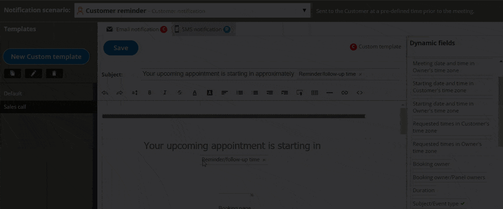
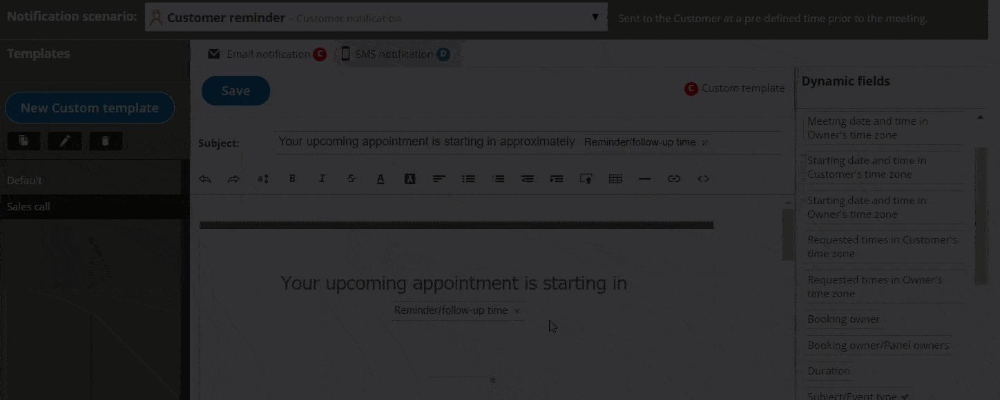

import { Aside } from '@astrojs/starlight/components';

You can add Dynamic fields to Notification templates to populate emails and SMS notifications with customized data. 

In this article, you'll learn about Dynamic fields. 

```
&lt;script id="snippet-prepend">
$(function()&#123;
  
  /*disable in widget*/
  if($('.w-documentation-article').length === 0)&#123;

     var ToC =
  "&lt;nav role='navigation' class='table-of-contents toc-top'><h4>In this article:" + "<ul>";
     var el,     title, link, header;
      //Define the heading levels you want to use in ascending order. Can add extra or remove unneeded.
     $(".hg-article-body h1, .hg-article-body h2, .hg-article-body h3, .hg-article-body h4").each(function() &#123;
              el = $(this);
              title = el.text();
                 if(title != '')&#123;
                anchorTitle = el.text().replace(/([~!@#$%^&*()_+=`&#123;&#125;\[\]\|\\:;'&lt;>,.\/\? ])+/g, '-').toLowerCase();
                link = "#" + anchorTitle;
                //Set all headers to a 0-nesting level.
                header = 'header-nesting-0';
                //Adjust header-nesting layers so that they point to the correct html tag. header-nesting-1 should match the second .hg-article-body h# listed above; header-nesting-2 should match the third, etc.
                if($(this).is('h2'))&#123;
                    header = 'header-nesting-1';
                &#125;else if($(this).is('h3'))&#123;
                    header = 'header-nesting-2'
                &#125;
                el.html('<a id="'+anchorTitle+'" class="toc-anchor">' + el.html());
                newLine =
      "<li class='"+header+"'>" +
        "<a class='article-anchor' href='" + link + "'>" +
          title +
        "" +
      "";


                ToC += newLine;
              &#125;
              &#125;);
     ToC +=
   "" +
  "";
    $("#snippet-prepend").before(ToC);
  &#125;
&#125;);

&lt;/script>
```

```
&lt;style>
/* CSS to style the TOC as it displays and the auto-created anchors
.toc-top styles the box for the TOC; adjust styles here to tweak look and feel */
  
.toc-top &#123;
  background-color: #FAFAFA; /* set to #fff or delete entirely for no background */
  border: 1px solid #C8C8C8; /* adjust the color hex here to change border color */
  box-shadow: 0 1px 1px rgba(0, 0, 0, 0.05) inset;
  margin-top: 24px;
  margin-bottom: 36px;
  min-height: 20px;
  padding: 13px 20px;
  max-width: 75%;
&#125;
.toc-top h4 &#123;
  font-size: 18px;
  line-height: 26px;
  margin: 0 0 8px;
  font-weight: 400;
&#125;
.toc-top ul &#123;
  padding: 0 0 0 15px !important;
  margin-bottom: 0;	
&#125;
.toc-top > ul &#123;
  margin-bottom: 13px!important;
&#125;
.toc-anchor &#123;
  display: block;
  height: 90px; 
  margin-top: -90px; 
  visibility: hidden;
&#125;

/* Set the indentation for the nesting levels. May need to be edited to match changes above. Increase or decrease the margin-left to get your desired level of indentation. */
.header-nesting-1 &#123;
    margin-left: 14px;
&#125;
.header-nesting-1:before &#123;
	background-image: url(https://dyzz9obi78pm5.cloudfront.net/app/image/id/5d31bcc88e121c9b25ba22c4/n/bulletv2.svg)!important;
&#125;
.header-nesting-2 &#123;
    margin-left: 28px;
&#125;
.header-nesting-2:before &#123;
	background-image: url(https://dyzz9obi78pm5.cloudfront.net/app/image/id/5d31be536e121cf22b0cc6ae/n/bulletv3.svg)!important;
&#125;
&lt;/style>
```

# How do Dynamic fields work?

Dynamic fields allow you to create email and [SMS notifications](/getting-started-with-oncehub/introduction-to-oncehub/introduction-to-sms-notifications/ "Introduction to SMS notifications") that contain specific information related to your bookings and are personalized for the Customer and User.

For example, let’s say you want to start a confirmation email with a personalized greeting. To do this, you'll insert the dynamic field called **Customer name** into the template. Once you do this, every confirmation email will start with "Dear &lt;Customer name>". OnceHub will insert the name the Customer provided in the [Booking form](/booking-form/ "Collecting Customer data with Booking forms") where you defined that the field "Customer name" should be.

# Where do Dynamic fields get data from?

OnceHub provides over 80 Dynamic fields to choose from. Dynamic fields contain information taken from:

*   Booking details.
*   Customer information from the [Booking form](/introduction-to-the-booking-forms-editor/ "Introduction to the Booking Forms Editor").
*   [Booking page](/introduction-to-booking-pages/ "Introduction to Booking pages") details.
*   [Event type](/introduction-to-event-types/ "Introduction to Event types") details.
*   [Canceling and rescheduling data](/introduction-to-canceling-and-rescheduling/ "Introduction to canceling and rescheduling").
*   [Reassignment](/introduction-to-booking-reassignment/ "Introduction to Booking reassignment") details.
*   Reminders and Follow-up settings.
*   Website widget data.
*   User details.
*   CRM data.
*   [Custom fields](/creating-and-editing-custom-fields/ "Creating and editing Custom fields") created in the Booking forms editor.
*   Payment data.

**Note** Payment data is specified per transaction rather than per activity. Therefore, one activity may have a number of transactions. For example, a single booking may have a rescheduling fee and a refund.

# Adding Dynamic fields to your notification template

1.  [Create a Custom template](/how-to-create-a-custom-email-or-sms-template/ "How to create a Custom email or SMS template").
2.  Place the cursor in the template editor text box where you want to insert the Dynamic field (Figure 1).  
    Figure 5: Place the cursor in the template editor text box
3.  In the **Dynamic Fields** column on the right, click the Dynamic field you want to add (Figure 2).  
    Figure 2: Add a Dynamic field
4.  The chosen Dynamic field will appear in the selected location in the template.

To remove a Dynamic field, click on the **X** next to the Dynamic field you want to remove.

**Note**When you use Dynamic fields, you need to be sure that the data exists in your scheduling scenario. 

For example, **Event type price** is one of the Dynamic fields available to you. However, if you do not enter an Event type price in the [Payment/cancel and reschedule policy section](/event-type-payment-and-cancelreschedule-policy-section/ "Event type: Payment and cancel/reschedule policy section"), no data will be displayed for this field in your emails and SMS notifications.

# Dynamic fields and localization 

When [Customer notifications](/notifications-to-customers/ "Notifications to Customers") based on [Custom templates](/should-i-use-a-default-or-custom-template/ "Should I use a Default or Custom Template?") are sent, Dynamic fields such as time zone, country and location are shown in the locale (language) [selected on the Booking page](/applying-a-locale/ "Applying a Locale"). The date/time format also follows the selected locale. In all other cases, Dynamic fields are shown in English, and the date/time format follows User profile settings. [Learn more about localization](/editing-customer-interface-text/ "Editing Customer interface text")

<table class="table-bordered"><tbody><tr><td><span style="font-size: 10px;"><br /></span></td><td><strong>Default templates<span style="font-size: 10px;"><br /></span></strong></td><td><strong>Custom templates<span style="font-size: 10px;"><br /></span></strong></td></tr><tr><td>User notifications by email and SMS<span style="font-size: 10px;"><br /></span></td><td>OnceHub Dynamic fields are shown in English.<br /><br />Date/time format follows <a href="https://help.oncehub.com/help/managing-your-profile-in-oncehub#datetime" title="Profile: Date and time section">User profile settings</a>.<span style="font-size: 10px;"><br /></span></td><td>OnceHub Dynamic fields are shown in English.<br /><br />Date/time format follows <a href="https://help.oncehub.com/help/managing-your-profile-in-oncehub#datetime" title="Profile: Date and time section">User profile settings</a>.<span style="font-size: 10px;"><br /></span></td></tr><tr><td>Customer notifications by email and SMS, and the Calendar event<span style="font-size: 10px;"><br /></span></td><td>OnceHub Dynamic fields are shown in English.<br /><br />Date/time format follows <a href="https://help.oncehub.com/help/managing-your-profile-in-oncehub#datetime" title="Profile: Date and time section">User profile settings</a>.<span style="font-size: 10px;"><br /></span></td><td>OnceHub dynamic fields such as time zone, country, and location are shown in the locale (language) <a href="https://oncehub.knowledgeowl.com/help/applying-a-locale" title="Applying a Locale">selected on the Booking page</a>.<br /><br />Date/time format follows <a href="https://oncehub.knowledgeowl.com/help/the-localization-editor" title="The Localization editor">locale settings</a>.<span style="font-size: 10px;"><br /></span></td></tr></tbody></table>