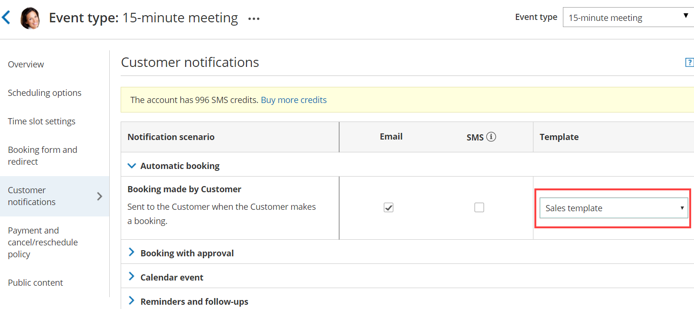
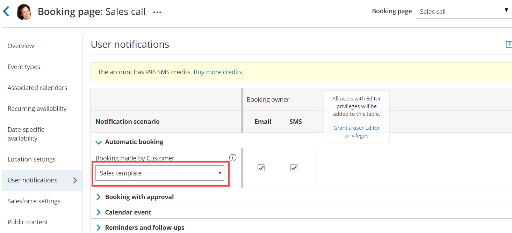

import { Aside } from '@astrojs/starlight/components';

You can test your [Custom templates](/how-to-create-a-custom-email-or-sms-template/ "How to create a Custom email or SMS template") by creating a test booking and filling out a Booking form as if you were a Customer. You can perform several of these test bookings to test every template you have created in every relevant scenario. 

In this article, you'll learn how to test a Custom notification template.

```
&lt;script id="snippet-prepend">
$(function()&#123;
  
  /*disable in widget*/
  if($('.w-documentation-article').length === 0)&#123;

     var ToC =
  "&lt;nav role='navigation' class='table-of-contents toc-top'><h4>In this article:" + "<ul>";
     var el,     title, link, header;
      //Define the heading levels you want to use in ascending order. Can add extra or remove unneeded.
     $(".hg-article-body h1, .hg-article-body h2, .hg-article-body h3, .hg-article-body h4").each(function() &#123;
              el = $(this);
              title = el.text();
                 if(title != '')&#123;
                anchorTitle = el.text().replace(/([~!@#$%^&*()_+=`&#123;&#125;\[\]\|\\:;'&lt;>,.\/\? ])+/g, '-').toLowerCase();
                link = "#" + anchorTitle;
                //Set all headers to a 0-nesting level.
                header = 'header-nesting-0';
                //Adjust header-nesting layers so that they point to the correct html tag. header-nesting-1 should match the second .hg-article-body h# listed above; header-nesting-2 should match the third, etc.
                if($(this).is('h2'))&#123;
                    header = 'header-nesting-1';
                &#125;else if($(this).is('h3'))&#123;
                    header = 'header-nesting-2'
                &#125;
                el.html('<a id="'+anchorTitle+'" class="toc-anchor">' + el.html());
                newLine =
      "<li class='"+header+"'>" +
        "<a class='article-anchor' href='" + link + "'>" +
          title +
        "" +
      "";


                ToC += newLine;
              &#125;
              &#125;);
     ToC +=
   "" +
  "";
    $("#snippet-prepend").before(ToC);
  &#125;
&#125;);

&lt;/script>
```

```
&lt;style>
/* CSS to style the TOC as it displays and the auto-created anchors
.toc-top styles the box for the TOC; adjust styles here to tweak look and feel */
  
.toc-top &#123;
  background-color: #FAFAFA; /* set to #fff or delete entirely for no background */
  border: 1px solid #C8C8C8; /* adjust the color hex here to change border color */
  box-shadow: 0 1px 1px rgba(0, 0, 0, 0.05) inset;
  margin-top: 24px;
  margin-bottom: 36px;
  min-height: 20px;
  padding: 13px 20px;
  max-width: 75%;
&#125;
.toc-top h4 &#123;
  font-size: 18px;
  line-height: 26px;
  margin: 0 0 8px;
  font-weight: 400;
&#125;
.toc-top ul &#123;
  padding: 0 0 0 15px !important;
  margin-bottom: 0;	
&#125;
.toc-top > ul &#123;
  margin-bottom: 13px!important;
&#125;
.toc-anchor &#123;
  display: block;
  height: 90px; 
  margin-top: -90px; 
  visibility: hidden;
&#125;

/* Set the indentation for the nesting levels. May need to be edited to match changes above. Increase or decrease the margin-left to get your desired level of indentation. */
.header-nesting-1 &#123;
    margin-left: 14px;
&#125;
.header-nesting-1:before &#123;
	background-image: url(https://dyzz9obi78pm5.cloudfront.net/app/image/id/5d31bcc88e121c9b25ba22c4/n/bulletv2.svg)!important;
&#125;
.header-nesting-2 &#123;
    margin-left: 28px;
&#125;
.header-nesting-2:before &#123;
	background-image: url(https://dyzz9obi78pm5.cloudfront.net/app/image/id/5d31be536e121cf22b0cc6ae/n/bulletv3.svg)!important;
&#125;
&lt;/style>
```

# Testing the Custom notification template

1.  In the [Booking form section](/introduction-to-the-booking-form-redirect-section/ "Introduction to the Booking form and redirect section") of your [Event type](/event-type-sections/ "Location of the Booking form and the Customer notifications sections"), use from the **Booking form** drop-down menu to select a Booking form (Figure 1).  
    Figure 1: Selecting a Booking form template
2.  In the [Customer notification section](/introduction-to-customer-notifications/ "The Customer Notifications section") of your Event type, select a template for each [Notification scenario](/notification-scenarios/ "Notification scenarios") you want to send notifications for (Figure 2).  
    Figure 2: Choosing a Custom notification template for each Notification scenario
3.  In the [User notifications section](/introduction-to-user-notifications/ "Introduction to User notifications section") of your Booking page, select a template for each [Notification scenario](/notification-scenarios/ "Notification scenarios") you want to send notifications for (Figure 3).  
    Figure 3: Choosing a Custom notification template for each Notification scenario
    
    **Note**If you want to receive [User SMS notifications](/sending-sms-notifications-to-users/ "Sending SMS notifications to Users"), you'll need to enter a phone number in your [Profile's SMS notifications section](/managing-your-profile-in-oncehub#notifications/ "Profile: Overview section").
    
4.  In the [Booking page Overview section](/booking-page-overview-section/ "Booking page: Overview section") of your Booking page, click on the public link in the **Share & Publish** section. Figure 4: Booking page public link
5.  Schedule a meeting and fill out the Booking form that you created as if you were a Customer. 
6.  Click **Done**.
7.  You can now check that you received a confirmation email and SMS.  
    If you're using [Booking with approval mode](/automatic-booking-or-booking-with-approval/ "Automatic booking or Booking with approval"), you can click **Approve the booking request** in your User email notification. [Learn more about scheduling booking requests](/scheduling-and-responding-to-booking-requests/ "Scheduling and responding to booking requests")  
    You can also check that the calendar event was added to your calendar. [Learn more about calendar events](/customer-calendar-event-options/ "Customer Calendar Event options")
8.  Finally, you can choose to [cancel or reschedule the booking](/introduction-to-canceling-and-rescheduling/ "Introduction to canceling and rescheduling"), or let the booking run its course and test the reminder and follow-up messages. 

# Testing checklist

During the testing, you should check the following:

*   The text is written the way you want.
*   The correct [Dynamic fields](/dynamic-fields/ "Dynamic fields") were chosen.
*   The spacing/formatting is correct.
*   That you are sending emails and SMS notifications for the required booking notifications.