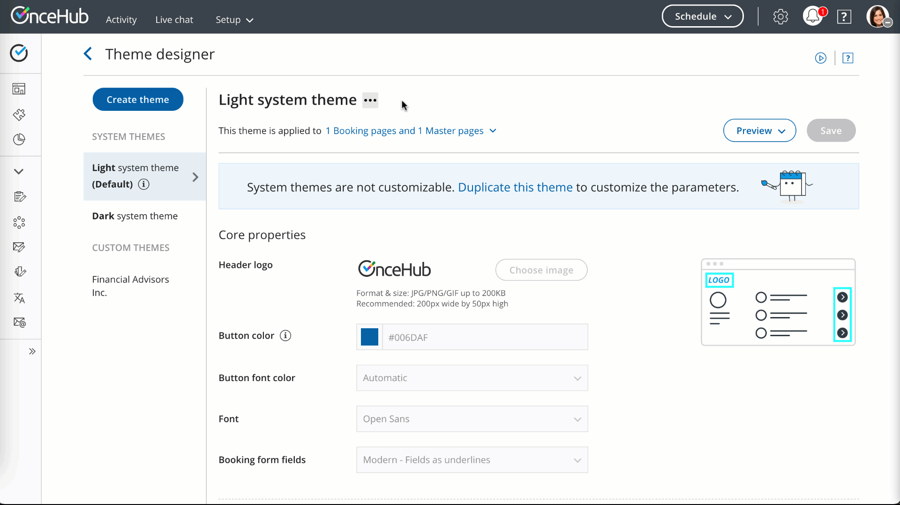

import { Aside } from '@astrojs/starlight/components';

The [Theme designer](/the-theme-designer/ "Introduction to the ScheduleOnce Theme designer") allows you to fully customize the look and feel of your [Booking pages](/introduction-to-booking-pages/ "Introduction to Booking pages") and [Master pages](/introduction-to-master-pages/ "Introduction to Master Pages"). 

The Theme designer comes with two [system themes](/system-themes/ "System Themes"). If you need more customization for your theme, you can create a custom theme by duplicating an existing theme and modifying it, or you can create a new custom theme from scratch. 

You do not need an assigned product license to create custom themes in the Theme designer. [Learn more](/common-use-cases-for-users-without-a-scheduleonce-license/)

However, you may need to upgrade your plan to apply a custom theme to your page(s). 

In this article, you'll learn about creating a custom theme.

```
&lt;script id="snippet-prepend">
$(function()&#123;
  
  /*disable in widget*/
  if($('.w-documentation-article').length === 0)&#123;

     var ToC =
  "&lt;nav role='navigation' class='table-of-contents toc-top'><h4>In this article:" + "<ul>";
     var el,     title, link, header;
      //Define the heading levels you want to use in ascending order. Can add extra or remove unneeded.
     $(".hg-article-body h1, .hg-article-body h2, .hg-article-body h3, .hg-article-body h4").each(function() &#123;
              el = $(this);
              title = el.text();
                 if(title != '')&#123;
                anchorTitle = el.text().replace(/([~!@#$%^&*()_+=`&#123;&#125;\[\]\|\\:;'&lt;>,.\/\? ])+/g, '-').toLowerCase();
                link = "#" + anchorTitle;
                //Set all headers to a 0-nesting level.
                header = 'header-nesting-0';
                //Adjust header-nesting layers so that they point to the correct html tag. header-nesting-1 should match the second .hg-article-body h# listed above; header-nesting-2 should match the third, etc.
                if($(this).is('h2'))&#123;
                    header = 'header-nesting-1';
                &#125;else if($(this).is('h3'))&#123;
                    header = 'header-nesting-2'
                &#125;
                el.html('<a id="'+anchorTitle+'" class="toc-anchor">' + el.html());
                newLine =
      "<li class='"+header+"'>" +
        "<a class='article-anchor' href='" + link + "'>" +
          title +
        "" +
      "";


                ToC += newLine;
              &#125;
              &#125;);
     ToC +=
   "" +
  "";
    $("#snippet-prepend").before(ToC);
  &#125;
&#125;);

&lt;/script>
```

```
&lt;style>
/* CSS to style the TOC as it displays and the auto-created anchors
.toc-top styles the box for the TOC; adjust styles here to tweak look and feel */
  
.toc-top &#123;
  background-color: #FAFAFA; /* set to #fff or delete entirely for no background */
  border: 1px solid #C8C8C8; /* adjust the color hex here to change border color */
  box-shadow: 0 1px 1px rgba(0, 0, 0, 0.05) inset;
  margin-top: 24px;
  margin-bottom: 36px;
  min-height: 20px;
  padding: 13px 20px;
  max-width: 75%;
&#125;
.toc-top h4 &#123;
  font-size: 18px;
  line-height: 26px;
  margin: 0 0 8px;
  font-weight: 400;
&#125;
.toc-top ul &#123;
  padding: 0 0 0 15px !important;
  margin-bottom: 0;	
&#125;
.toc-top > ul &#123;
  margin-bottom: 13px!important;
&#125;
.toc-anchor &#123;
  display: block;
  height: 90px; 
  margin-top: -90px; 
  visibility: hidden;
&#125;

/* Set the indentation for the nesting levels. May need to be edited to match changes above. Increase or decrease the margin-left to get your desired level of indentation. */
.header-nesting-1 &#123;
    margin-left: 14px;
&#125;
.header-nesting-1:before &#123;
	background-image: url(https://dyzz9obi78pm5.cloudfront.net/app/image/id/5d31bcc88e121c9b25ba22c4/n/bulletv2.svg)!important;
&#125;
.header-nesting-2 &#123;
    margin-left: 28px;
&#125;
.header-nesting-2:before &#123;
	background-image: url(https://dyzz9obi78pm5.cloudfront.net/app/image/id/5d31be536e121cf22b0cc6ae/n/bulletv3.svg)!important;
&#125;
&lt;/style>
```

# Creating a custom theme

1.  Go to **Booking pages** in the bar on the left. 
2.  On the left, select **Theme designer**. 
3.  Click the **Create theme** button on the top left corner.
4.  In the **Create theme** pop-up, enter a **Theme name** and select a **Base theme** for your new Custom theme. Then click **Create**.
    
    **Note** The **Base theme** cannot be changed once the theme is created.
    
5.  Alternatively, you can duplicate an existing theme by clicking the **Duplicate theme** button (Figure 2). Figure 2: Duplicate theme button
6.  Configure your custom theme [](https://oncehub.knowledgeowl.com/help/theme-properties "Theme properties")as required by modifying the Core properties (Figure 3), Page background properties, Interaction pane properties, and Information pane properties. [Learn more about Theme properties](/theme-properties/ "Theme properties") Figure 3: Core properties
7.  Click **Save**.

## Default theme 

You can set any theme as your default theme, including a system theme. The default theme is automatically applied to all newly created pages, but not to existing pages.

Figure 4: Default theme

# Previewing and applying a Custom theme

You can preview a theme on a Booking page or Master page by selecting it from the drop-down menu in the top right of the Theme designer and clicking the **Preview** button (Figure 4). Previewing a theme does not apply the theme to the page.

Figure 5: Previewing a theme

Once you're happy with it, you can [apply the theme](/applying-a-theme/ "Applying a theme ").