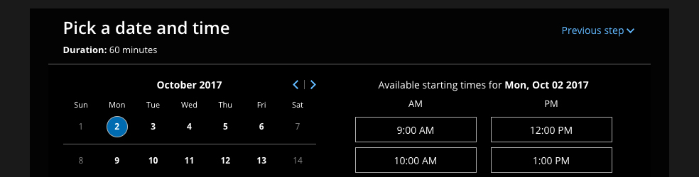

import { Aside } from '@astrojs/starlight/components';

The OnceHub [Theme designer](/the-theme-designer/ "Introduction to the ScheduleOnce Theme designer") provides two system themes for your [Booking pages](/introduction-to-booking-pages/ "Introduction to Booking pages") and [Master pages](/introduction-to-master-pages/ "Introduction to Master pages"). You can use these themes as they are, or adjust them according to your needs. 

In this article, you'll learn about System themes. 

```
&lt;script id="snippet-prepend">
$(function()&#123;
  
  /*disable in widget*/
  if($('.w-documentation-article').length === 0)&#123;

     var ToC =
  "&lt;nav role='navigation' class='table-of-contents toc-top'><h4>In this article:" + "<ul>";
     var el,     title, link, header;
      //Define the heading levels you want to use in ascending order. Can add extra or remove unneeded.
     $(".hg-article-body h1, .hg-article-body h2, .hg-article-body h3, .hg-article-body h4").each(function() &#123;
              el = $(this);
              title = el.text();
                 if(title != '')&#123;
                anchorTitle = el.text().replace(/([~!@#$%^&*()_+=`&#123;&#125;\[\]\|\\:;'&lt;>,.\/\? ])+/g, '-').toLowerCase();
                link = "#" + anchorTitle;
                //Set all headers to a 0-nesting level.
                header = 'header-nesting-0';
                //Adjust header-nesting layers so that they point to the correct html tag. header-nesting-1 should match the second .hg-article-body h# listed above; header-nesting-2 should match the third, etc.
                if($(this).is('h2'))&#123;
                    header = 'header-nesting-1';
                &#125;else if($(this).is('h3'))&#123;
                    header = 'header-nesting-2'
                &#125;
                el.html('<a id="'+anchorTitle+'" class="toc-anchor">' + el.html());
                newLine =
      "<li class='"+header+"'>" +
        "<a class='article-anchor' href='" + link + "'>" +
          title +
        "" +
      "";


                ToC += newLine;
              &#125;
              &#125;);
     ToC +=
   "" +
  "";
    $("#snippet-prepend").before(ToC);
  &#125;
&#125;);

&lt;/script>
```

```
&lt;style>
/* CSS to style the TOC as it displays and the auto-created anchors
.toc-top styles the box for the TOC; adjust styles here to tweak look and feel */
  
.toc-top &#123;
  background-color: #FAFAFA; /* set to #fff or delete entirely for no background */
  border: 1px solid #C8C8C8; /* adjust the color hex here to change border color */
  box-shadow: 0 1px 1px rgba(0, 0, 0, 0.05) inset;
  margin-top: 24px;
  margin-bottom: 36px;
  min-height: 20px;
  padding: 13px 20px;
  max-width: 75%;
&#125;
.toc-top h4 &#123;
  font-size: 18px;
  line-height: 26px;
  margin: 0 0 8px;
  font-weight: 400;
&#125;
.toc-top ul &#123;
  padding: 0 0 0 15px !important;
  margin-bottom: 0;	
&#125;
.toc-top > ul &#123;
  margin-bottom: 13px!important;
&#125;
.toc-anchor &#123;
  display: block;
  height: 90px; 
  margin-top: -90px; 
  visibility: hidden;
&#125;

/* Set the indentation for the nesting levels. May need to be edited to match changes above. Increase or decrease the margin-left to get your desired level of indentation. */
.header-nesting-1 &#123;
    margin-left: 14px;
&#125;
.header-nesting-1:before &#123;
	background-image: url(https://dyzz9obi78pm5.cloudfront.net/app/image/id/5d31bcc88e121c9b25ba22c4/n/bulletv2.svg)!important;
&#125;
.header-nesting-2 &#123;
    margin-left: 28px;
&#125;
.header-nesting-2:before &#123;
	background-image: url(https://dyzz9obi78pm5.cloudfront.net/app/image/id/5d31be536e121cf22b0cc6ae/n/bulletv3.svg)!important;
&#125;
&lt;/style>
```

# Editing a system theme

1.  Go to **Setup -> OnceHub setup** and open the lefthand sidebar. 
2.  In the **Tools** section, select **Theme designer**. 
3.  Select a System theme from the list on the left hand side of the page (Figure 1). 
    
    Figure 1: Select a System theme
    
4.  If required, you can add a **header logo**, edit the **button color**, and edit the **button font color**.
5.  When you're done making changes, click **Save**.

# Theme properties of a System theme

You can customize the following [Theme properties](/theme-properties/ "Theme properties") of a System theme:

*   **Header logo:** This image is visible to your Customers.
*   **Button color:** This is the color of the buttons and other properties on your page. It is intended to attract your Customer's attention to specific elements.
*   **Button font color:** This can be used to maximize contrast against the button background color. We recommend keeping it on **Automatic**.

**Note** If you want to customize additional Theme properties, you'll need to [create a Custom theme](/custom-themes/ "Custom themes"). 

You may need to upgrade your plan to apply a custom theme to your page(s).

# Previewing and applying a System theme

To preview a theme on a Booking page or Master page, select it from the drop-down menu in the top right of the Theme designer and click the **Preview** button (Figure 2). Previewing a theme does not apply the theme to the page.

Figure 2: Preview a System theme

[Learn more about applying a theme](/applying-a-theme/ "Applying a theme ")

## Default theme 

You can set any theme as your default theme, including a system theme. The default theme is automatically applied to all newly created pages, but not to existing pages.

Figure 3: Set as default theme

# Available System themes

*   **Light** (This is the default theme) 
    
    Figure 4: Light system theme
    
*   **Dark
    
    Figure 5: Dark system theme
    
    **