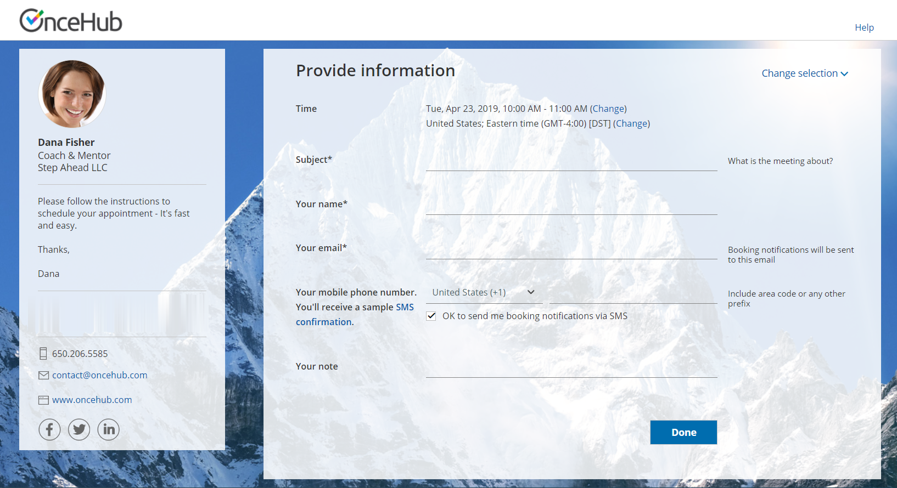

import { Aside } from '@astrojs/starlight/components';

Booking forms allow you to collect information from your Customers when they make a booking. After selecting a date and time, Customers reach the Booking form step and provide the information required to complete the booking.

Figure 1: Sample Booking form

In this article, you'll learn about about collecting and utilizing Customer data using Booking forms.

```
&lt;script id="snippet-prepend">
$(function()&#123;
  
  /*disable in widget*/
  if($('.w-documentation-article').length === 0)&#123;

     var ToC =
  "&lt;nav role='navigation' class='table-of-contents toc-top'><h4>In this article:" + "<ul>";
     var el,     title, link, header;
      //Define the heading levels you want to use in ascending order. Can add extra or remove unneeded.
     $(".hg-article-body h1, .hg-article-body h2, .hg-article-body h3, .hg-article-body h4").each(function() &#123;
              el = $(this);
              title = el.text();
                 if(title != '')&#123;
                anchorTitle = el.text().replace(/([~!@#$%^&*()_+=`&#123;&#125;\[\]\|\\:;'&lt;>,.\/\? ])+/g, '-').toLowerCase();
                link = "#" + anchorTitle;
                //Set all headers to a 0-nesting level.
                header = 'header-nesting-0';
                //Adjust header-nesting layers so that they point to the correct html tag. header-nesting-1 should match the second .hg-article-body h# listed above; header-nesting-2 should match the third, etc.
                if($(this).is('h2'))&#123;
                    header = 'header-nesting-1';
                &#125;else if($(this).is('h3'))&#123;
                    header = 'header-nesting-2'
                &#125;
                el.html('<a id="'+anchorTitle+'" class="toc-anchor">' + el.html());
                newLine =
      "<li class='"+header+"'>" +
        "<a class='article-anchor' href='" + link + "'>" +
          title +
        "" +
      "";


                ToC += newLine;
              &#125;
              &#125;);
     ToC +=
   "" +
  "";
    $("#snippet-prepend").before(ToC);
  &#125;
&#125;);

&lt;/script>
```

```
&lt;style>
/* CSS to style the TOC as it displays and the auto-created anchors
.toc-top styles the box for the TOC; adjust styles here to tweak look and feel */
  
.toc-top &#123;
  background-color: #FAFAFA; /* set to #fff or delete entirely for no background */
  border: 1px solid #C8C8C8; /* adjust the color hex here to change border color */
  box-shadow: 0 1px 1px rgba(0, 0, 0, 0.05) inset;
  margin-top: 24px;
  margin-bottom: 36px;
  min-height: 20px;
  padding: 13px 20px;
  max-width: 75%;
&#125;
.toc-top h4 &#123;
  font-size: 18px;
  line-height: 26px;
  margin: 0 0 8px;
  font-weight: 400;
&#125;
.toc-top ul &#123;
  padding: 0 0 0 15px !important;
  margin-bottom: 0;	
&#125;
.toc-top > ul &#123;
  margin-bottom: 13px!important;
&#125;
.toc-anchor &#123;
  display: block;
  height: 90px; 
  margin-top: -90px; 
  visibility: hidden;
&#125;

/* Set the indentation for the nesting levels. May need to be edited to match changes above. Increase or decrease the margin-left to get your desired level of indentation. */
.header-nesting-1 &#123;
    margin-left: 14px;
&#125;
.header-nesting-1:before &#123;
	background-image: url(https://dyzz9obi78pm5.cloudfront.net/app/image/id/5d31bcc88e121c9b25ba22c4/n/bulletv2.svg)!important;
&#125;
.header-nesting-2 &#123;
    margin-left: 28px;
&#125;
.header-nesting-2:before &#123;
	background-image: url(https://dyzz9obi78pm5.cloudfront.net/app/image/id/5d31be536e121cf22b0cc6ae/n/bulletv3.svg)!important;
&#125;
&lt;/style>
```

# Booking form fields

You can [create and customize](/creating-a-booking-form/ "Creating a Booking form") as many Booking forms as you need using the [Booking forms editor](/introduction-to-the-booking-forms-editor/ "Introduction to the Booking Forms Editor"). Each form can have its own set of fields in a specified order.

The Booking form always contains the name and email fields, which are mandatory OnceHub fields, plus any [System fields](/editing-system-fields/ "Editing System Fields") or [Custom fields](/creating-and-editing-custom-fields/ "Creating and editing Custom fields") you choose to add. You can choose to make these additional fields either mandatory or not.

Some **System fields** will be [conditionally added](/conditional-fields/ "Conditional Fields") to the form. For example: if you choose to let the Customer set the meeting subject, this field will be automatically added to the Booking form.

The graphic style of the fields is determined by the theme you set in the [Theme designer](/the-theme-designer/ "The Theme Designer"). The graphic style can be either Modern (fields as underlines) or Classic (fields as boxes). By default, the graphic style is set to Modern. 

# Finding Customer data

All [Customer data collected in the Booking form](/reports-viewing-collected-information-from-your-booking-form/ "Viewing collected information from your Booking form") is available to you via the following methods:

*   [Email notifications, reminders and calendar events](/communicating-with-users-and-stakeholders/ "Communicating with Users and stakeholders") (unless set otherwise by [creating custom notification templates](/introduction-to-the-notification-templates-editor/ "Introduction to the Notification Templates Editor"))
*   [The Activity stream](/introduction-to-the-activity-stream/ "Introduction to the Activity Stream")
*   [Reports](/introduction-to-scheduleonce-reports/ "Introduction to ScheduleOnce reports")

# Selecting a Booking form

When you have multiple Booking forms, you can choose which Booking forms will be used for different scenarios. Booking forms can be related either to Booking pages or Event types. 

By default, the location of the Booking form section depends on whether or not your [Booking page is associated with any Event types](/adding-event-types-to-booking-pages/ "Adding Event types to Booking pages"). 

*   Booking pages **with Event types**: Each Event type has its own Booking form, set in the **Event types’s** [Booking form section](/introduction-to-the-booking-form-redirect-section/ "Introduction to the Booking form and redirect section").
*   Booking pages **without Event types**: The Booking form is selected in the **Booking page’s** [Booking form section](/introduction-to-the-booking-form-redirect-section/ "Introduction to the Booking form and redirect section").

However, you can [customize the location of the Booking form section](/event-type-sections/ "Location of the Booking form and the Customer notifications sections")[](https://oncehub.knowledgeowl.com/help/event-type-sections "Location of the Booking form and the Customer notifications sections").

# Skipping or prepopulating Booking forms

It's not always necessary to collect Customer information as part of the scheduling process. For example, you may already have the data in your CRM. 

In these cases, the Booking form is typically skipped completely if you have all the data needed, or prepopulated if you require additional data. [Prepopulated Booking forms](/prepopulated-booking-forms/ "Prepopulated Booking forms") work in private mode or public mode depending on the source of the prepopulation data. [Learn more about prepopulated forms](/prepopulated-booking-forms/ "Prepopulated Booking forms")

The Booking form is typically skipped or prepopulated in the following scenarios:

*   **Personalized links:** When you invite an existing prospect or Customer to schedule, their information is already known to you. You can send them a Personalized link from [Salesforce](/using-personalized-links-salesforce-id/ "Using personalized links (Salesforce ID)") or [Infusionsoft](/using-personalized-links-infusionsoft-id/ "Using Personalized links (Infusionsoft ID)") to save them the time of filling out redundant information. If you are not using our native CRM integration, you can create a Personalized link using [URL parameters](/scheduleonce-url-parameters-and-processing-rules/ "ScheduleOnce URL parameters and processing rules").
*   **Web form integration:** The Customer filled out [your web form](/introduction-to-webform-integration/ "Introduction to Web form Integration"), so their data is already available to you or stored in your CRM. This data can be passed to OnceHub as [parameters in the URL](/integrating-your-web-form-with-scheduleonce-using-url-parameters/ "Integrating your Web form with ScheduleOnce using URL parameters") or as a CRM record ID ([Salesforce](/integrating-web-forms-with-salesforce-and-scheduleonce/ "Integrating Web forms with Salesforce and ScheduleOnce") or [Infusionsoft](/integrating-with-infusionsoft-web-forms/ "Integrating with Infusionsoft Web forms")).
*   **Login integration:** When the Customer is [authenticated in your app or portal](/login-integration/ "Login Integration"), their identity is known to you. You can pass their CRM record ID (Salesforce or Infusionsoft) or parameters like name or email, and the Booking form will be skipped or prepopulated for them.
*   **Landing page:** You send your Customer an email (possibly as part of a campaign) with a link to a landing page (any web page that offers scheduling). That email link is personalized with the Customer data (using URL parameters, [Salesforce ID](/using-the-salesforce-record-id-to-personalize-scheduling-in-landing-pages/ "Using the Salesforce Record ID to personalize scheduling in landing pages") or [Infusionsoft ID](/using-infusionsoft-contact-id-to-personalize-scheduling-in-landing-pages/ "Using InfusionSoft Contact ID to personalize scheduling in landing pages")), and the data is passed to the landing page. The landing page allows the Customer to schedule and all their data is seamlessly passed on to OnceHub, so they don’t need to refill known values.