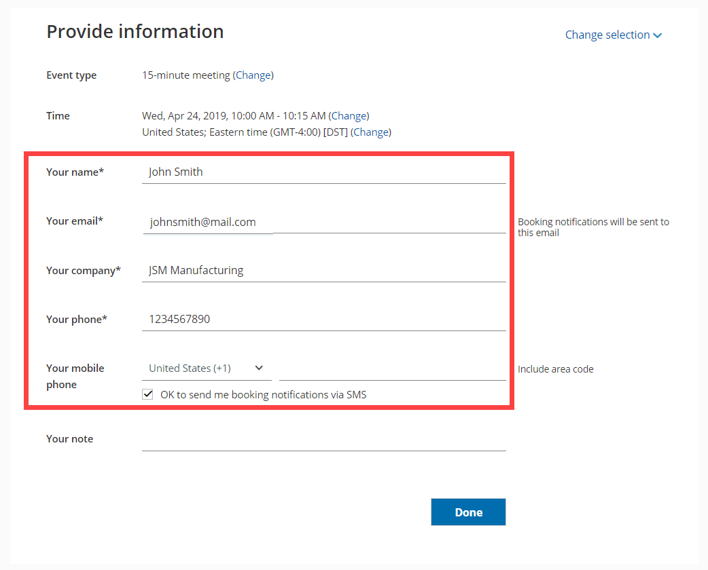

import { Aside } from '@astrojs/starlight/components';

It's not always necessary to collect Customer information as part of the scheduling process. For example, you may already have the data in your CRM. In these cases, the [Booking form](/booking-form/ "Introduction to Booking forms") is typically skipped completely (if you have all the data you need) or prepopulated (if you require additional data).

```
&lt;script id="snippet-prepend">
$(function()&#123;
  
  /*disable in widget*/
  if($('.w-documentation-article').length === 0)&#123;

     var ToC =
  "&lt;nav role='navigation' class='table-of-contents toc-top'><h4>In this article:" + "<ul>";
     var el,     title, link, header;
      //Define the heading levels you want to use in ascending order. Can add extra or remove unneeded.
     $(".hg-article-body h1, .hg-article-body h2, .hg-article-body h3, .hg-article-body h4").each(function() &#123;
              el = $(this);
              title = el.text();
                 if(title != '')&#123;
                anchorTitle = el.text().replace(/([~!@#$%^&*()_+=`&#123;&#125;\[\]\|\\:;'&lt;>,.\/\? ])+/g, '-').toLowerCase();
                link = "#" + anchorTitle;
                //Set all headers to a 0-nesting level.
                header = 'header-nesting-0';
                //Adjust header-nesting layers so that they point to the correct html tag. header-nesting-1 should match the second .hg-article-body h# listed above; header-nesting-2 should match the third, etc.
                if($(this).is('h2'))&#123;
                    header = 'header-nesting-1';
                &#125;else if($(this).is('h3'))&#123;
                    header = 'header-nesting-2'
                &#125;
                el.html('<a id="'+anchorTitle+'" class="toc-anchor">' + el.html());
                newLine =
      "<li class='"+header+"'>" +
        "<a class='article-anchor' href='" + link + "'>" +
          title +
        "" +
      "";


                ToC += newLine;
              &#125;
              &#125;);
     ToC +=
   "" +
  "";
    $("#snippet-prepend").before(ToC);
  &#125;
&#125;);

&lt;/script>
```

```
&lt;style>
/* CSS to style the TOC as it displays and the auto-created anchors
.toc-top styles the box for the TOC; adjust styles here to tweak look and feel */
  
.toc-top &#123;
  background-color: #FAFAFA; /* set to #fff or delete entirely for no background */
  border: 1px solid #C8C8C8; /* adjust the color hex here to change border color */
  box-shadow: 0 1px 1px rgba(0, 0, 0, 0.05) inset;
  margin-top: 24px;
  margin-bottom: 36px;
  min-height: 20px;
  padding: 13px 20px;
  max-width: 75%;
&#125;
.toc-top h4 &#123;
  font-size: 18px;
  line-height: 26px;
  margin: 0 0 8px;
  font-weight: 400;
&#125;
.toc-top ul &#123;
  padding: 0 0 0 15px !important;
  margin-bottom: 0;	
&#125;
.toc-top > ul &#123;
  margin-bottom: 13px!important;
&#125;
.toc-anchor &#123;
  display: block;
  height: 90px; 
  margin-top: -90px; 
  visibility: hidden;
&#125;

/* Set the indentation for the nesting levels. May need to be edited to match changes above. Increase or decrease the margin-left to get your desired level of indentation. */
.header-nesting-1 &#123;
    margin-left: 14px;
&#125;
.header-nesting-1:before &#123;
	background-image: url(https://dyzz9obi78pm5.cloudfront.net/app/image/id/5d31bcc88e121c9b25ba22c4/n/bulletv2.svg)!important;
&#125;
.header-nesting-2 &#123;
    margin-left: 28px;
&#125;
.header-nesting-2:before &#123;
	background-image: url(https://dyzz9obi78pm5.cloudfront.net/app/image/id/5d31be536e121cf22b0cc6ae/n/bulletv3.svg)!important;
&#125;
&lt;/style>
```

# Prepopulated Booking forms

When the Booking form is prepopulated, it can operate in two modes: private or public. The mode of the Booking form depends on the source of the prepopulation data provided. Prepopulation data can originate from two sources:

*   Parameters passed in the URL to the Booking page.
*   Customer information stored in a Database such as your CRM or OnceHub account.

# Prepopulation with URL Parameters

[Prepopulation data provided directly in the Public link (as URL parameters)](/how-to-create-a-personalized-link-url-parameters/ "How to create a Personalized Link (URL parameters)") is visible in the browser address bar. By definition, this information is not private. When forms are prepopulated with data from URL parameters, the form displays the information publicly (Figure 1). In public mode, the data is visible and can be edited by the Customer before submission.

Figure 1: Booking form with data prepopulated from URL parameters

# Prepopulation with Customer data stored in a database

We are committed to keeping Customer data safe and secure. We have added a layer of security for bookings made with contacts stored in databases, such as your [Infusionsoft CRM](/using-personalized-links-infusionsoft-id/ "Using Personalized links (Infusionsoft ID)") or [Salesforce CRM](/using-the-salesforce-record-id-to-personalize-scheduling-in-landing-pages/ "Using the Salesforce Record ID to personalize scheduling in landing pages").

If the prepopulation data is from a database, the form works in private mode. In private mode, prepopulated data can’t be viewed or edited by the Customer before submission. The prepopulated data used in the Booking is indicated as a checklist and the Customer can provide additional information if required.

**Note**

To use data from a database in a prepopulated Booking form, you first have to [connect to Infusionsoft](/the-scheduleonce-connector-for-infusionsoft/ "The ScheduleOnce connector for Infusionsoft") or [connect to Salesforce](/the-scheduleonce-connector-for-salesforce/ "The ScheduleOnce connector for Salesforce").

Figure 2: Data prepopulated from a database

 Private mode is automatically used when necessary (no configuration is required). It is enabled:

*   When you use a record ID from your CRM to prepopulate the Booking form. 
*   When a customer reschedules an existing appointment and additional data is required to complete the booking. If no additional data is required, the Booking form step will be skipped during rescheduling.

Private mode protects customer privacy. Customer data from your CRM or OnceHub account should not be visible on a page accessible from the web. Click here to see the [OnceHub Privacy Notice](https://www.oncehub.com/trustcenter/legal/privacynotice/).

**Note**

For security and privacy reasons, using CRM record IDs to skip or prepopulate the Booking form is not compatible with [collecting data from an embedded Booking page](https://developers.oncehub.com/v1.0.0/docs/collecting-data-from-an-embedded-booking-page) or [redirecting booking confirmation data](https://developers.oncehub.com/v1.0.0/docs/redirecting-booking-confirmation-data).