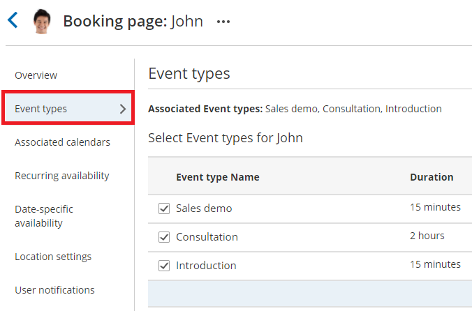

import { Aside } from '@astrojs/starlight/components';

[Event types](/introduction-to-event-types/ "Introduction to Event types") are a powerful tool to standardize the meeting types that will be offered on different [Booking pages](/introduction-to-booking-pages/ "Introduction to Booking pages"). We recommend associating your Booking page with at least one Event type. This enables better modeling of advanced scheduling scenarios (for example, multi-User scenarios using [Pooled availability](/introduction-to-pooled-availability/ "Introduction to Pooled availability")) and provides a better scheduling experience for your Customers.

In this article, you'll learn about adding Event types to Booking pages.

```
&lt;script id="snippet-prepend">
$(function()&#123;
  
  /*disable in widget*/
  if($('.w-documentation-article').length === 0)&#123;

     var ToC =
  "&lt;nav role='navigation' class='table-of-contents toc-top'><h4>In this article:" + "<ul>";
     var el,     title, link, header;
      //Define the heading levels you want to use in ascending order. Can add extra or remove unneeded.
     $(".hg-article-body h1, .hg-article-body h2, .hg-article-body h3, .hg-article-body h4").each(function() &#123;
              el = $(this);
              title = el.text();
                 if(title != '')&#123;
                anchorTitle = el.text().replace(/([~!@#$%^&*()_+=`&#123;&#125;\[\]\|\\:;'&lt;>,.\/\? ])+/g, '-').toLowerCase();
                link = "#" + anchorTitle;
                //Set all headers to a 0-nesting level.
                header = 'header-nesting-0';
                //Adjust header-nesting layers so that they point to the correct html tag. header-nesting-1 should match the second .hg-article-body h# listed above; header-nesting-2 should match the third, etc.
                if($(this).is('h2'))&#123;
                    header = 'header-nesting-1';
                &#125;else if($(this).is('h3'))&#123;
                    header = 'header-nesting-2'
                &#125;
                el.html('<a id="'+anchorTitle+'" class="toc-anchor">' + el.html());
                newLine =
      "<li class='"+header+"'>" +
        "<a class='article-anchor' href='" + link + "'>" +
          title +
        "" +
      "";


                ToC += newLine;
              &#125;
              &#125;);
     ToC +=
   "" +
  "";
    $("#snippet-prepend").before(ToC);
  &#125;
&#125;);

&lt;/script>
```

```
&lt;style>
/* CSS to style the TOC as it displays and the auto-created anchors
.toc-top styles the box for the TOC; adjust styles here to tweak look and feel */
  
.toc-top &#123;
  background-color: #FAFAFA; /* set to #fff or delete entirely for no background */
  border: 1px solid #C8C8C8; /* adjust the color hex here to change border color */
  box-shadow: 0 1px 1px rgba(0, 0, 0, 0.05) inset;
  margin-top: 24px;
  margin-bottom: 36px;
  min-height: 20px;
  padding: 13px 20px;
  max-width: 75%;
&#125;
.toc-top h4 &#123;
  font-size: 18px;
  line-height: 26px;
  margin: 0 0 8px;
  font-weight: 400;
&#125;
.toc-top ul &#123;
  padding: 0 0 0 15px !important;
  margin-bottom: 0;	
&#125;
.toc-top > ul &#123;
  margin-bottom: 13px!important;
&#125;
.toc-anchor &#123;
  display: block;
  height: 90px; 
  margin-top: -90px; 
  visibility: hidden;
&#125;

/* Set the indentation for the nesting levels. May need to be edited to match changes above. Increase or decrease the margin-left to get your desired level of indentation. */
.header-nesting-1 &#123;
    margin-left: 14px;
&#125;
.header-nesting-1:before &#123;
	background-image: url(https://dyzz9obi78pm5.cloudfront.net/app/image/id/5d31bcc88e121c9b25ba22c4/n/bulletv2.svg)!important;
&#125;
.header-nesting-2 &#123;
    margin-left: 28px;
&#125;
.header-nesting-2:before &#123;
	background-image: url(https://dyzz9obi78pm5.cloudfront.net/app/image/id/5d31be536e121cf22b0cc6ae/n/bulletv3.svg)!important;
&#125;
&lt;/style>
```

# Location of scheduling sections

When you associate Event types with Booking pages, some of your scheduling settings are related to the Event type and some are related to the Booking page. 

The table below shows the settings that are related to each:

<table class="table-bordered"><tbody><tr><td><strong>Event type</strong></td><td><strong>Booking page</strong></td></tr><tr><td><a href="https://oncehub.knowledgeowl.com/help/introduction-to-the-scheduling-options-section" title="Introduction to the Scheduling options section">Scheduling options</a></td><td><a href="https://oncehub.knowledgeowl.com/help/booking-page-associated-calendars-section" title="Booking page: Associated calendars section">Associated calendars</a></td></tr><tr><td><a href="https://oncehub.knowledgeowl.com/help/introduction-to-time-slot-settings" title="Introduction to Time slot settings">Time slot settings</a></td><td><a href="https://oncehub.knowledgeowl.com/help/booking-page-associated-calendars-section" title="Booking page: Associated calendars section"></a><a href="https://oncehub.knowledgeowl.com/help/booking-page-recurring-availability-section" title="Booking Page: Recurring Availability section">Recurring availability</a></td></tr><tr><td><a href="https://oncehub.knowledgeowl.com/help/introduction-to-customer-notifications" title="The Customer Notifications section">Customer notifications</a></td><td><a href="https://oncehub.knowledgeowl.com/help/booking-page-date-specific-availability-section" title="Booking Page: Date-specific availability section">Date-specific availability</a></td></tr><tr><td><a href="https://oncehub.knowledgeowl.com/help/booking-form" title="Introduction to Booking forms">Booking form</a></td><td><a href="https://oncehub.knowledgeowl.com/help/booking-page-location-settings-section" title="Booking page: Location settings section">Location settings</a></td></tr><tr><td><a href="https://help.oncehub.com/help/introduction-to-canceling-and-rescheduling" title="Event type: Payment and cancel/reschedule policy section">Payment and cancel/reschedule policy</a></td><td><a href="https://oncehub.knowledgeowl.com/help/introduction-to-user-notifications" title="Introduction to User notifications section">User notifications</a></td></tr><tr><td><br /></td><td><a href="https://oncehub.knowledgeowl.com/help/booking-page-public-content-section" title="Booking Page: Public Content section">Public content</a></td></tr></tbody></table>

  

**Note**If you prefer that the [Booking form](/introduction-to-the-booking-form-redirect-section/ "Introduction to the Booking form and redirect section") section and [Customer notifications](/introduction-to-customer-notifications/ "The Customer notifications section") section are related to the Booking page, even when you are using Event types, you can change this in the [Event type sections](/event-type-sections/ "Event type sections: Location of the Booking form and the Customer notifications sections").

# Requirements

 To associate Event types with a Booking page, you must have [permission to edit the Event types section of the Booking page](/booking-page-access-permissions/ "Booking page access permissions").

# Associating Event types

1.  ```
    &lt;style type="text/css">&lt;/style>
    ```
    
    ```
    &lt;style type="text/css">&lt;/style>
    ```
    
    Go to **Booking pages** in the bar on the left. [Create the Event types](/event-types-creating-an-event-type/ "Creating an Event type") that you wish to use. Note that you can also [duplicate existing Event types](/duplicating-an-event-type/ "Duplicating an Event type").
2.  Select the relevant Booking page.
3.  Select the **Event types** section of the Booking page. You will see a list of Event types you have created in your account (Figure 1).  
    
    
    Figure 1: Event type section
    
4.  Check the checkbox next to each Event type that you want to associate with this Booking page. 
5.  Click **Save**.