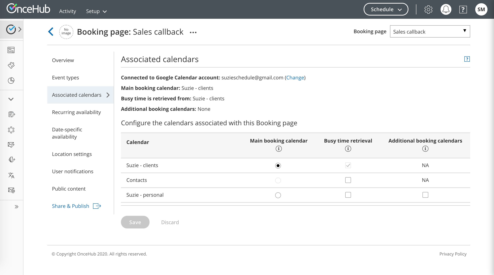

import { Aside } from '@astrojs/starlight/components';

The Associated calendars section is the heart of our integration with your calendar. To be able to configure the Associated calendars section of your Booking page, you need to connect a calendar. 

```
&lt;script id="snippet-prepend">
$(function()&#123;
  
  /*disable in widget*/
  if($('.w-documentation-article').length === 0)&#123;

     var ToC =
  "&lt;nav role='navigation' class='table-of-contents toc-top'><h4>In this article:" + "<ul>";
     var el,     title, link, header;
      //Define the heading levels you want to use in ascending order. Can add extra or remove unneeded.
     $(".hg-article-body h1, .hg-article-body h2, .hg-article-body h3, .hg-article-body h4").each(function() &#123;
              el = $(this);
              title = el.text();
                 if(title != '')&#123;
                anchorTitle = el.text().replace(/([~!@#$%^&*()_+=`&#123;&#125;\[\]\|\\:;'&lt;>,.\/\? ])+/g, '-').toLowerCase();
                link = "#" + anchorTitle;
                //Set all headers to a 0-nesting level.
                header = 'header-nesting-0';
                //Adjust header-nesting layers so that they point to the correct html tag. header-nesting-1 should match the second .hg-article-body h# listed above; header-nesting-2 should match the third, etc.
                if($(this).is('h2'))&#123;
                    header = 'header-nesting-1';
                &#125;else if($(this).is('h3'))&#123;
                    header = 'header-nesting-2'
                &#125;
                el.html('<a id="'+anchorTitle+'" class="toc-anchor">' + el.html());
                newLine =
      "<li class='"+header+"'>" +
        "<a class='article-anchor' href='" + link + "'>" +
          title +
        "" +
      "";


                ToC += newLine;
              &#125;
              &#125;);
     ToC +=
   "" +
  "";
    $("#snippet-prepend").before(ToC);
  &#125;
&#125;);

&lt;/script>
```

```
&lt;style>
/* CSS to style the TOC as it displays and the auto-created anchors
.toc-top styles the box for the TOC; adjust styles here to tweak look and feel */
  
.toc-top &#123;
  background-color: #FAFAFA; /* set to #fff or delete entirely for no background */
  border: 1px solid #C8C8C8; /* adjust the color hex here to change border color */
  box-shadow: 0 1px 1px rgba(0, 0, 0, 0.05) inset;
  margin-top: 24px;
  margin-bottom: 36px;
  min-height: 20px;
  padding: 13px 20px;
  max-width: 75%;
&#125;
.toc-top h4 &#123;
  font-size: 18px;
  line-height: 26px;
  margin: 0 0 8px;
  font-weight: 400;
&#125;
.toc-top ul &#123;
  padding: 0 0 0 15px !important;
  margin-bottom: 0;	
&#125;
.toc-top > ul &#123;
  margin-bottom: 13px!important;
&#125;
.toc-anchor &#123;
  display: block;
  height: 90px; 
  margin-top: -90px; 
  visibility: hidden;
&#125;

/* Set the indentation for the nesting levels. May need to be edited to match changes above. Increase or decrease the margin-left to get your desired level of indentation. */
.header-nesting-1 &#123;
    margin-left: 14px;
&#125;
.header-nesting-1:before &#123;
	background-image: url(https://dyzz9obi78pm5.cloudfront.net/app/image/id/5d31bcc88e121c9b25ba22c4/n/bulletv2.svg)!important;
&#125;
.header-nesting-2 &#123;
    margin-left: 28px;
&#125;
.header-nesting-2:before &#123;
	background-image: url(https://dyzz9obi78pm5.cloudfront.net/app/image/id/5d31be536e121cf22b0cc6ae/n/bulletv3.svg)!important;
&#125;
&lt;/style>
```

# Location of the Associated calendars section

To locate the Associated calendars section, go to **Booking pages**. Select the relevant **Booking page** **→** **Associated calendars**.

Figure 1: Booking page: Associated calendars section

You are able to use calendar settings from profile level or set associated calendars for the specific booking page you've selected. 

If you have selected to set associated calendars for the specific booking page, you can set the following: 

*   The main calendar in which bookings are created
*   One or more calendars from which busy time is retrieved
*   Any number of additional calendars to which the calendar event from a new booking can be added. 

Figure 2: Choosing your associated calendars

# Main booking calendar

The calendar events for your bookings are created in your main booking calendar. The **Main booking calendar** column lists all of the calendars in your account. These can be your own calendars or calendars that are shared with you, depending on the calendar that you are connected to. To be able to book in a main booking calendar, you need to have full read/write permissions for this calendar.

# Busy time retrieval

The **Busy time retrieval** column is where you select the calendars that busy time is retrieved from. By default, busy time is always retrieved from the main booking calendar that your bookings are created in. Note that this can't be changed because it's necessary in order to ensure you don't get double-booked. It's also required in order to [control the number of bookings per slot](/introduction-to-time-slot-settings/ "Introduction to Time slot settings").

You can select any number of additional calendars in the **Busy time retrieval** column. These can be any calendars displayed in the list, with any level of permission: your calendars, calendars that others shared with you, or public calendars like a holiday calendar.

# Additional booking calendars

The **Additional booking calendars** column is where you select the additional calendars where events will automatically be added to. Note that if the additional booking calendar is a third-party calendar feed, it can't accept bookings. 

There are two possible scenarios when you use an additional booking calendar:

*   **The additional booking calendar is a calendar that you own in your connected calendar account.** In this case, the calendar event will be created in the calendar and you will not receive a calendar invite.
*   **The additional booking calendar is shared with your connected calendar account:** In this case, the calendar event will be created in the shared calendar. Also, the calendar Owner can receive a calendar invite if the calendar invite is enabled in the [Customer notifications section](/introduction-to-customer-notifications/ "The Customer Notifications section"). In addition, Owners of shared calendars can configure their calendar to notify them when a booking is made.

# FAQs

*   **Why is busy time not blocking my availability on my booking pages?**  
    There may be a number of reasons, depending on your Booking page settings and the calendar that you've connected to. Learn more about [troubleshooting Booking page issues with busy time](/why-does-my-booking-page-say-im-available-when-im-busy/ "Booking page troubleshooting: Why does my Booking page say I’m available when I’m busy?").
    
*   **Why are all-day events not blocking my availability on my booking pages?**  
    By default, all day events are set to "Available" or "Free" in your calendar. You should open the event in the calendar and change its status to “Busy." If this does not help, you can try some other solutions from our article on [troubleshooting Booking page issues with busy time](/why-does-my-booking-page-say-im-available-when-im-busy/ "Troubleshooting: Why does my Booking page say I’m available when I’m busy?").
    
*   **Why am I receiving a settings conflict when attempting to select a calendar for busy time retrieval?**  
    This is because you're also using the Group sessions setting in the [Scheduling options section](/introduction-to-the-scheduling-options-section/ "Introduction to the Scheduling options section").