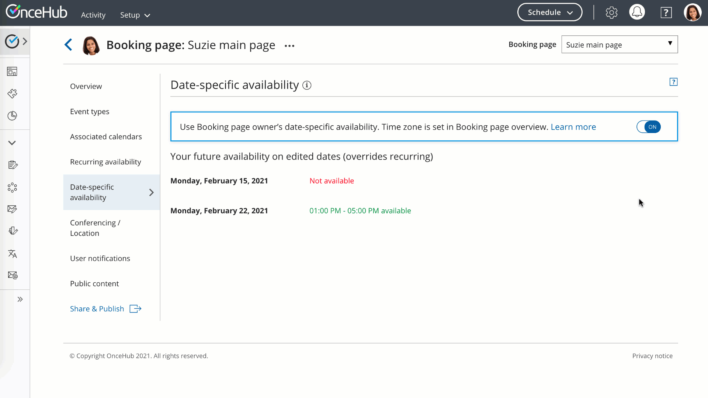
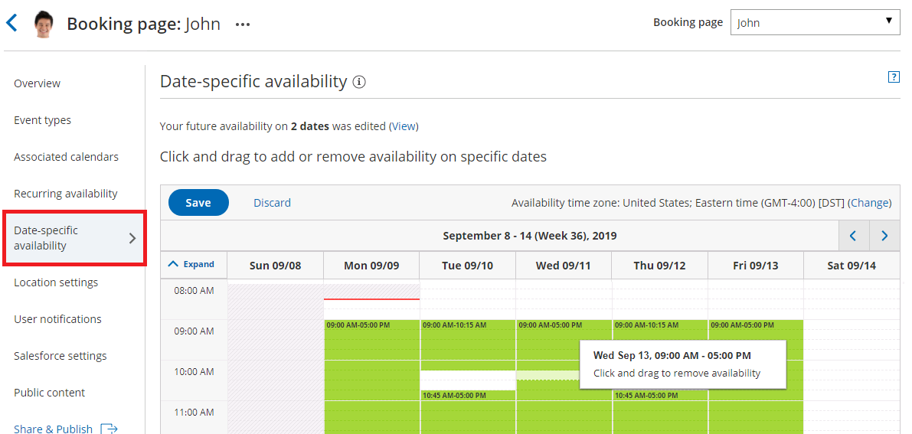
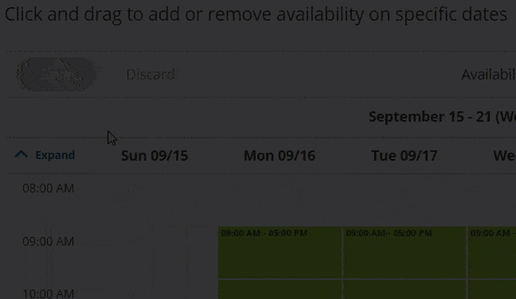
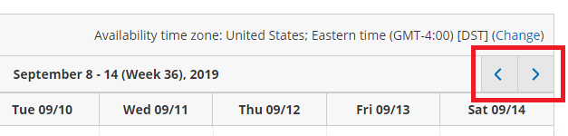
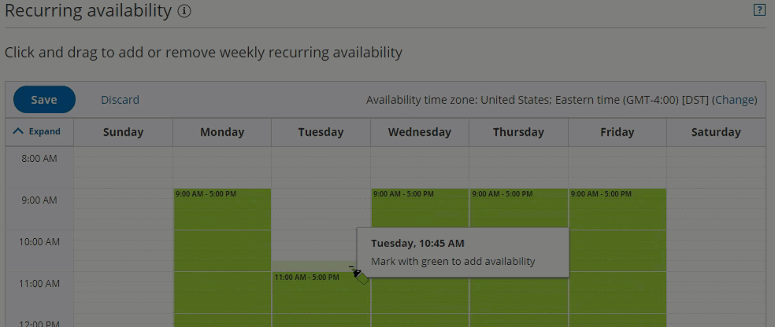
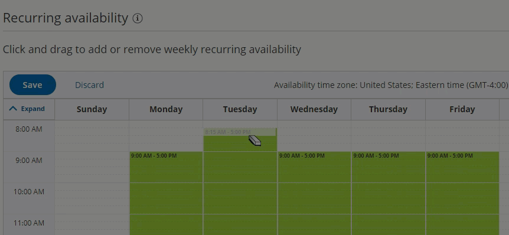
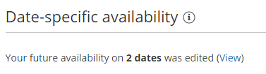

import { Aside } from '@astrojs/starlight/components';

**Important**

We recommend always updating your availability with User availability, located on your User profile. This article is only relevant for those who need an individual Booking page to reflect different availability from their standard User availability.

When you define availability for a specific Booking page rather than through your User profile, you can use two types of availability: [Recurring availability](/booking-page-recurring-availability-section/) and Date-specific availability. Date-specific availability is defined for specific days so that you can designate your availability for each calendar day. 

You do not need an assigned product license to access and update the Date-specific availability section, though you do need the right [Booking page access permissions](/booking-page-access-permissions/). This means an assistant or other collaborator can update your availability on your behalf, without paying for an extra license. [Learn more](/common-use-cases-for-users-without-a-scheduleonce-license/)

In this article, you'll learn about using the Date-specific availability section.

```
&lt;script id="snippet-prepend">
$(function()&#123;
  
  /*disable in widget*/
  if($('.w-documentation-article').length === 0)&#123;

     var ToC =
  "&lt;nav role='navigation' class='table-of-contents toc-top'><h4>In this article:" + "<ul>";
     var el,     title, link, header;
      //Define the heading levels you want to use in ascending order. Can add extra or remove unneeded.
     $(".hg-article-body h1, .hg-article-body h2, .hg-article-body h3, .hg-article-body h4").each(function() &#123;
              el = $(this);
              title = el.text();
                 if(title != '')&#123;
                anchorTitle = el.text().replace(/([~!@#$%^&*()_+=`&#123;&#125;\[\]\|\\:;'&lt;>,.\/\? ])+/g, '-').toLowerCase();
                link = "#" + anchorTitle;
                //Set all headers to a 0-nesting level.
                header = 'header-nesting-0';
                //Adjust header-nesting layers so that they point to the correct html tag. header-nesting-1 should match the second .hg-article-body h# listed above; header-nesting-2 should match the third, etc.
                if($(this).is('h2'))&#123;
                    header = 'header-nesting-1';
                &#125;else if($(this).is('h3'))&#123;
                    header = 'header-nesting-2'
                &#125;
                el.html('<a id="'+anchorTitle+'" class="toc-anchor">' + el.html());
                newLine =
      "<li class='"+header+"'>" +
        "<a class='article-anchor' href='" + link + "'>" +
          title +
        "" +
      "";


                ToC += newLine;
              &#125;
              &#125;);
     ToC +=
   "" +
  "";
    $("#snippet-prepend").before(ToC);
  &#125;
&#125;);

&lt;/script>
```

```
&lt;style>
/* CSS to style the TOC as it displays and the auto-created anchors
.toc-top styles the box for the TOC; adjust styles here to tweak look and feel */
  
.toc-top &#123;
  background-color: #FAFAFA; /* set to #fff or delete entirely for no background */
  border: 1px solid #C8C8C8; /* adjust the color hex here to change border color */
  box-shadow: 0 1px 1px rgba(0, 0, 0, 0.05) inset;
  margin-top: 24px;
  margin-bottom: 36px;
  min-height: 20px;
  padding: 13px 20px;
  max-width: 75%;
&#125;
.toc-top h4 &#123;
  font-size: 18px;
  line-height: 26px;
  margin: 0 0 8px;
  font-weight: 400;
&#125;
.toc-top ul &#123;
  padding: 0 0 0 15px !important;
  margin-bottom: 0;	
&#125;
.toc-top > ul &#123;
  margin-bottom: 13px!important;
&#125;
.toc-anchor &#123;
  display: block;
  height: 90px; 
  margin-top: -90px; 
  visibility: hidden;
&#125;

/* Set the indentation for the nesting levels. May need to be edited to match changes above. Increase or decrease the margin-left to get your desired level of indentation. */
.header-nesting-1 &#123;
    margin-left: 14px;
&#125;
.header-nesting-1:before &#123;
	background-image: url(https://dyzz9obi78pm5.cloudfront.net/app/image/id/5d31bcc88e121c9b25ba22c4/n/bulletv2.svg)!important;
&#125;
.header-nesting-2 &#123;
    margin-left: 28px;
&#125;
.header-nesting-2:before &#123;
	background-image: url(https://dyzz9obi78pm5.cloudfront.net/app/image/id/5d31be536e121cf22b0cc6ae/n/bulletv3.svg)!important;
&#125;
&lt;/style>
```

# When to use Date-specific availability

If your scheduling is limited to specific days, or if your availability pattern is highly variable from week to week, it may be best to use Date-specific alone. This is the most precise method, but it requires more maintenance. 

Using Date-specific availability can also be a good solution if your calendar is not connected and busy times cannot block out your availability.

Your [Recurring availability](/booking-page-recurring-availability-section/ "Booking Page: Recurring Availability section") weekly pattern will serve as a basis for your Date-specific availability. Any changes that you make in your Date-specific availability will apply to the edited days only. Date-specific availability will always override your Recurring availability on those dates. 

# Adjusting your availability

You can used Date-specific availability to reduce or increase your availability:

*   **Increase availability:** Use Date-specific availability to add availability on top of Recurring availability. For example, if you were on vacation on a certain week, the week after the vacation you could make up for it by making yourself available until late in the evening.
*   **Reduce availability:** Use Date-specific availability to block parts of your Recurring availability. For example, you normally work Mon-Fri as a repeating pattern, but you need to block off two specific dates due to a business trip. You could remove availability for those two dates on the Date-specific availability calendar.

# Requirements

To edit the Date-specific availability section, you must be an Owner or Editor of the Booking page with [the permission enabled in your Profile](/managing-your-profile-in-oncehub#permissions/ "Introduction to My profile").

You must toggle **OFF** User availability by opting not to use the Booking page owner's recurring availability, located at the top of the section.

Figure 1: Toggle off User availability

# How to edit Date-specific availability:

1.  Go to **Booking pages** in the bar on the left.
2.   Select the relevant Booking page.
3.  Click on the **Date-specific availability** section of the Booking page (Figure 1).  
    The default Date-specific availability is displayed based on your [Recurring availability](/booking-page-recurring-availability-section/ "Booking page: Recurring availability section") in the Booking page time zone.  
    Note that busy time retrieved from your connected calendar will appear in blue blocks on the Date-specific availability grid.  
    Figure 2: Date-specific availability section 
4.  To update the time zone for this entire Booking page, click the time zone **Change** link (Figure 2). Note that your connected calendar must be set to the same time zone.  
    Figure 3: Change time zone
5.  To modify the hours displayed in the grid, click **Expand** and define your preferences (Figure 3).  
    
    
    Figure 4: Expand hours
    
6.  To see previous or future weeks in the grid, click the arrows at the top right corner (Figure 4).
    
    Figure 5: Select week
    
7.  To add availability, click and drag over white (unavailable) slots, to mark them green (Figure 5). This will increase your availability for this date only.  
    
    
    Figure 6: Adding availability
    
8.  To remove availability, click and drag over green (available) slots, to mark them white (Figure 6). This will reduce your availability for this date only.  
    
    
    Figure 7: Removing availability
    
9.  Review your Date-specific availability by clicking the **View** link (Figure 7).  
    
    
    Figure 8: View link
    
10.  Click **Save**.