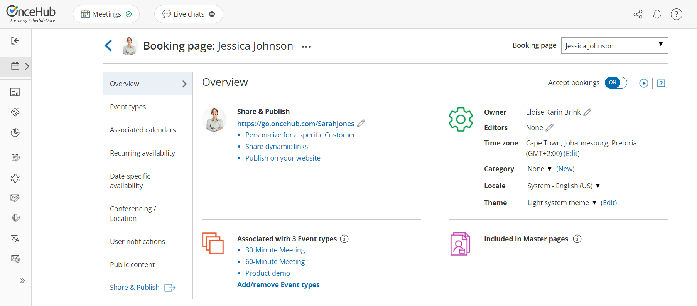
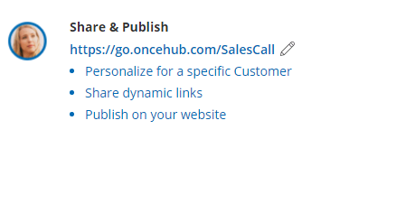
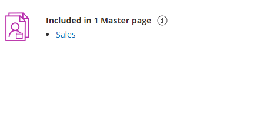

import { Aside } from '@astrojs/starlight/components';

The Booking page Overview section summarizes the main properties of a specific [Booking page](/introduction-to-booking-pages/ "Introduction to Booking pages"). It includes the Booking page's main settings, the associated Event types, any Master pages it is included in, and share and publish options. 

In this article, you'll learn about the Booking page Overview section. 

```
&lt;script id="snippet-prepend">
$(function()&#123;
  
  /*disable in widget*/
  if($('.w-documentation-article').length === 0)&#123;

     var ToC =
  "&lt;nav role='navigation' class='table-of-contents toc-top'><h4>In this article:" + "<ul>";
     var el,     title, link, header;
      //Define the heading levels you want to use in ascending order. Can add extra or remove unneeded.
     $(".hg-article-body h1, .hg-article-body h2, .hg-article-body h3, .hg-article-body h4").each(function() &#123;
              el = $(this);
              title = el.text();
                 if(title != '')&#123;
                anchorTitle = el.text().replace(/([~!@#$%^&*()_+=`&#123;&#125;\[\]\|\\:;'&lt;>,.\/\? ])+/g, '-').toLowerCase();
                link = "#" + anchorTitle;
                //Set all headers to a 0-nesting level.
                header = 'header-nesting-0';
                //Adjust header-nesting layers so that they point to the correct html tag. header-nesting-1 should match the second .hg-article-body h# listed above; header-nesting-2 should match the third, etc.
                if($(this).is('h2'))&#123;
                    header = 'header-nesting-1';
                &#125;else if($(this).is('h3'))&#123;
                    header = 'header-nesting-2'
                &#125;
                el.html('<a id="'+anchorTitle+'" class="toc-anchor">' + el.html());
                newLine =
      "<li class='"+header+"'>" +
        "<a class='article-anchor' href='" + link + "'>" +
          title +
        "" +
      "";


                ToC += newLine;
              &#125;
              &#125;);
     ToC +=
   "" +
  "";
    $("#snippet-prepend").before(ToC);
  &#125;
&#125;);

&lt;/script>
```

```
&lt;style>
/* CSS to style the TOC as it displays and the auto-created anchors
.toc-top styles the box for the TOC; adjust styles here to tweak look and feel */
  
.toc-top &#123;
  background-color: #FAFAFA; /* set to #fff or delete entirely for no background */
  border: 1px solid #C8C8C8; /* adjust the color hex here to change border color */
  box-shadow: 0 1px 1px rgba(0, 0, 0, 0.05) inset;
  margin-top: 24px;
  margin-bottom: 36px;
  min-height: 20px;
  padding: 13px 20px;
  max-width: 75%;
&#125;
.toc-top h4 &#123;
  font-size: 18px;
  line-height: 26px;
  margin: 0 0 8px;
  font-weight: 400;
&#125;
.toc-top ul &#123;
  padding: 0 0 0 15px !important;
  margin-bottom: 0;	
&#125;
.toc-top > ul &#123;
  margin-bottom: 13px!important;
&#125;
.toc-anchor &#123;
  display: block;
  height: 90px; 
  margin-top: -90px; 
  visibility: hidden;
&#125;

/* Set the indentation for the nesting levels. May need to be edited to match changes above. Increase or decrease the margin-left to get your desired level of indentation. */
.header-nesting-1 &#123;
    margin-left: 14px;
&#125;
.header-nesting-1:before &#123;
	background-image: url(https://dyzz9obi78pm5.cloudfront.net/app/image/id/5d31bcc88e121c9b25ba22c4/n/bulletv2.svg)!important;
&#125;
.header-nesting-2 &#123;
    margin-left: 28px;
&#125;
.header-nesting-2:before &#123;
	background-image: url(https://dyzz9obi78pm5.cloudfront.net/app/image/id/5d31be536e121cf22b0cc6ae/n/bulletv3.svg)!important;
&#125;
&lt;/style>
```

To switch between the Overview sections of different Booking pages without returning to **Booking page scheduling** **setup**, use the shortcut drop-down in the top right corner. You can [disable your page](/disabling-your-booking-page/ "Disabling your Booking page") to stop accepting bookings, or enable it by clicking on the **Accept bookings** toggle on the top right.

Figure 1: Booking page Overview section

Below you can find out more about the different parts of the Booking page Overview section.

# Booking page primary settings 

To access the Booking page primary settings, click the action menu (three dots) next to your Booking page name above the Overview section. In the drop-down menu, click **Primary settings.** 

Alternately, you can click on the pencil (edit) icon next to the Booking page link, the **Owner** field or the **Editors** field.

To assign someone as Owner of an enabled Booking page, they must first be [assigned](/user-account-management/account-management/account-management/managing-seats-in-oncehub/) a scheduled meetings license. [Learn more](/your-account-user-management#faq/)

Figure 2: Booking page primary settings

In the **Booking page primary settings** pop-up, you can edit the following:

*   **Public name:** The Public name is visible to Customers as the page title. It can be changed later in the [Public content section](/event-type-public-content-section/).
*   **Internal label:** The Internal label is only visible internally and is not visible to your Customers. 
*   **Public link:** This is the link used by Customers to access the page. The Public link must be unique and include at least four characters. 
*   **Owner:** The Owner is the User who receives the bookings. 
*   **Editors (optional):** Editors are Users who can edit/view the page and receive User notifications. This feature is available in multi-User accounts only.
*   **Event types:** [Event types](/introduction-to-event-types/ "Introduction to Event types") are the meeting types offered to the Customer.
*   **Image or photo (optional):** You can add or edit a photo or image to your page, which will be visible to Customers.

# Sharing and publishing

Figure 2: Share & Publish section

The **Share & Publish** section (Figure 2) contains the following:

*   **Public link:** This is your page link that your Customers can use to schedule bookings with you. [Learn more about Booking page links](/using-general-links/ "Using General links")
*   **Personalize for a specific Customer:** Creates a static link for a specific Customer. With this link, your Customer will be able to book without having to fill out their name and email. You create this type of link for each Customer individually. [Learn more about creating a Personalized link](/how-to-create-a-personalized-link-url-parameters/ "How to create a Personalized Link (URL parameters)")
    
    **Tip**You can use the [OnceHub for Gmail extension](/integrations/browser-extension/introduction-to-oncehub-for-gmail/ "Introduction to OnceHub for Gmail") to schedule with Personalized links directly from your Gmail account. You can generate Personalized links, copy them in a single click, and send them in an email. 
    
    [Learn more about OnceHub for Gmail](/integrations/browser-extension/introduction-to-oncehub-for-gmail/ "Introduction to OnceHub for Gmail")
    
*   **Share dynamic links:** Creates a dynamic link which you can share via your CRM or mass email campaign tool. [Learn more about using Personalized links](/using-personalized-links/ "Using Personalized links")
*   **Publish on your website:** Generates code that you can add into your website code so that you can integrate scheduling into your website. [Learn more about publishing Booking pages on websites](/website-embed/ "How to publish Booking pages on websites")

# Main settings

Figure 3: Main settings section

The **Main settings** section (Figure 3) contains the following:

*   **Owner:** The Owner is the User who receives the bookings. Each Booking page has one Owner. [Learn more about Booking page ownership](/booking-page-ownership/ "Booking Page Ownership")
    
*   **Editors:** Editors are Users who can edit/view the page and receive notifications. Any account Administrator or Member can be an Editor.
    
*   **Time zone:** Usually, this is the time zone of the Owner or the location. If you're using calendar integration, the Booking page time zone should be the same as the time zone of the connected calendar. [Learn more about time zone settings](/booking-page-time-zone-settings/ "Booking Page: Time zone settings")
    
*   **Category:** Categories organize Booking pages for you and your Customers. [Learn more about categories](/so-introduction-to-categories/ "Introduction to Categories")
    
*   **Locale:** The selected locale sets the date/format and the language of the page. [Learn more about localization](/the-localization-editor/ "The Localization editor")
    
*   **Theme:** The [theme you apply to the Booking page](/the-theme-designer/ "The Theme Designer") determines the logo, design and branding  on your Booking page.[](https://oncehub.knowledgeowl.com/help/using-general-links "Using General links")
    

# Associated Event types

Figure 4: Associated Event types

Use this list to review the [Event types that are associated with the Booking page](/adding-event-types-to-booking-pages/ "Adding Event types to Booking pages"). To edit an Event type, click on it in this list to navigate to it. We recommend associating your Booking pages with at least one Event type. 

Adding Event types to a Booking page allows your Customer to choose between different meeting types when they book with you. If your Booking page is only associated with one Event type, your Customers will not need to choose a meeting type and they will bypass this step.

To associate an Event type with a Booking page, go to the [Event types section of the Booking page](/adding-event-types-to-booking-pages/ "Adding Event types to Booking pages").

# Included in Master pages

Figure 5: Included in Master pages

Booking pages can be included in Master pages to create a single point of access for your Customers. Use the list in this section to review the Master pages that include this Booking page. To edit a Master page, click on it in this list to navigate to it. 

When a Customer schedules on a Master page, they either [manually select a provider](/multiple-team-members-accepting-appointments-without-event-types/ "Multiple team members accepting appointments without Event types") or they are [automatically assigned a provider](/automatic-booking-or-booking-with-approval/ "Automatic booking or Booking with approval") using pooled availability. In either case, the Customer will be able to schedule a booking using any of the Booking pages included in that Master page.

To include a Booking page in a Master page, go to the [Assignment section of the Master page](/master-page-assignment-section/ "Master Page: Assignment section").