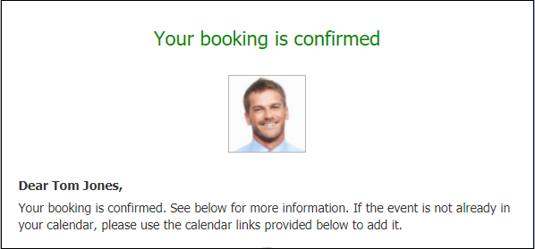
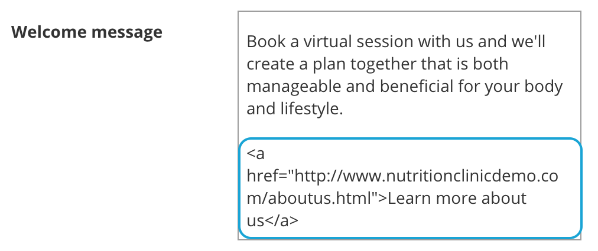
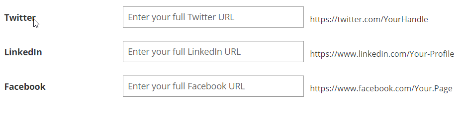

import { Aside } from '@astrojs/starlight/components';

The **Public content** section is where you enter information to help Customers understand what your [Booking page](/introduction-to-booking-pages/ "Introduction to Booking pages") is for. You can enter basic information about yourself or your staff member, your meeting type, location, and write a welcome message to the Customers who schedule time with you. You can also [add tags](/using-booking-page-tags-in-master-pages/ "Using Booking page tags in Master pages") that enable your Customers to filter Booking pages [grouped in a Master page](/introduction-to-master-pages/ "Including Booking pages in a Master page").

The Public content you add is used when your page is in [Enabled status](/booking-page-overview-section/ "Booking page: Overview section") as well as in [Disabled status](/disabling-your-booking-page/ "Disabling your Booking page"). When you disable your page, you can keep the Public content section as is or change it to display a different message.  

```
&lt;script id="snippet-prepend">
$(function()&#123;
  
  /*disable in widget*/
  if($('.w-documentation-article').length === 0)&#123;

     var ToC =
  "&lt;nav role='navigation' class='table-of-contents toc-top'><h4>In this article:" + "<ul>";
     var el,     title, link, header;
      //Define the heading levels you want to use in ascending order. Can add extra or remove unneeded.
     $(".hg-article-body h1, .hg-article-body h2, .hg-article-body h3, .hg-article-body h4").each(function() &#123;
              el = $(this);
              title = el.text();
                 if(title != '')&#123;
                anchorTitle = el.text().replace(/([~!@#$%^&*()_+=`&#123;&#125;\[\]\|\\:;'&lt;>,.\/\? ])+/g, '-').toLowerCase();
                link = "#" + anchorTitle;
                //Set all headers to a 0-nesting level.
                header = 'header-nesting-0';
                //Adjust header-nesting layers so that they point to the correct html tag. header-nesting-1 should match the second .hg-article-body h# listed above; header-nesting-2 should match the third, etc.
                if($(this).is('h2'))&#123;
                    header = 'header-nesting-1';
                &#125;else if($(this).is('h3'))&#123;
                    header = 'header-nesting-2'
                &#125;
                el.html('<a id="'+anchorTitle+'" class="toc-anchor">' + el.html());
                newLine =
      "<li class='"+header+"'>" +
        "<a class='article-anchor' href='" + link + "'>" +
          title +
        "" +
      "";


                ToC += newLine;
              &#125;
              &#125;);
     ToC +=
   "" +
  "";
    $("#snippet-prepend").before(ToC);
  &#125;
&#125;);

&lt;/script>
```

```
&lt;style>
/* CSS to style the TOC as it displays and the auto-created anchors
.toc-top styles the box for the TOC; adjust styles here to tweak look and feel */
  
.toc-top &#123;
  background-color: #FAFAFA; /* set to #fff or delete entirely for no background */
  border: 1px solid #C8C8C8; /* adjust the color hex here to change border color */
  box-shadow: 0 1px 1px rgba(0, 0, 0, 0.05) inset;
  margin-top: 24px;
  margin-bottom: 36px;
  min-height: 20px;
  padding: 13px 20px;
  max-width: 75%;
&#125;
.toc-top h4 &#123;
  font-size: 18px;
  line-height: 26px;
  margin: 0 0 8px;
  font-weight: 400;
&#125;
.toc-top ul &#123;
  padding: 0 0 0 15px !important;
  margin-bottom: 0;	
&#125;
.toc-top > ul &#123;
  margin-bottom: 13px!important;
&#125;
.toc-anchor &#123;
  display: block;
  height: 90px; 
  margin-top: -90px; 
  visibility: hidden;
&#125;

/* Set the indentation for the nesting levels. May need to be edited to match changes above. Increase or decrease the margin-left to get your desired level of indentation. */
.header-nesting-1 &#123;
    margin-left: 14px;
&#125;
.header-nesting-1:before &#123;
	background-image: url(https://dyzz9obi78pm5.cloudfront.net/app/image/id/5d31bcc88e121c9b25ba22c4/n/bulletv2.svg)!important;
&#125;
.header-nesting-2 &#123;
    margin-left: 28px;
&#125;
.header-nesting-2:before &#123;
	background-image: url(https://dyzz9obi78pm5.cloudfront.net/app/image/id/5d31be536e121cf22b0cc6ae/n/bulletv3.svg)!important;
&#125;
&lt;/style>
```

# Location of the Public content section

To access this section, go to **Booking pages** in the bar on the left. Select the relevant **Booking page** → **Public content** section (Figure 1).

Figure 1: Public content section

# Public content features

## Add a Booking page image 

You can add your photo or any other image. For best results, upload an image in JPG, PNG or GIF format (max 200KB). It will be cropped or scaled to a 200 x 200 pixels rectangle as part of the upload process. If you check the checkbox marked **Include image in default Customer notification emails**, the image will be included in all relevant [Customer notifications](/customer-notifications/ "Customer notifications") such as email confirmations (Figure 2). 

Figure 2: Customer notification email

**Note**Booking pages created before December 20th 2015 will have this option turned off by default. If you want to enable it for your existing booking pages, you can simply check the **Include image in default Customer notification emails** checkbox.

## Add a Name

Choose the name of your page here. It can be your name, your organization's name, or the type of meeting your Customers are booking.

## Add Titles

You can enter subheadings to the name of your page.

## Add a Welcome message

You can enter up to 2,000 characters with spaces. 

The welcome message can include hyperlinks (clickable URLs). The Welcome message also allows you to include HTML links. 

For instance, adding this code in the Public content session: 

Figure 3: HTML link in the Event type description 

**Note**

Do not create a line break after **&lt;a** at the start of the code. In the above graphic, it wraps to the next line automatically due to spacing. However, your entry should not have any extra line breaks.

...results in this link shown on the customer end:

Figure 4: Event type description including HTML link

## Add Phone and Email

Enter a phone number and email address for your Customers to contact you.

## Add a Website link

Enter a URL to reference your organization's website or another relevant site you want to provide to Customers booking with you. The link entered will also automatically make the [header logo](/the-theme-designer/ "The Theme designer") at the top left of the Booking form clickable, directing to the same URL.

## Add social media links

### Add a Twitter link

Copy and paste your full Twitter URL. It can be a personal or company handle, and must start with https://twitter.com/

### Add a LinkedIn link

Copy and paste your full LinkedIn URL. It can be a personal or company profile, and must start with https://www.linkedin.com/

### Add a Facebook link

Copy and paste your full Facebook URL. It can be a personal or company page, and must start with https://www.facebook.com/

Figure 5: Social media options

**Note**By default, the customer-facing interface also includes OnceHub branding in the left pane of your Booking page; for instance, "Powered by OnceHub." You can adjust this according to your preference in your OnceHub account **Settings** page. [Learn more](/for-review/managing-your-account/ "Learn more")

## Tags sub-section

In this sub-section, you [add tags](/using-booking-page-tags-in-master-pages/ "Using Booking page tags in Master pages") to your Booking page by entering keywords separated by a comma (Figure 4). The maximum character limit per tag is 25. Tags can be very useful when you group Booking pages under a Master page. 

Figure 6: Using tags

This enables you to add a new filtering dimension to your Booking page. For example:

*   When OnceHub is used for scheduling meetings in conferences, trade shows and other events, attendees can filter the host list by host properties.[](http://help.scheduleonce.com/customer/portal/articles/999850-scheduling-in-conferences-trade-shows-and-other-events)
*   When OnceHub is used for room and resource scheduling, Customers can filter the room list by room properties.
*   When you're offering multiple providers for a service, you can use tags as another level of organization to allow Customers to find providers with the skill(s) they need, such as language fluency.

When you add a tag to a Booking page, the box for the tag is checked by default. The added tag is also made available in all Booking pages in your account. When you edit the **Public content** section of a different Booking page, you'll be able to see that added tag and check it.

**Note**In order to improve tag management, a tag that is not checked in at least one Booking page will not be saved in the system and will be automatically deleted.