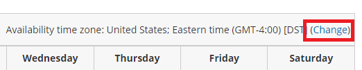
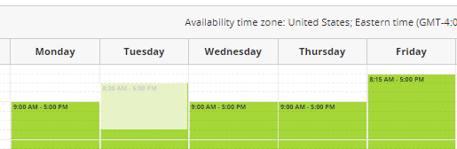

import { Aside } from '@astrojs/starlight/components';

Availability is always managed per Booking page. Availability settings on one Booking page are separate from the availability settings on another Booking page. OnceHub uses two types of availability: Recurring availability and [Date-specific availability](/booking-page-date-specific-availability-section/ "Booking page: Date-specific availability section").

You can use Recurring only, Date-specific only, or both. Recurring availability is defined on a weekly basis, allowing you to create a pattern that repeats every week.

You do not need an assigned product license to access and update the Recurring availability section, though you do need the right [Booking page access permissions](/booking-page-access-permissions/). This means an assistant or other collaborator can update your availability on your behalf, without paying for an extra license. [Learn more](/common-use-cases-for-users-without-a-scheduleonce-license/)

In this article, you'll learn about using the Recurring availability section.

```
&lt;script id="snippet-prepend">
$(function()&#123;
  
  /*disable in widget*/
  if($('.w-documentation-article').length === 0)&#123;

     var ToC =
  "&lt;nav role='navigation' class='table-of-contents toc-top'><h4>In this article:" + "<ul>";
     var el,     title, link, header;
      //Define the heading levels you want to use in ascending order. Can add extra or remove unneeded.
     $(".hg-article-body h1, .hg-article-body h2, .hg-article-body h3, .hg-article-body h4").each(function() &#123;
              el = $(this);
              title = el.text();
                 if(title != '')&#123;
                anchorTitle = el.text().replace(/([~!@#$%^&*()_+=`&#123;&#125;\[\]\|\\:;'&lt;>,.\/\? ])+/g, '-').toLowerCase();
                link = "#" + anchorTitle;
                //Set all headers to a 0-nesting level.
                header = 'header-nesting-0';
                //Adjust header-nesting layers so that they point to the correct html tag. header-nesting-1 should match the second .hg-article-body h# listed above; header-nesting-2 should match the third, etc.
                if($(this).is('h2'))&#123;
                    header = 'header-nesting-1';
                &#125;else if($(this).is('h3'))&#123;
                    header = 'header-nesting-2'
                &#125;
                el.html('<a id="'+anchorTitle+'" class="toc-anchor">' + el.html());
                newLine =
      "<li class='"+header+"'>" +
        "<a class='article-anchor' href='" + link + "'>" +
          title +
        "" +
      "";


                ToC += newLine;
              &#125;
              &#125;);
     ToC +=
   "" +
  "";
    $("#snippet-prepend").before(ToC);
  &#125;
&#125;);

&lt;/script>
```

```
&lt;style>
/* CSS to style the TOC as it displays and the auto-created anchors
.toc-top styles the box for the TOC; adjust styles here to tweak look and feel */
  
.toc-top &#123;
  background-color: #FAFAFA; /* set to #fff or delete entirely for no background */
  border: 1px solid #C8C8C8; /* adjust the color hex here to change border color */
  box-shadow: 0 1px 1px rgba(0, 0, 0, 0.05) inset;
  margin-top: 24px;
  margin-bottom: 36px;
  min-height: 20px;
  padding: 13px 20px;
  max-width: 75%;
&#125;
.toc-top h4 &#123;
  font-size: 18px;
  line-height: 26px;
  margin: 0 0 8px;
  font-weight: 400;
&#125;
.toc-top ul &#123;
  padding: 0 0 0 15px !important;
  margin-bottom: 0;	
&#125;
.toc-top > ul &#123;
  margin-bottom: 13px!important;
&#125;
.toc-anchor &#123;
  display: block;
  height: 90px; 
  margin-top: -90px; 
  visibility: hidden;
&#125;

/* Set the indentation for the nesting levels. May need to be edited to match changes above. Increase or decrease the margin-left to get your desired level of indentation. */
.header-nesting-1 &#123;
    margin-left: 14px;
&#125;
.header-nesting-1:before &#123;
	background-image: url(https://dyzz9obi78pm5.cloudfront.net/app/image/id/5d31bcc88e121c9b25ba22c4/n/bulletv2.svg)!important;
&#125;
.header-nesting-2 &#123;
    margin-left: 28px;
&#125;
.header-nesting-2:before &#123;
	background-image: url(https://dyzz9obi78pm5.cloudfront.net/app/image/id/5d31be536e121cf22b0cc6ae/n/bulletv3.svg)!important;
&#125;
&lt;/style>
```

# When to use Recurring availability

Recurring availability is best to use if your availability is consistent from week to week. This is especially true if you have connected your calendar and you use busy times to block out your availability. 

If you have exceptions to your Recurring availability, you can use [Date-specific availability](/booking-page-date-specific-availability-section/ "Booking page: Date-specific availability section") to edit your availability without changing your weekly pattern. Date-specific availability overrides Recurring availability, and can be used to reduce or increase your availability.

# Requirements

To edit the **Recurring availability** section, you must be an Owner or Editor of the Booking page with the permission enabled in your Profile.

# Editing the Recurring availability section

1.  Go to **Booking pages** in the bar on the left.
2.   Select the relevant Booking page.
3.  Click on the **Recurring availability** section of the Booking page (Figure 1).  
    The default weekly recurring availability is set between 9 AM and 5 PM based on the Booking page time zone.  
    Note that only a weekly pattern without dates is displayed. Busy time from your connected calendar is not shown.  
    Figure 1: Recurring availability section 
4.  To update the time zone for this entire Booking page, click the time zone **Change** link (Figure 2). Note that your connected calendar must be set to the same time zone.  
    
    
    Figure 2: Change time zone
    
5.  To modify the hours displayed in the grid, click **Expand** and define your preferences (Figure 3).  
    
    
    Figure 3: Expand hours
    
6.  To add availability, click and drag over white (unavailable) slots, to mark them green (Figure 4). This will increase your availability for all weeks.  
    Figure 4: Adding availability 
7.  To remove availability, click and drag over green (available) slots, to mark them white (Figure 5). This will reduce your availability for all weeks.  
    
    
    Figure 5: Removing availability
    
8.  Click **Save**.