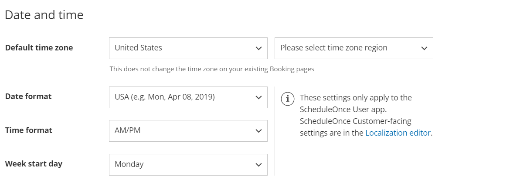

import { Aside } from '@astrojs/starlight/components';

In addition to a wide range of time zone features, OnceHub has developed its own time zone and Daylight Saving Time database. We track Daylight Saving changes worldwide to ensure that you never have a time zone mishap.

```
&lt;iframe width="640" height="360" src="https://www.youtube.com/embed/PadaGZU15zA?&amp;wmode=opaque&amp;rel=0" frameborder="0" allowfullscreen="" class="fr-draggable">&lt;/iframe>
```

  

```
&lt;script id="snippet-prepend">
$(function()&#123;
  
  /*disable in widget*/
  if($('.w-documentation-article').length === 0)&#123;

     var ToC =
  "&lt;nav role='navigation' class='table-of-contents toc-top'><h4>In this article:" + "<ul>";
     var el,     title, link, header;
      //Define the heading levels you want to use in ascending order. Can add extra or remove unneeded.
     $(".hg-article-body h1, .hg-article-body h2, .hg-article-body h3, .hg-article-body h4").each(function() &#123;
              el = $(this);
              title = el.text();
                 if(title != '')&#123;
                anchorTitle = el.text().replace(/([~!@#$%^&*()_+=`&#123;&#125;\[\]\|\\:;'&lt;>,.\/\? ])+/g, '-').toLowerCase();
                link = "#" + anchorTitle;
                //Set all headers to a 0-nesting level.
                header = 'header-nesting-0';
                //Adjust header-nesting layers so that they point to the correct html tag. header-nesting-1 should match the second .hg-article-body h# listed above; header-nesting-2 should match the third, etc.
                if($(this).is('h2'))&#123;
                    header = 'header-nesting-1';
                &#125;else if($(this).is('h3'))&#123;
                    header = 'header-nesting-2'
                &#125;
                el.html('<a id="'+anchorTitle+'" class="toc-anchor">' + el.html());
                newLine =
      "<li class='"+header+"'>" +
        "<a class='article-anchor' href='" + link + "'>" +
          title +
        "" +
      "";


                ToC += newLine;
              &#125;
              &#125;);
     ToC +=
   "" +
  "";
    $("#snippet-prepend").before(ToC);
  &#125;
&#125;);

&lt;/script>
```

```
&lt;style>
/* CSS to style the TOC as it displays and the auto-created anchors
.toc-top styles the box for the TOC; adjust styles here to tweak look and feel */
  
.toc-top &#123;
  background-color: #FAFAFA; /* set to #fff or delete entirely for no background */
  border: 1px solid #C8C8C8; /* adjust the color hex here to change border color */
  box-shadow: 0 1px 1px rgba(0, 0, 0, 0.05) inset;
  margin-top: 24px;
  margin-bottom: 36px;
  min-height: 20px;
  padding: 13px 20px;
  max-width: 75%;
&#125;
.toc-top h4 &#123;
  font-size: 18px;
  line-height: 26px;
  margin: 0 0 8px;
  font-weight: 400;
&#125;
.toc-top ul &#123;
  padding: 0 0 0 15px !important;
  margin-bottom: 0;	
&#125;
.toc-top > ul &#123;
  margin-bottom: 13px!important;
&#125;
.toc-anchor &#123;
  display: block;
  height: 90px; 
  margin-top: -90px; 
  visibility: hidden;
&#125;

/* Set the indentation for the nesting levels. May need to be edited to match changes above. Increase or decrease the margin-left to get your desired level of indentation. */
.header-nesting-1 &#123;
    margin-left: 14px;
&#125;
.header-nesting-1:before &#123;
	background-image: url(https://dyzz9obi78pm5.cloudfront.net/app/image/id/5d31bcc88e121c9b25ba22c4/n/bulletv2.svg)!important;
&#125;
.header-nesting-2 &#123;
    margin-left: 28px;
&#125;
.header-nesting-2:before &#123;
	background-image: url(https://dyzz9obi78pm5.cloudfront.net/app/image/id/5d31be536e121cf22b0cc6ae/n/bulletv3.svg)!important;
&#125;
&lt;/style>
```

# Time zone settings

By default, the time zone on the Booking page is the same as the time zone in the **Date and time** section in the Booking page owner's OnceHub Profile (Figure 1). You can access this by signing into your OnceHub Account, opening the left navigation bar and selecting [Profile **\->** Date and time section](/managing-your-profile-in-oncehub#datetime/ "Profile: Date and time section"). 

Figure 1: Date and time section

*   You can change the time zone setting in the [Overview](/booking-page-overview-section/ "Booking page: Overview section"), [Recurring availability](/booking-page-recurring-availability-section/ "Booking Page: Recurring Availability section"), or [Date-specific availability](/booking-page-date-specific-availability-section/ "Booking Page: Date-specific availability section") sections of each Booking page. 
*   When you change the time zone in one of these sections, it automatically updates the other sections. The timezone on the User's profile is not affected.

The ability to have different time zones for different Booking pages is handy in the following scenarios.

# Accepting appointments for distributed teams across multiple time zones

If you have Team members in multiple time zones, create a Booking page for each Team member. Each Team member's Booking page can be set to their local time zone. Bookings will be created directly in their calendar according to their local time zone. 

This configuration is very useful for distributed teams such as sales teams, online tutors, consultants, and more. [Learn more about User management](/introduction-to-user-management/ "Introduction to User management")

# Scheduling for frequent travelers

If you travel often, one of the biggest challenges in scheduling your appointments is the need to manage scheduling for at least two locations and time zones: your home location and the destination location. 

You can create a separate Booking page for each location or travel destination. You can set each Booking page to its own individual time zone and use Date-specific availability to specify the days and times of your stay in the local time zone. [Learn more about scheduling meetings for a business trip](/scheduling-meetings-for-a-business-trip/ "Scheduling meetings for a business trip")