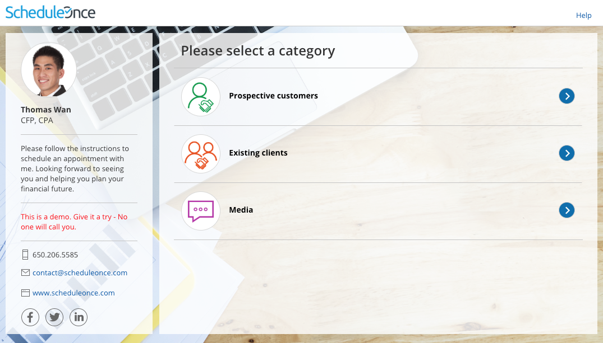
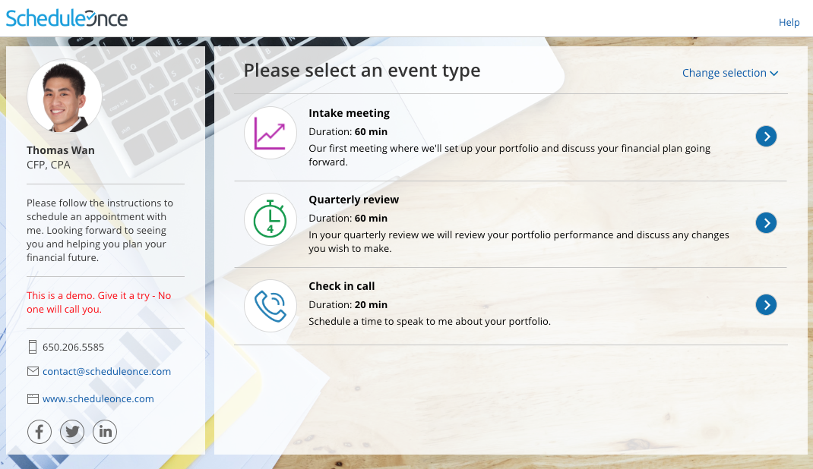

import { Aside } from '@astrojs/starlight/components';

You can use [categories](/so-introduction-to-categories/ "Introduction to Categories") to organize your [Event types](/introduction-to-event-types/ "Introduction to Event types") into groups based on meeting type, group, location, etc. If Event type categories are [visible to Customers](/creating-categories-for-booking-pages-or-event-types/ "Creating categories for Booking pages or Event types"), they will show up on your [Booking pages](/introduction-to-booking-pages/ "Introduction to Booking pages") as a separate step. This helps Customers better understand the available options and ensures that they select the correct Event type. 

# Scheduling flow of Booking pages with categorized Event types

[Click this link for an interactive demo](https://go.oncehub.com/financialplanner)

1.  **Category selection:** First, Customers are presented with a list of categories. In the example shown below (Figure 1), categories are used to model the query type.  
    Figure 1: Category selection step
    
    **Tip**In Booking pages, the selection instructions on the category step are "Please select a category". Category labels and selection instructions cannot be changed in Booking pages.  
      
    If you want to customize the selection instructions, you must create the scheduling scenario using [categories in a Master page](/the-customer-experience-of-categorized-items-in-master-pages/ "The Customer experience of categorized items in Master pages").
    
2.  Once the Customer has selected a category, they'll be presented with a list of Event types in that category. If you only have one Event type in a category, the Event type selection step will be skipped.
    
    **Tip**In Booking pages, the Selection instructions on the Event type step are "Please select an event type". Category labels and selection instructions cannot be changed in Booking pages.  
      
    If you want to customize the Selection instructions you must create the scheduling scenario using [categories in a Master page](/the-customer-experience-of-categorized-items-in-master-pages/ "The Customer experience of categorized items in Master pages"). 
    
    Figure 2: Event type selection
    
    **Note**Event types that are not in a category will also be displayed in this step, regardless of which category the Customer selected.
    
3.  **Event type selection:** The Customer selects an Event type from the list. Once the Event type has been selected, Customers will pick a date and time for the meeting and fill out and submit the Booking form.
    

The Category will always appear in [User notifications](/communicating-with-users-and-stakeholders/ "Communicating with Users and stakeholders"). The category will only appear in [Customer notifications](/introduction-to-customer-notifications/ "The Customer Notifications section") if the Customer went through a Category selection step during their booking process.