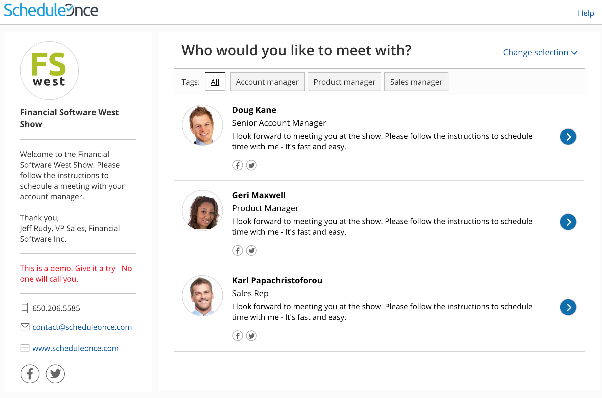
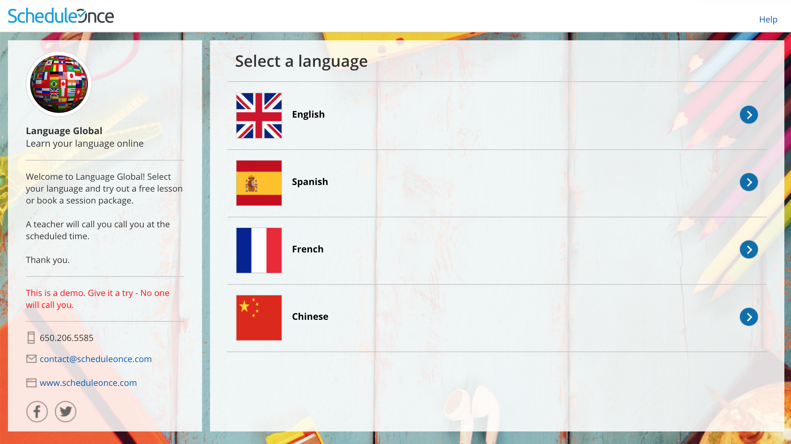
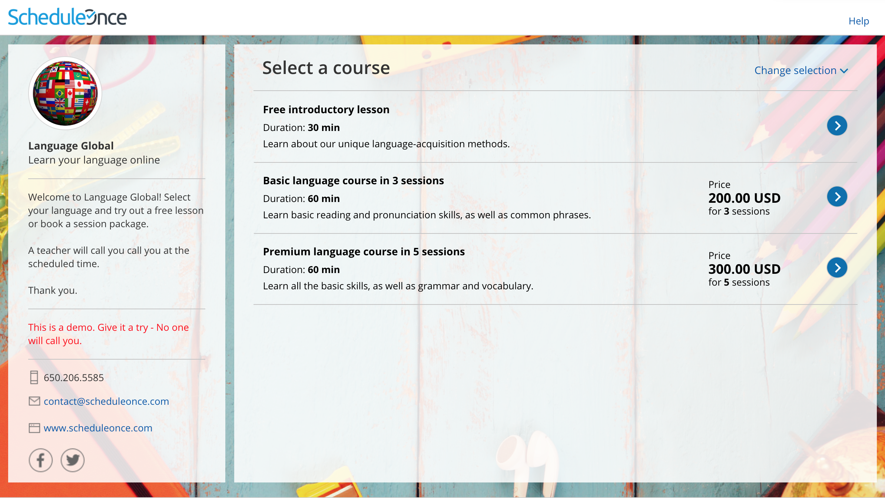

import { Aside } from '@astrojs/starlight/components';

You can use [categories](/so-introduction-to-categories/ "Introduction to categories") to organize [Event types](/introduction-to-event-types/ "Introduction to Event types") and [Booking pages](/introduction-to-booking-pages/ "Introduction to Booking pages") into intuitive and functional groups. If Event type categories or Booking page categories are [visible to Customers](/creating-categories-for-booking-pages-or-event-types/ "Creating categories for Booking pages or Event types"), they will show up on your Master page as a separate step. Categories in Master pages help Customers to better understand the options available to them, ensuring that they make the correct selection.

```
&lt;script id="snippet-prepend">
$(function()&#123;
  
  /*disable in widget*/
  if($('.w-documentation-article').length === 0)&#123;

     var ToC =
  "&lt;nav role='navigation' class='table-of-contents toc-top'><h4>In this article:" + "<ul>";
     var el,     title, link, header;
      //Define the heading levels you want to use in ascending order. Can add extra or remove unneeded.
     $(".hg-article-body h1, .hg-article-body h2, .hg-article-body h3, .hg-article-body h4").each(function() &#123;
              el = $(this);
              title = el.text();
                 if(title != '')&#123;
                anchorTitle = el.text().replace(/([~!@#$%^&*()_+=`&#123;&#125;\[\]\|\\:;'&lt;>,.\/\? ])+/g, '-').toLowerCase();
                link = "#" + anchorTitle;
                //Set all headers to a 0-nesting level.
                header = 'header-nesting-0';
                //Adjust header-nesting layers so that they point to the correct html tag. header-nesting-1 should match the second .hg-article-body h# listed above; header-nesting-2 should match the third, etc.
                if($(this).is('h2'))&#123;
                    header = 'header-nesting-1';
                &#125;else if($(this).is('h3'))&#123;
                    header = 'header-nesting-2'
                &#125;
                el.html('<a id="'+anchorTitle+'" class="toc-anchor">' + el.html());
                newLine =
      "<li class='"+header+"'>" +
        "<a class='article-anchor' href='" + link + "'>" +
          title +
        "" +
      "";


                ToC += newLine;
              &#125;
              &#125;);
     ToC +=
   "" +
  "";
    $("#snippet-prepend").before(ToC);
  &#125;
&#125;);

&lt;/script>
```

```
&lt;style>
/* CSS to style the TOC as it displays and the auto-created anchors
.toc-top styles the box for the TOC; adjust styles here to tweak look and feel */
  
.toc-top &#123;
  background-color: #FAFAFA; /* set to #fff or delete entirely for no background */
  border: 1px solid #C8C8C8; /* adjust the color hex here to change border color */
  box-shadow: 0 1px 1px rgba(0, 0, 0, 0.05) inset;
  margin-top: 24px;
  margin-bottom: 36px;
  min-height: 20px;
  padding: 13px 20px;
  max-width: 75%;
&#125;
.toc-top h4 &#123;
  font-size: 18px;
  line-height: 26px;
  margin: 0 0 8px;
  font-weight: 400;
&#125;
.toc-top ul &#123;
  padding: 0 0 0 15px !important;
  margin-bottom: 0;	
&#125;
.toc-top > ul &#123;
  margin-bottom: 13px!important;
&#125;
.toc-anchor &#123;
  display: block;
  height: 90px; 
  margin-top: -90px; 
  visibility: hidden;
&#125;

/* Set the indentation for the nesting levels. May need to be edited to match changes above. Increase or decrease the margin-left to get your desired level of indentation. */
.header-nesting-1 &#123;
    margin-left: 14px;
&#125;
.header-nesting-1:before &#123;
	background-image: url(https://dyzz9obi78pm5.cloudfront.net/app/image/id/5d31bcc88e121c9b25ba22c4/n/bulletv2.svg)!important;
&#125;
.header-nesting-2 &#123;
    margin-left: 28px;
&#125;
.header-nesting-2:before &#123;
	background-image: url(https://dyzz9obi78pm5.cloudfront.net/app/image/id/5d31be536e121cf22b0cc6ae/n/bulletv3.svg)!important;
&#125;
&lt;/style>
```

# Scheduling flow of Master pages with categorized Booking pages

[Click this link for an interactive demo](https://go.oncehub.com/show)

1.  **Category selection:** Customers are presented with a list of Booking page categories to choose from. 
    *   By default, the selection instruction is "Select a category." You can [edit the instruction](/creating-categories-for-booking-pages-or-event-types/ "Creating categories for Booking pages or Event types") based on what your categories represent. 
    *   In the example shown below, categories are used to model different product types offered by the Financial services company. The selection instructions are "Select your product interest."Figure 1: Category selection step
2.  **Booking page selection:** Once the Customer has selected a category, they'll be presented with a list of all Booking pages in the selected category.  In this example, the Customer sees Booking pages for Team members that specialize in the chosen product category.  
    Figure 2: Booking page selection step
    
    **Note** Booking pages that are not within a category will also be displayed in this step, regardless of which category the Customer selected.
    
3.  **Event type selection:** Next, the Customer will choose an Event type. 
4.  Finally, the Customer will pick a date and time for the meeting and fill out and submit the [Booking form](/introduction-to-the-booking-form-redirect-section/ "Introduction to the Booking form and redirect section").
    

The category name will always appear in [User notifications](/communicating-with-users-and-stakeholders/ "Communicating with Users and stakeholders"). The category name will only appear in [Customer notifications](/introduction-to-customer-notifications/ "The Customer Notifications section") if the Customer went through a category selection step during their booking process.

# Scheduling flow of Master pages with categorized Event types

[Click this link for an interactive demo](https://go.oncehub.com/Tutoring)

1.  **Category selection:** Customers are presented with a list of Event type categories. 
    *   By default, the selection instruction is "Select a category." You can edit the instructions based on what your categories represent. 
    *   In the example shown below, categories are used for different languages that are taught at the school. The selection instructions are "Select a language."Figure 3: Category selection step
2.  **Event type selection:** Once the Customer has selected a category, they'll be presented with a list of all the Event types in the selected category. In this example, the Customer sees all courses offered in the selected language.Figure 4: Event type selection step
    
    **Note**Event types that are not within a category will also be displayed in this step, regardless of which category the Customer selected.
    
3.  Once the Customer has selected an Event type, they'll continue the scheduling process. In this example, the Customer picks a tutor, selects a time, and fills out the Booking form.
    

The Category will always appear in [User notifications](/communicating-with-users-and-stakeholders/ "Communicating with Users and stakeholders"). The category will only appear in [Customer notifications](/introduction-to-customer-notifications/ "The Customer Notifications section") if the Customer went through a Category selection step during their booking process.

# Scheduling flow of Master pages with categorized Booking pages and Event types

Master pages with categorized Event types and Booking pages will have two separate category selection steps: one for Booking page categories and one for Event type categories. The order in which the category selection steps is displayed depends on the [Master page scenario](/master-page-scenarios/ "Master page scenarios").

Let's take a look at an example where the chosen scenario is **Event types first**.

1.  **Event type category selection:** First, the Customer is presented with a list of Event type categories. After they select an Event type category, they'll be presented with a list of all the Event types in that category. 
    
2.  **Event type selection**: The Customer selects an Event type in that category. 
    
    **Note**Event types that are not within a category will also be displayed in this step, regardless of which category the Customer selected.
    
3.  **Booking page category selection:** After selecting an Event type, the Customer is presented with a list of Booking page categories. After they select a Booking page category, they'll be presented with a list of all the Booking pages in that category. 
4.  **Booking page selection:** The Customer selects a Booking page in that category.
    
    **Note**Booking pages that are not within a category will also be displayed in this step, regardless of which category the Customer selected.
    
5.  Finally, they'll select a date and time, and fill out a Booking form.