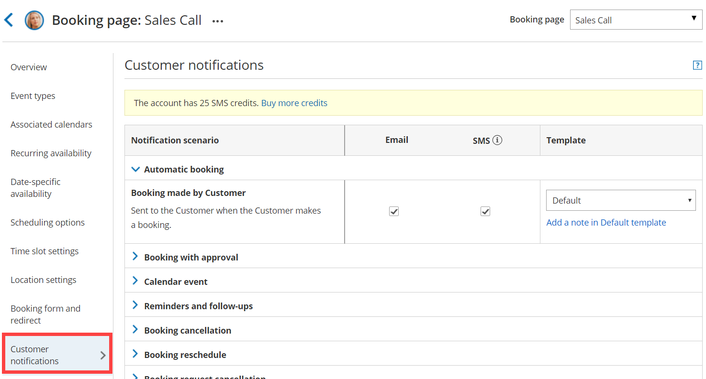
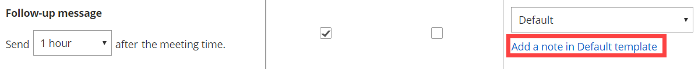
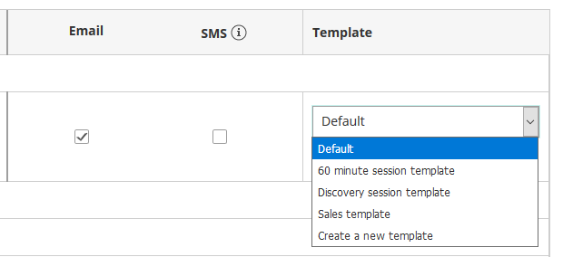

import { Aside } from '@astrojs/starlight/components';

The Customer notifications section is where you set which notification scenarios will trigger email notifications, [SMS notifications](/getting-started-with-oncehub/introduction-to-oncehub/introduction-to-sms-notifications/ "Introduction to SMS notifications"), or both to be sent to your Customers. Examples of notification scenarios include: scheduling confirmations, event reminders, event follow-ups, [cancellations](/introduction-to-canceling-and-rescheduling/ "Introduction to canceling and rescheduling"), and [rescheduled bookings](/introduction-to-canceling-and-rescheduling/ "Introduction to canceling and rescheduling"). 

```
&lt;script id="snippet-prepend">
$(function()&#123;
  
  /*disable in widget*/
  if($('.w-documentation-article').length === 0)&#123;

     var ToC =
  "&lt;nav role='navigation' class='table-of-contents toc-top'><h4>In this article:" + "<ul>";
     var el,     title, link, header;
      //Define the heading levels you want to use in ascending order. Can add extra or remove unneeded.
     $(".hg-article-body h1, .hg-article-body h2, .hg-article-body h3, .hg-article-body h4").each(function() &#123;
              el = $(this);
              title = el.text();
                 if(title != '')&#123;
                anchorTitle = el.text().replace(/([~!@#$%^&*()_+=`&#123;&#125;\[\]\|\\:;'&lt;>,.\/\? ])+/g, '-').toLowerCase();
                link = "#" + anchorTitle;
                //Set all headers to a 0-nesting level.
                header = 'header-nesting-0';
                //Adjust header-nesting layers so that they point to the correct html tag. header-nesting-1 should match the second .hg-article-body h# listed above; header-nesting-2 should match the third, etc.
                if($(this).is('h2'))&#123;
                    header = 'header-nesting-1';
                &#125;else if($(this).is('h3'))&#123;
                    header = 'header-nesting-2'
                &#125;
                el.html('<a id="'+anchorTitle+'" class="toc-anchor">' + el.html());
                newLine =
      "<li class='"+header+"'>" +
        "<a class='article-anchor' href='" + link + "'>" +
          title +
        "" +
      "";


                ToC += newLine;
              &#125;
              &#125;);
     ToC +=
   "" +
  "";
    $("#snippet-prepend").before(ToC);
  &#125;
&#125;);

&lt;/script>
```

```
&lt;style>
/* CSS to style the TOC as it displays and the auto-created anchors
.toc-top styles the box for the TOC; adjust styles here to tweak look and feel */
  
.toc-top &#123;
  background-color: #FAFAFA; /* set to #fff or delete entirely for no background */
  border: 1px solid #C8C8C8; /* adjust the color hex here to change border color */
  box-shadow: 0 1px 1px rgba(0, 0, 0, 0.05) inset;
  margin-top: 24px;
  margin-bottom: 36px;
  min-height: 20px;
  padding: 13px 20px;
  max-width: 75%;
&#125;
.toc-top h4 &#123;
  font-size: 18px;
  line-height: 26px;
  margin: 0 0 8px;
  font-weight: 400;
&#125;
.toc-top ul &#123;
  padding: 0 0 0 15px !important;
  margin-bottom: 0;	
&#125;
.toc-top > ul &#123;
  margin-bottom: 13px!important;
&#125;
.toc-anchor &#123;
  display: block;
  height: 90px; 
  margin-top: -90px; 
  visibility: hidden;
&#125;

/* Set the indentation for the nesting levels. May need to be edited to match changes above. Increase or decrease the margin-left to get your desired level of indentation. */
.header-nesting-1 &#123;
    margin-left: 14px;
&#125;
.header-nesting-1:before &#123;
	background-image: url(https://dyzz9obi78pm5.cloudfront.net/app/image/id/5d31bcc88e121c9b25ba22c4/n/bulletv2.svg)!important;
&#125;
.header-nesting-2 &#123;
    margin-left: 28px;
&#125;
.header-nesting-2:before &#123;
	background-image: url(https://dyzz9obi78pm5.cloudfront.net/app/image/id/5d31be536e121cf22b0cc6ae/n/bulletv3.svg)!important;
&#125;
&lt;/style>
```

# Location of the Customer notifications section

By default, when your [Booking page is associated with Event types](/adding-event-types-to-booking-pages/ "Adding Event types to Booking pages"), the Customer notifications section is [located on the Event type](/introduction-to-event-types/ "Introduction to Event types"). When your [Booking Page](/introduction-to-booking-pages/ "Introduction to Booking pages") is not associated with [Event types](/introduction-to-event-types/ "Introduction to Event types"), this section is located on the Booking page[](https://oncehub.knowledgeowl.com/help/introduction-to-event-types "Introduction to Event types"). However, your account Administrator can [change the location of this section](/event-type-sections/ "Event type sections: Location of the Booking form and the Customer notifications sections") to be always on either Booking pages or Event types for the entire account.

*   For Booking pages **associated** with Event types, go to **Booking pages** in the bar on the left → select the relevant **Event type → Customer notifications** section (Figure 1). 
    
    Figure 1: Customer notifications section on Event type
    
*   For Booking pages **not associated** with Event types, go to go to **Booking pages** in the bar on the left → select the relevant **Booking page →** **Customer notifications** section (Figure 2).  
    
    
    Figure 2: Customer notifications section on Booking page
    

# Configuring notifications

Notification scenarios are booking events that will trigger an email or SMS notification to be sent to the Customer. [Learn more about the different Customer notification scenarios and when they apply](/customer-notification-scenarios/ "Customer notification scenarios")

**Note** Not all scenarios apply to every situation. For example, the [Booking request made by Customer](/scheduling-and-responding-to-booking-requests/ "Scheduling and responding to booking requests") scenario triggers a notification to the Customer when the Customer makes a Booking request. However, this scenario only applies to Booking pages that use [Booking with approval mode](/automatic-booking-or-booking-with-approval/ "Automatic booking or Booking with approval").

# Selecting a delivery method: Email or SMS

You can send an email notification or [SMS notification](/getting-started-with-oncehub/introduction-to-oncehub/introduction-to-sms-notifications/ "Introduction to SMS notifications") for each Notification scenario, such as the Automatic booking scenario (Figure 3). 

Figure 3:  Email notification and SMS notification selected

The exception is the [Calendar event](/customer-calendar-event-options/ "Customer Calendar Event options") scenario, which has no SMS notification option (Figure 4).

Figure 4: Calendar event notification option

# Reminders and follow-ups

You can send up to three Customer reminders before a meeting. You can choose to send a reminder from between 5 minutes to 30 days before the meeting time (Figure 5). By default, email notifications are checked for all three Customer reminders. 

Figure 5: Customer reminder optionsYou can also send a follow-up message after the meeting. By default, the follow-up message options are unchecked. No follow-up messages will be sent unless you select them. You can choose to send a follow-up message from between 5 minutes to 30 days after a booking (Figure 6). 

**Figure 6: Follow-up message option**

**Note**

We recommend sending SMS notifications in addition to email notifications. SMS notifications usually short, whereas the notification emails contain all of the important booking information that your Customer will need. 

You can create [Custom SMS templates](/how-to-create-a-custom-email-or-sms-template/ "How to create a Custom email or SMS template") that include more information, but the messages will be longer.

# Adding personal notes to emails

If you use Default templates, the majority of the content in email notifications and SMS notifications is fixed and cannot be changed. However, you can add a short note to some of the notification emails to make the message more personal and to help the Customer prepare for the upcoming meeting. 

For example, if you're a tax consultant, you might want to add a note to your booking confirmation and reminder notifications that says, “Please remember to bring your income statement and bank details to our meeting.” 

The length of the note is limited to 10,000 characters. A note can be added by clicking the **Add note in Default template** link under the **Template** drop-down menu (Figure 7).

Figure 7: Add a note to your notification email

## Adding notes to confirmation emails

You can add a note to the confirmation emails that are sent in the following notification scenarios:

*   Booking made by Customer
*   Booking request approved by User
*   The Calendar event

These three notification scenarios share the same note. If you write a note for one of these emails, it's automatically added to the other two notification emails. Any edits you make in one are also automatically applied to the other two.

## Adding notes to reminders 

A separate note can be written for Customer email reminders. The email reminders share the same note. If you write a note for one email reminder, it's automatically added to the other email reminders. Any edits you make to one reminder note are automatically applied to the other reminders.

## Creating a follow-up email or SMS notification

For the follow-up message option, there's no pre-written text in the Default email template or SMS template. If you want to send a follow-up message to your Customer, you'll need to write your own text by clicking the **Add a note in Default template** link (Figure 8). 

Figure 8: Add a note to your follow-up message

# Customizing your notifications further

If you need further customization of your email notifications and SMS notifications, you can use [Custom templates](/how-to-create-a-custom-email-or-sms-template/ "How to create a Custom email or SMS template"). Custom templates give you the utmost flexibility over the content, allowing you to insert images, use any text you want, and add hyperlinks. 

The templates you create are available as choices via the drop-down menu in the **Template** column (Figure 9). [Learn more about custom template editors](/introduction-to-the-notification-templates-editor/ "Introduction to the Notification Templates Editor")

Figure 9: Choosing a custom template

# Setting the time for reminder and follow-up notifications

You can send up to three reminders before a meeting and a follow-up message after the meeting. Reminders can be sent up to 30 days in advance and the follow-up message can be sent up to 30 days after your meeting is over. You can choose the timing of the reminders and follow-ups by using the drop-down menus (Figure 10). 

Figure 10: Timing option menus

It's important to think about the best notification timeline for your target audience and how they would like to receive reminders. For example, you may want to send an email notification a week before the meeting time, an email and SMS the day before, and an SMS ten minutes before.

Sending SMS reminders in addition to email reminders gives your Customers additional reminder channels and makes them less likely to miss your meeting. [Learn more about sending SMS notifications to your Customers](/sending-sms-notifications-to-customers/ "Sending SMS notifications to Customers")