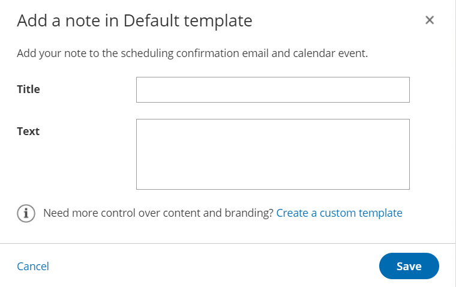

import { Aside } from '@astrojs/starlight/components';

When you're scheduling bookings, there are many instances where you might want to send an email or an SMS to your Customer. There are several events on your Customer's journey to making a booking. OnceHub allows you to pick and choose which events your Customers are notified about and which delivery method to use. 

For example, you might want to send your Customer an email when a booking is confirmed and an SMS reminder a day before the meeting. The Customer notification settings can be different for every Booking page or Event type. You can set up Customer notifications in a few simple steps.

```
&lt;script id="snippet-prepend">
$(function()&#123;
  
  /*disable in widget*/
  if($('.w-documentation-article').length === 0)&#123;

     var ToC =
  "&lt;nav role='navigation' class='table-of-contents toc-top'><h4>In this article:" + "<ul>";
     var el,     title, link, header;
      //Define the heading levels you want to use in ascending order. Can add extra or remove unneeded.
     $(".hg-article-body h1, .hg-article-body h2, .hg-article-body h3, .hg-article-body h4").each(function() &#123;
              el = $(this);
              title = el.text();
                 if(title != '')&#123;
                anchorTitle = el.text().replace(/([~!@#$%^&*()_+=`&#123;&#125;\[\]\|\\:;'&lt;>,.\/\? ])+/g, '-').toLowerCase();
                link = "#" + anchorTitle;
                //Set all headers to a 0-nesting level.
                header = 'header-nesting-0';
                //Adjust header-nesting layers so that they point to the correct html tag. header-nesting-1 should match the second .hg-article-body h# listed above; header-nesting-2 should match the third, etc.
                if($(this).is('h2'))&#123;
                    header = 'header-nesting-1';
                &#125;else if($(this).is('h3'))&#123;
                    header = 'header-nesting-2'
                &#125;
                el.html('<a id="'+anchorTitle+'" class="toc-anchor">' + el.html());
                newLine =
      "<li class='"+header+"'>" +
        "<a class='article-anchor' href='" + link + "'>" +
          title +
        "" +
      "";


                ToC += newLine;
              &#125;
              &#125;);
     ToC +=
   "" +
  "";
    $("#snippet-prepend").before(ToC);
  &#125;
&#125;);

&lt;/script>
```

```
&lt;style>
/* CSS to style the TOC as it displays and the auto-created anchors
.toc-top styles the box for the TOC; adjust styles here to tweak look and feel */
  
.toc-top &#123;
  background-color: #FAFAFA; /* set to #fff or delete entirely for no background */
  border: 1px solid #C8C8C8; /* adjust the color hex here to change border color */
  box-shadow: 0 1px 1px rgba(0, 0, 0, 0.05) inset;
  margin-top: 24px;
  margin-bottom: 36px;
  min-height: 20px;
  padding: 13px 20px;
  max-width: 75%;
&#125;
.toc-top h4 &#123;
  font-size: 18px;
  line-height: 26px;
  margin: 0 0 8px;
  font-weight: 400;
&#125;
.toc-top ul &#123;
  padding: 0 0 0 15px !important;
  margin-bottom: 0;	
&#125;
.toc-top > ul &#123;
  margin-bottom: 13px!important;
&#125;
.toc-anchor &#123;
  display: block;
  height: 90px; 
  margin-top: -90px; 
  visibility: hidden;
&#125;

/* Set the indentation for the nesting levels. May need to be edited to match changes above. Increase or decrease the margin-left to get your desired level of indentation. */
.header-nesting-1 &#123;
    margin-left: 14px;
&#125;
.header-nesting-1:before &#123;
	background-image: url(https://dyzz9obi78pm5.cloudfront.net/app/image/id/5d31bcc88e121c9b25ba22c4/n/bulletv2.svg)!important;
&#125;
.header-nesting-2 &#123;
    margin-left: 28px;
&#125;
.header-nesting-2:before &#123;
	background-image: url(https://dyzz9obi78pm5.cloudfront.net/app/image/id/5d31be536e121cf22b0cc6ae/n/bulletv3.svg)!important;
&#125;
&lt;/style>
```

# Templates

You can use our Default templates or create your own. The Default email and SMS templates use text created by OnceHub which provides your Customer with all the important meeting information such as meeting time and location.

1.  You can add the Booking page image to all default Customer notification emails except for the **Booking request canceled by Customer** email notification. Including the Team Member’s image allows you to engage with your Customers on a more personal level.  
      
    
    **Note**  
    This option is enabled by default for all Booking pages created after December 20th 2015. For Booking pages created before December 20th 2015, you can enable this option in the [Booking page Public content section](/booking-page-public-content-section/ "Booking page: Public content section").
    
2.  You can add notes to the Customer’s default confirmation email and reminder email templates without changing the rest of the message content (Figure 1). This is done in the [Customer notifications section](/introduction-to-customer-notifications/ "The Customer Notifications section").  
    
    
    Figure 1: Add a note to a Default template
    
3.  If you want to customize the text or the appearance of your email and SMS messages to your customers, you can create your own templates in the [Notification templates editor](/introduction-to-the-notification-templates-editor/ "Introduction to the Notification templates editor"). You can access the editor by going to **Booking pages** in the bar on the left → **Notification templates editor** in the bar on the left.

# Notification scenarios and delivery methods

You can choose the notifications scenarios and delivery methods that suit your needs. The [Customer notifications section](/introduction-to-customer-notifications/ "The Customer notifications section") lists all of the possible notification scenarios that can take place throughout the booking lifecycle. Here are the options that you can select:

*   **Scenarios:** Events that can occur during a booking lifecycle.  
*   **Delivery method:** Email, SMS, or both. 
*   **Template:** You can choose the Default template or a custom one you created. 

When your [Booking page is associated with Event types](/adding-event-types-to-booking-pages/ "Adding Event types to Booking pages"), the Customer notifications section is [located on the Event type](/introduction-to-event-types/ "Introduction to Event types"). When your [Booking Page](/introduction-to-booking-pages/ "Introduction to Booking pages") is not associated with [Event types](/introduction-to-event-types/ "Introduction to Event types"), this section is located on the Booking page[](https://help.oncehub.com/help/introduction-to-event-types "Introduction to Event types"). 

[Learn more about the location of the Customer notifications section](/introduction-to-customer-notifications/ "The Customer notifications section")

**Note**If a Customer invites additional guests to the meeting via the [Customer guests](/multiple-attendee-scenario-can-customers-invite-guests-to-a-booking/ "Can Customers Invite Guests to a Booking?") feature, those guests will be CCed in all email notifications, but will not receive any SMS notifications.

# Collecting a mobile number from the Customer

If you want to send SMS alerts to your Customer, you'll need to collect a mobile number via the Booking form. To do this, you'll need to add the **Customer mobile phone** [system field](/the-fields-library/ "The Fields library") to the Booking form used in your Booking page. Booking forms are created and edited in the [Booking forms editor](/introduction-to-the-booking-forms-editor/ "Introduction to the Booking forms editor"). Go to **Booking pages** in the bar on the left → **Booking forms editor** in the bar on the left.

[Learn more about creating a Booking form](/creating-a-booking-form/ "Creating a Booking form")

**Note**If a Customer does not provide a mobile number or types it incorrectly, SMS notifications will not be delivered.