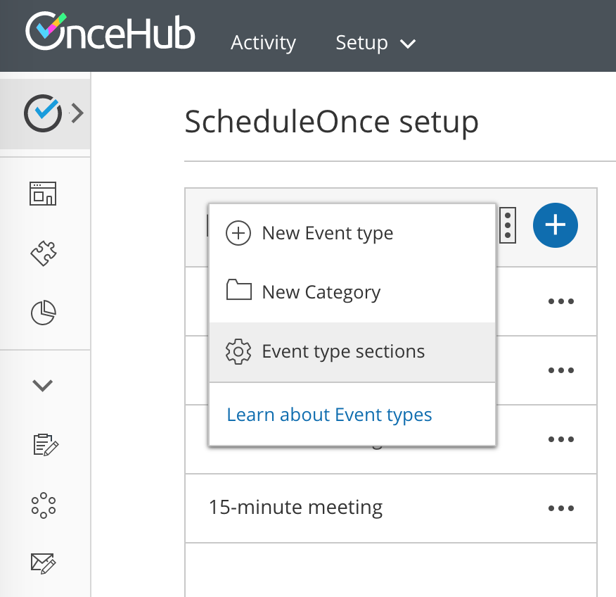
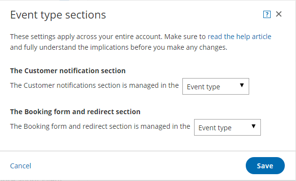

import { Aside } from '@astrojs/starlight/components';

You can change the location of the [Booking form and redirect](/introduction-to-the-booking-form-redirect-section/ "Introduction to the Booking form and redirect section") section and the [Customer notifications](/introduction-to-customer-notifications/ "The Customer notifications section") section to be within either the [Booking page](/introduction-to-booking-pages/ "Introduction to Booking pages") or the [Event type](/introduction-to-event-types/ "Introduction to Event types"). 

In this article, you'll learn about the options for customizing the location of the Booking form and Customer notificiations section.

```
&lt;script id="snippet-prepend">
$(function()&#123;
  
  /*disable in widget*/
  if($('.w-documentation-article').length === 0)&#123;

     var ToC =
  "&lt;nav role='navigation' class='table-of-contents toc-top'><h4>In this article:" + "<ul>";
     var el,     title, link, header;
      //Define the heading levels you want to use in ascending order. Can add extra or remove unneeded.
     $(".hg-article-body h1, .hg-article-body h2, .hg-article-body h3, .hg-article-body h4").each(function() &#123;
              el = $(this);
              title = el.text();
                 if(title != '')&#123;
                anchorTitle = el.text().replace(/([~!@#$%^&*()_+=`&#123;&#125;\[\]\|\\:;'&lt;>,.\/\? ])+/g, '-').toLowerCase();
                link = "#" + anchorTitle;
                //Set all headers to a 0-nesting level.
                header = 'header-nesting-0';
                //Adjust header-nesting layers so that they point to the correct html tag. header-nesting-1 should match the second .hg-article-body h# listed above; header-nesting-2 should match the third, etc.
                if($(this).is('h2'))&#123;
                    header = 'header-nesting-1';
                &#125;else if($(this).is('h3'))&#123;
                    header = 'header-nesting-2'
                &#125;
                el.html('<a id="'+anchorTitle+'" class="toc-anchor">' + el.html());
                newLine =
      "<li class='"+header+"'>" +
        "<a class='article-anchor' href='" + link + "'>" +
          title +
        "" +
      "";


                ToC += newLine;
              &#125;
              &#125;);
     ToC +=
   "" +
  "";
    $("#snippet-prepend").before(ToC);
  &#125;
&#125;);

&lt;/script>
```

```
&lt;style>
/* CSS to style the TOC as it displays and the auto-created anchors
.toc-top styles the box for the TOC; adjust styles here to tweak look and feel */
  
.toc-top &#123;
  background-color: #FAFAFA; /* set to #fff or delete entirely for no background */
  border: 1px solid #C8C8C8; /* adjust the color hex here to change border color */
  box-shadow: 0 1px 1px rgba(0, 0, 0, 0.05) inset;
  margin-top: 24px;
  margin-bottom: 36px;
  min-height: 20px;
  padding: 13px 20px;
  max-width: 75%;
&#125;
.toc-top h4 &#123;
  font-size: 18px;
  line-height: 26px;
  margin: 0 0 8px;
  font-weight: 400;
&#125;
.toc-top ul &#123;
  padding: 0 0 0 15px !important;
  margin-bottom: 0;	
&#125;
.toc-top > ul &#123;
  margin-bottom: 13px!important;
&#125;
.toc-anchor &#123;
  display: block;
  height: 90px; 
  margin-top: -90px; 
  visibility: hidden;
&#125;

/* Set the indentation for the nesting levels. May need to be edited to match changes above. Increase or decrease the margin-left to get your desired level of indentation. */
.header-nesting-1 &#123;
    margin-left: 14px;
&#125;
.header-nesting-1:before &#123;
	background-image: url(https://dyzz9obi78pm5.cloudfront.net/app/image/id/5d31bcc88e121c9b25ba22c4/n/bulletv2.svg)!important;
&#125;
.header-nesting-2 &#123;
    margin-left: 28px;
&#125;
.header-nesting-2:before &#123;
	background-image: url(https://dyzz9obi78pm5.cloudfront.net/app/image/id/5d31be536e121cf22b0cc6ae/n/bulletv3.svg)!important;
&#125;
&lt;/style>
```

# Customizing the location of the Booking form and Customer notifications section

1.   Go to **Booking pages** in the bar on the left.
2.  Click the action menu (3 dots) of the Event types section (Figure 1).  
    
    
    Figure 1: Event types action menu
    
3.  In the drop-down menu, click **Event type sections**. 
4.  In the pop-up (Figure 2), you can select where you want the **Customer notifications section** and the **Booking form and redirect section** to be managed.  
    
    
    Figure 2: Event types sections popup
    
5.  Click **Save**.

The option to customize the location means that Booking forms and Customer notifications can vary either by Booking page or by Event type. This additional flexibility enables better modeling of advanced scheduling scenarios and provides a better scheduling experience for your Customers.

[Booking forms](/booking-form/ "Introduction to Booking forms") allow you to collect more information from your Customers when they make a booking. The information collected will be available from the [Activity stream](/introduction-to-the-activity-stream/ "Introduction to the ScheduleOnce Activity stream"), Calendar events, and in all email communication to you and your Customers. Note that the [Automatic redirect](/automatic-redirect/ "Automatic redirect") feature is also located in the **Booking form and redirect** section.

[Customer notifications](/introduction-to-customer-notifications/ "The Customer notifications section") are automatic email notifications and SMS notifications sent to your Customers throughout the scheduling process. Customer notifications include scheduling confirmation, reminders, and follow-ups.

# Option 1: Managing both sections on Event types

This solution is a great option for accounts that need to centralize the management of Customer notifications and Booking forms by Event types. This is the default location when [Booking pages are associated with Event types](/adding-event-types-to-booking-pages/ "Adding Event types to Booking pages") (recommended). 

For example, consider a multi-user account with multiple members providing coaching services in various locations. The Users can standardize and localize the online booking experience by managing Customer notifications and Booking forms at the Event type level.

# Option 2: Managing both sections on Booking pages

This solution is a great option for accounts with multiple Users who need to customize the online booking experience for each individual User. This is the default location when Booking pages **are not associated** with Event types. 

For example, external experts or consultants providing independent services can customize Customer notifications and Booking forms on their respective Booking pages. In this case, the Master page is used as a portal for the independent experts or consultants.

# Option 3: Managing the Booking form and redirect section on Booking pages and the Customer notifications section on Event types

In this case, you want to standardize Customer notifications at the Event type level and independently manage Booking forms on your Booking pages. This allows each Booking page Owner to tailor the details for their own Booking form while keeping a consistent tone for all of your Customer notifications. 

# Option 4: Managing the Booking form and redirect section on Event types and the Customer notifications section on Booking pages

In this case, you want to standardize Booking forms at the Event type level and manage the Customer notifications independently on your Booking pages. This keeps a consistent tone for your Booking forms while allowing Users to provide different Customer notification scenarios depending on the Booking page.