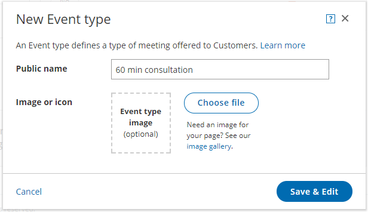

import { Aside } from '@astrojs/starlight/components';

An [Event type](/introduction-to-event-types/ "Introduction to Event types") defines a type of meeting offered to Customers. Creating new Event types is easy, and you can create as many as you need. You can create a new Event type from scratch or [duplicate an existing Event type](/duplicating-an-event-type/ "Duplicating an Event type") to copy all your settings.

In this article, you'll learn how to create a new Event type.

# Requirements

To create Event types, you must be a [OnceHub Administrator](/user-type-member-vs-admin-team-manager/ "Differences between Administrator and Member").

# Creating an Event type

1.  Go to **Booking pages** in the bar on the left.
2.  Click the Plus button   in the **Event types** pane. Another way to create a new Event type is by [duplicating an existing one](/duplicating-an-event-type/ "Duplicating an Event type") that is similar to the one you're creating.
3.  The **New Event type** pop-up appears (Figure 1). Figure 1: New Event type pop-up
4.  Define the properties for your Event type:
    *   **Public name:** The Public name is visible to Customers as the meeting type title. It can be changed in the [Public content section](/event-type-public-content-section/ "Event types: Public content section") later.
    *   **Image or icon (optional):** You may add an icon or image that will be visible to Customers. It can be changed in the [Public content section](/event-type-public-content-section/ "Event types: Public content section") later.
    *   Additional properties will be available after clicking **Save & Edit**.
5.  Click **Save & Edit**. You will be redirected to the [Event type Overview section](/event-type-overview-section/ "Event type: Overview Section") to continue editing your settings.