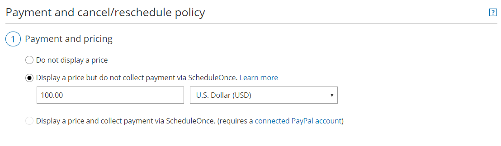
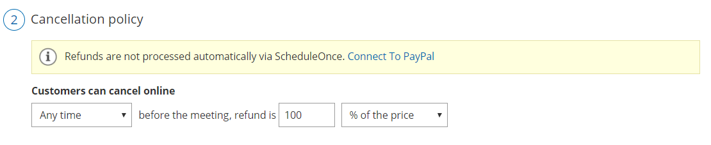
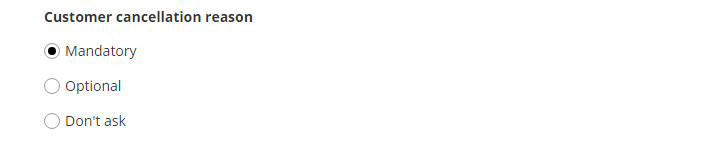
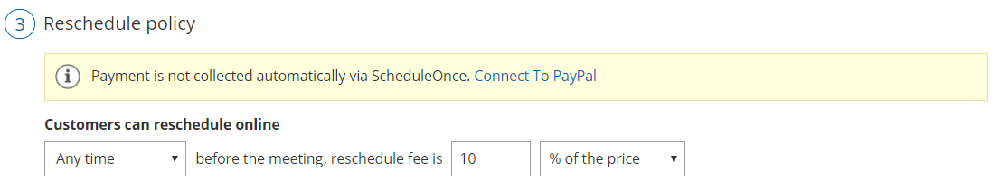

import { Aside } from '@astrojs/starlight/components';

Booking pages enables you to specify when your Customers can cancel or reschedule a booking.

In this article, you'll learn how to configure the Customer Cancellation policy and Reschedule policy when you display a price for your Event type, but do not collect payment via OnceHub . 

```
&lt;script id="snippet-prepend">
$(function()&#123;
  
  /*disable in widget*/
  if($('.w-documentation-article').length === 0)&#123;

     var ToC =
  "&lt;nav role='navigation' class='table-of-contents toc-top'><h4>In this article:" + "<ul>";
     var el,     title, link, header;
      //Define the heading levels you want to use in ascending order. Can add extra or remove unneeded.
     $(".hg-article-body h1, .hg-article-body h2, .hg-article-body h3, .hg-article-body h4").each(function() &#123;
              el = $(this);
              title = el.text();
                 if(title != '')&#123;
                anchorTitle = el.text().replace(/([~!@#$%^&*()_+=`&#123;&#125;\[\]\|\\:;'&lt;>,.\/\? ])+/g, '-').toLowerCase();
                link = "#" + anchorTitle;
                //Set all headers to a 0-nesting level.
                header = 'header-nesting-0';
                //Adjust header-nesting layers so that they point to the correct html tag. header-nesting-1 should match the second .hg-article-body h# listed above; header-nesting-2 should match the third, etc.
                if($(this).is('h2'))&#123;
                    header = 'header-nesting-1';
                &#125;else if($(this).is('h3'))&#123;
                    header = 'header-nesting-2'
                &#125;
                el.html('<a id="'+anchorTitle+'" class="toc-anchor">' + el.html());
                newLine =
      "<li class='"+header+"'>" +
        "<a class='article-anchor' href='" + link + "'>" +
          title +
        "" +
      "";


                ToC += newLine;
              &#125;
              &#125;);
     ToC +=
   "" +
  "";
    $("#snippet-prepend").before(ToC);
  &#125;
&#125;);

&lt;/script>
```

```
&lt;style>
/* CSS to style the TOC as it displays and the auto-created anchors
.toc-top styles the box for the TOC; adjust styles here to tweak look and feel */
  
.toc-top &#123;
  background-color: #FAFAFA; /* set to #fff or delete entirely for no background */
  border: 1px solid #C8C8C8; /* adjust the color hex here to change border color */
  box-shadow: 0 1px 1px rgba(0, 0, 0, 0.05) inset;
  margin-top: 24px;
  margin-bottom: 36px;
  min-height: 20px;
  padding: 13px 20px;
  max-width: 75%;
&#125;
.toc-top h4 &#123;
  font-size: 18px;
  line-height: 26px;
  margin: 0 0 8px;
  font-weight: 400;
&#125;
.toc-top ul &#123;
  padding: 0 0 0 15px !important;
  margin-bottom: 0;	
&#125;
.toc-top > ul &#123;
  margin-bottom: 13px!important;
&#125;
.toc-anchor &#123;
  display: block;
  height: 90px; 
  margin-top: -90px; 
  visibility: hidden;
&#125;

/* Set the indentation for the nesting levels. May need to be edited to match changes above. Increase or decrease the margin-left to get your desired level of indentation. */
.header-nesting-1 &#123;
    margin-left: 14px;
&#125;
.header-nesting-1:before &#123;
	background-image: url(https://dyzz9obi78pm5.cloudfront.net/app/image/id/5d31bcc88e121c9b25ba22c4/n/bulletv2.svg)!important;
&#125;
.header-nesting-2 &#123;
    margin-left: 28px;
&#125;
.header-nesting-2:before &#123;
	background-image: url(https://dyzz9obi78pm5.cloudfront.net/app/image/id/5d31be536e121cf22b0cc6ae/n/bulletv3.svg)!important;
&#125;
&lt;/style>
```

# Displaying a price but not collecting payment via OnceHub 

When you display a price for your Event type but do not collect payment via OnceHub, you set the price for your Event type, but collect payment and process refunds manually (not via OnceHub). 

You can also customize the cancellation and reschedule policy description displayed to Customers to include the refund amount they will receive if they cancel, or the reschedule fee they will be charged if they reschedule. 

Customers should be informed that all payment transactions will be handled manually and not via OnceHub. 

**Note** 

You have the option to collect payment via OnceHub and automate your cancellation and reschedule policy. [Learn more about collecting payment via OnceHub](/payment-and-cancelreschedule-policy-when-payment-is-collected-via-scheduleonce/ "Event type: Payment and cancel/reschedule policy when payment is collected via ScheduleOnce") 

# Customer Cancel/reschedule policy rules

The following rules apply to the Customer Cancel/reschedule policy:

*   The Cancellation and Reschedule policy only affects your Customers. Users are not subject to the policy and can cancel or reschedule at any time from the [Activity stream](/introduction-to-the-activity-stream/ "Introduction to the Activity Stream").
*   Your Customers can always access the Customer cancel/reschedule link in [default email and calendar invite templates](/should-i-use-a-default-or-custom-template/ "Should I use a Default or Custom Template?"), regardless of the Cancel/reschedule policy. Your customized policy will be reflected on the [Customer Cancel/reschedule page](/reschedule-the-customer-cancelreschedule-page/ "The Customer Cancel/Reschedule page") that the Customer accesses via the cancel/reschedule link. The policy will always reflect the settings that were saved at the time of the initial booking.
*   If you are working in [Booking with approval mode](/automatic-booking-or-booking-with-approval/ "Automatic booking or Booking with approval"), the Customer Cancel/reschedule policy does not apply to booking requests. However, it will apply to scheduled or rescheduled bookings.

# Configuring the Customer Cancellation and Reschedule policy

1.  Go to **Setup** -> **OnceHub** **setup** in the top navigation bar.
2.  In the **Event types** section, click on the Event type you want to edit.
3.  Click the **Payment and cancel/reschedule policy** section (Figure 1).  
    
    
    Figure 1: Payment and cancel/reschedule policy
    
4.  In the **Payment and pricing** step, select **Display a price but do not collect payment via** **OnceHub** (Figure 2).Figure 2: Payment and pricing 
5.  In the **Cancellation policy** step (Figure 3), select your preferred option.
    
    Figure 3: Cancellation policy
    
    *   **Any time before the meeting**: This means that Customers can cancel at any time before the scheduled meeting time. This can be a matter of minutes before the meeting. You can inform Customers of the refund amount they will receive if they cancel the booking. Note that refunds will not be processed automatically via OnceHub.
    *   **Up until a certain time before the meeting**: In this case, you can select how long before the scheduled meeting time the Customer can cancel. The possible values range from 15 minutes to 14 days. You can inform Customers of the refund amount they will receive if they cancel the booking before and after the milestone. Note that refunds will not be processed automatically via OnceHub.
    *   **Never**: In this case, the Customer will never be able to cancel the booking.
        
          
        
        **Note**   
        When you work with [Session packages](/session-packages/ "Session packages"), Customers can cancel each session independently and each session is subject to the Cancellation policy. In the **Payment and cancel/reschedule policy** section, you set the package price and the refund amount that Customers will receive if they cancel each session independently.
        
          
        
6.  In the **Cancellation policy** step, you can define the **Policy description** that is visible to Customers on the Customer Cancel/reschedule page. By default, OnceHub generates an automatic text based on your selection. You can decide to use a custom text instead if you want to customize the Customer cancellation policy description.
    
7.  Finally, in the **Cancellation policy** step you can also choose to ask your Customers to give you a **cancellation reason** (see Figure 4). This question will be displayed on the [Customer Cancel/reschedule page](/reschedule-the-customer-cancelreschedule-page/ "The Customer Cancel/Reschedule page"). You can choose to make the cancellation reason **Mandatory**, **Optional**, or choose not to display the field at all by selecting **Don't ask**.Figure 4: Customer cancellation reason
    
8.  In the **Reschedule policy** step (Figure 5), you can select the following options.  
      
    Figure 5: Reschedule policy
    
    *   **Any time before the meeting**: This means that Customers can reschedule any time before the scheduled meeting time. This can be a matter of minutes before the meeting. You can inform Customers that they will be charged a reschedule fee if they reschedule the booking. Note that payments are not collected automatically via OnceHub.
    *   **Up until a certain time before the meeting**: In this case, you can select how long before the scheduled meeting time the Customer can reschedule. The possible values range from 15 minutes to 14 days. You can inform Customers that they will be charged a reschedule fee if they reschedule the booking before or after the milestone. Note that payments are not collected automatically via OnceHub.
    *   **Never**: In this case, the Customer will never be able to reschedule the booking.
        
        **Note**When you work with [Session packages](/session-packages/ "Session packages"), Customers can reschedule each session independently and each session is subject to the Reschedule policy. In the **Payment and cancel/reschedule policy** section, you set the package price and the reschedule fee that Customers will be required to pay offline if they reschedule each session independently.
        
9.  Define the **Reschedule policy description** that is visible to Customers on the [Customer Cancel/reschedule page](/reschedule-the-customer-cancelreschedule-page/ "The Customer Cancel/Reschedule page"). By default, OnceHub generates an automatic text based on your selection. You use a custom text instead if you want to customize the Customer reschedule policy description.
10.  Finally, in the **Reschedule policy** step you can also choose to ask your Customers to give you a reschedule reason. This question will be displayed on the [Customer Cancel/reschedule page](/reschedule-the-customer-cancelreschedule-page/ "The Customer Cancel/Reschedule page"). You can choose to make the cancellation reason **Mandatory**, **Optional**, or choose not to display the field at all by selecting **Don't ask**.
     
     Figure 6: Customer reschedule reason
     

Congratulations! You've now set the Customer Cancel/reschedule policy that is displayed on the Cancel/reschedule page for your Event type.