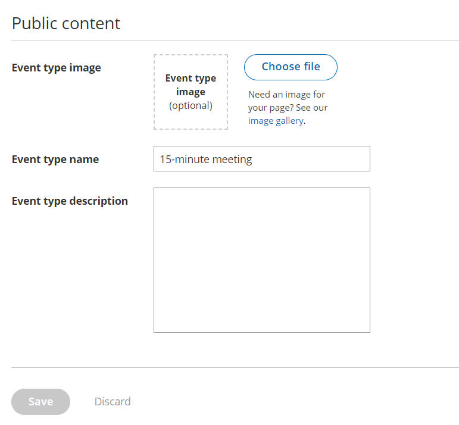
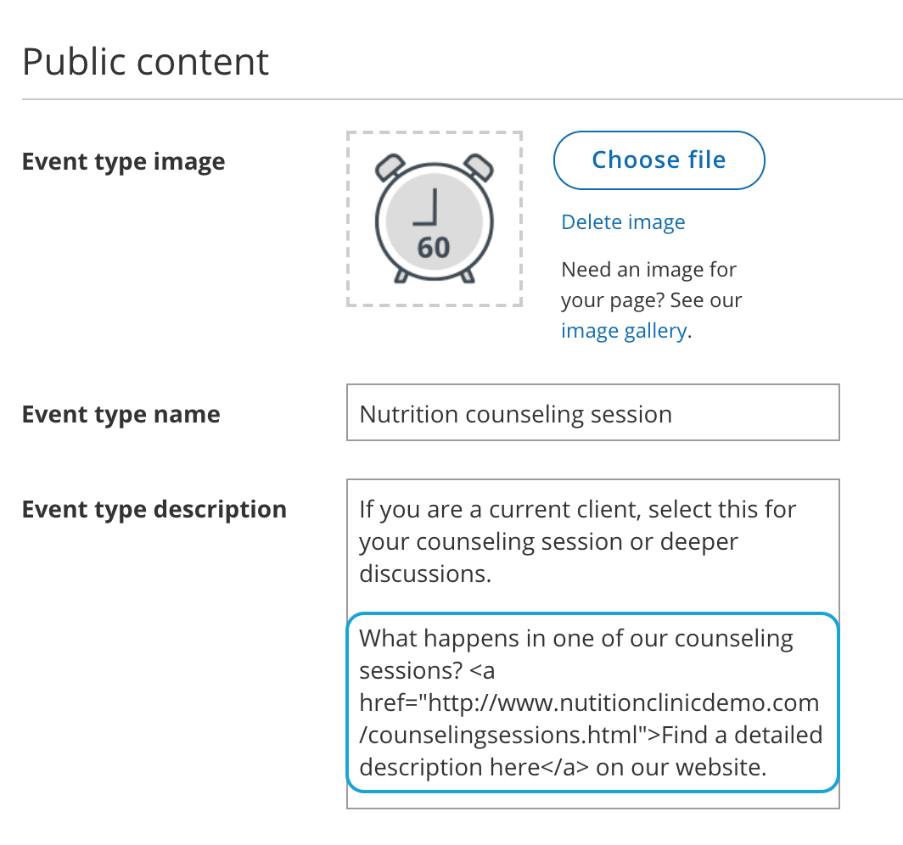
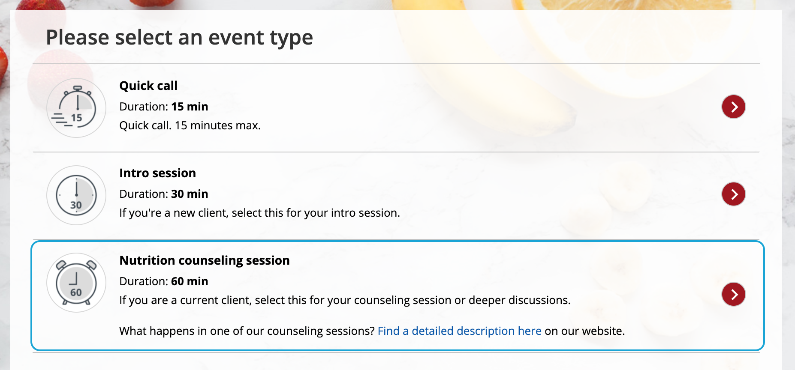

import { Aside } from '@astrojs/starlight/components';

The Public content section includes all the information that is available to your Customers when they book with you online.

# Location of the Public content section

Figure 1: Public content section

# Event type image

Upload an image in JPG, PNG or GIF format (max 200KB). It will be cropped or scaled to a 200 x 200 pixels rectangle as part of the upload process.

# Event type name

You can use up to 75 characters, including spaces.

# Event type description

You can enter up to 2,000 characters, including spaces.

The Event type description allows you to include HTML links. 

For instance, adding this code in the Public content session: 

Figure 2: HTML link in the Event type description

**Note**

Do not create a line break after **&lt;a** at the start of the code. In the above graphic, it wraps to the next line automatically due to spacing. However, your entry should not have any extra line breaks.

...results in this link shown on the customer end:

Figure 3: Event type description including HTML link