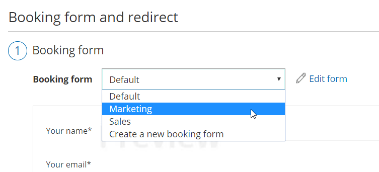
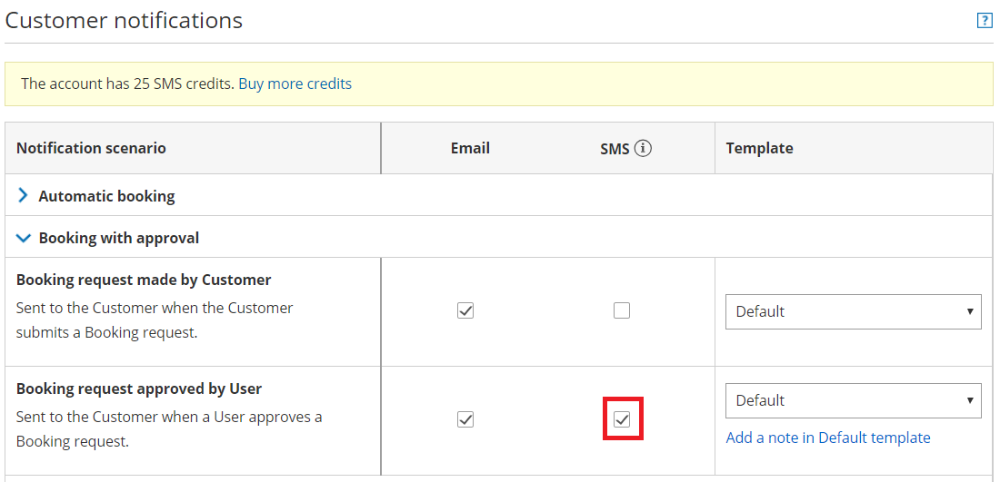

import { Aside } from '@astrojs/starlight/components';

You can send [SMS notifications](/getting-started-with-oncehub/introduction-to-oncehub/introduction-to-sms-notifications/ "Introduction to SMS notifications") to your Customers to keep them up-to-date about bookings they've made with you. Sending SMS notifications in addition to email notifications provides an extra notification channel. This makes it more likely that your Customers will attend their meetings with you.

In this article, you'll learn about sending SMS notifications to Customers. 

```
&lt;script id="snippet-prepend">
$(function()&#123;
  
  /*disable in widget*/
  if($('.w-documentation-article').length === 0)&#123;

     var ToC =
  "&lt;nav role='navigation' class='table-of-contents toc-top'><h4>In this article:" + "<ul>";
     var el,     title, link, header;
      //Define the heading levels you want to use in ascending order. Can add extra or remove unneeded.
     $(".hg-article-body h1, .hg-article-body h2, .hg-article-body h3, .hg-article-body h4").each(function() &#123;
              el = $(this);
              title = el.text();
                 if(title != '')&#123;
                anchorTitle = el.text().replace(/([~!@#$%^&*()_+=`&#123;&#125;\[\]\|\\:;'&lt;>,.\/\? ])+/g, '-').toLowerCase();
                link = "#" + anchorTitle;
                //Set all headers to a 0-nesting level.
                header = 'header-nesting-0';
                //Adjust header-nesting layers so that they point to the correct html tag. header-nesting-1 should match the second .hg-article-body h# listed above; header-nesting-2 should match the third, etc.
                if($(this).is('h2'))&#123;
                    header = 'header-nesting-1';
                &#125;else if($(this).is('h3'))&#123;
                    header = 'header-nesting-2'
                &#125;
                el.html('<a id="'+anchorTitle+'" class="toc-anchor">' + el.html());
                newLine =
      "<li class='"+header+"'>" +
        "<a class='article-anchor' href='" + link + "'>" +
          title +
        "" +
      "";


                ToC += newLine;
              &#125;
              &#125;);
     ToC +=
   "" +
  "";
    $("#snippet-prepend").before(ToC);
  &#125;
&#125;);

&lt;/script>
```

```
&lt;style>
/* CSS to style the TOC as it displays and the auto-created anchors
.toc-top styles the box for the TOC; adjust styles here to tweak look and feel */
  
.toc-top &#123;
  background-color: #FAFAFA; /* set to #fff or delete entirely for no background */
  border: 1px solid #C8C8C8; /* adjust the color hex here to change border color */
  box-shadow: 0 1px 1px rgba(0, 0, 0, 0.05) inset;
  margin-top: 24px;
  margin-bottom: 36px;
  min-height: 20px;
  padding: 13px 20px;
  max-width: 75%;
&#125;
.toc-top h4 &#123;
  font-size: 18px;
  line-height: 26px;
  margin: 0 0 8px;
  font-weight: 400;
&#125;
.toc-top ul &#123;
  padding: 0 0 0 15px !important;
  margin-bottom: 0;	
&#125;
.toc-top > ul &#123;
  margin-bottom: 13px!important;
&#125;
.toc-anchor &#123;
  display: block;
  height: 90px; 
  margin-top: -90px; 
  visibility: hidden;
&#125;

/* Set the indentation for the nesting levels. May need to be edited to match changes above. Increase or decrease the margin-left to get your desired level of indentation. */
.header-nesting-1 &#123;
    margin-left: 14px;
&#125;
.header-nesting-1:before &#123;
	background-image: url(https://dyzz9obi78pm5.cloudfront.net/app/image/id/5d31bcc88e121c9b25ba22c4/n/bulletv2.svg)!important;
&#125;
.header-nesting-2 &#123;
    margin-left: 28px;
&#125;
.header-nesting-2:before &#123;
	background-image: url(https://dyzz9obi78pm5.cloudfront.net/app/image/id/5d31be536e121cf22b0cc6ae/n/bulletv3.svg)!important;
&#125;
&lt;/style>
```

# Activating Customer SMS notifications

To activate Customer SMS notifications, complete the following steps.

1.  Make sure the [Mobile phone field](/the-fields-library/ "The Fields library") is in your [Booking form](/introduction-to-the-booking-forms-editor/ "Introduction to the Booking forms editor") to collect the Customer’s mobile number[](https://oncehub.knowledgeowl.com/help/introduction-to-the-booking-forms-editor "Introduction to the Booking forms editor").
2.  Select the Booking form in the [Booking page settings](/introduction-to-the-booking-form-redirect-section/ "Introduction to the Booking form and redirect section").
3.  Select SMS notifications in the [Customer notifications section](/introduction-to-customer-notifications/ "Introduction to the Customer notifications section").
4.  Make sure you have [SMS credits](/sms-pricing/ "SMS pricing") available.

# Collecting the Customer’s mobile number in the Booking form

In order to send a Customer an SMS notification, you'll need to get their mobile number. When your Customers make a booking with you, they fill out a Booking form with their information. 

By default, Customers will be asked to provide their mobile phone number on the Booking form. This means it will appear in the Booking form, but the Customer can choose whether or not to leave a mobile number. To ensure that you collect the Customer's mobile number, you can make it mandatory for your Customers to provide their mobile phone number. You can enable this setting in the [Booking forms editor](/introduction-to-the-booking-forms-editor/ "Introduction to the Booking Forms Editor"). 

1.  To customize your Booking form, **Booking pages** in the bar on the left. 
2.  Select **Booking forms editor** on the left. 
3.  Make sure that the **Mobile phone** field is included in the form. If the **Mobile phone** field is not included, add it by selecting it from the **System fields** pane on the right.
4.  Check the **Enable** **SMS** checkbox to enable SMS notifications.
    
    Figure 1: Enable SMS in the Booking forms editor
    
5.  Check the **Mandatory field** checkbox to make the **Mobile phone** field mandatory. This means that the Customer must enter text in this field in order to make the booking.
6.  Click the **Save** button. Note the name of the Booking form as you will need it for the next step.

When SMS notifications are enabled, an opt-in/opt-out checkbox will be included in the Booking form. This allows Customers to decide whether or not they would like to receive booking notifications via SMS.

**Note**

If the [Booking form is skipped](/prepopulated-booking-forms/ "Prepopulated Booking forms"), the checkbox will be displayed when the Customer chooses a time for the booking. Booking form skipping can be used with [Personalized links](/using-personalized-links/ "Using Personalized links"), [web form integration](/introduction-to-webform-integration/ "Introduction to Web form Integration") and [login integration](/login-integration/ "Login Integration").

# Selecting the Booking form in the Booking page settings

Once you've added the **Mobile phone** field to the Booking form you want to use, you'll need to make sure that this Booking form is the one selected in your Booking page. This can be done in the [**Booking form and redirect**](/introduction-to-the-booking-form-redirect-section/ "Introduction to the Booking form and redirect section") section of your Booking page.

By default, the location of the Booking form section depends on whether or not your [Booking page is associated with any Event types](/adding-event-types-to-booking-pages/ "Adding Event types to Booking pages"). 

*   Booking pages **with Event types**: Each Event type has its own Booking form, set in the **Event types’s** Booking form section.
*   Booking pages **without Event types**: The Booking form is selected in the **Booking page’s** Booking form section.

**Note**If your Booking page is associated with any Event types, you can [customize the location of the Booking form section](/event-type-sections/ "Location of the Booking form and the Customer notifications sections")[](https://help.oncehub.com/help/event-type-sections "Location of the Booking form and the Customer notifications sections").

In the **Booking form and redirect** section, select the correct Booking form from the **Booking form** drop-down menu (Figure 2).

Figure 3: Select a Booking form

You can see a preview of the Booking form below the drop-down menu. The preview includes all the fields in the Booking form in the exact order in which they will appear to your Customers. If you want to edit the Booking form, click **Edit form**.

# Selecting SMS notifications in the Customer notifications section

You can select which [Customer notification scenarios](/customer-notification-scenarios/ "Customer notification scenarios") you wish to send SMSes for in the [Customer notifications section](/introduction-to-customer-notifications/ "Introduction to the Customer notifications section"). By default, the location of the Customer notification section depends on whether or not your [Booking page is associated with any Event types](/adding-event-types-to-booking-pages/ "Adding Event types to Booking pages"). 

*   Booking page **with Event types**: The Customer notifications section is located on the **Event type**. 
*   Booking Page **without Event types:** The Customer notifications section is located on the **Booking page**[](https://help.oncehub.com/help/introduction-to-event-types "Introduction to Event types").

**Note**If your Booking page is associated with any Event types, you can [customize the location of the Customer notifications section](/event-type-sections/ "Location of the Booking form and the Customer notifications sections").

In the Customer notifications section, select the Notification scenarios you wish to send SMSes for by checking the SMS checkbox next to the relevant scenario (Figure 3). Click the **Save** button at the bottom when you're finished.

Figure 3: Customer notification scenarios

# Making sure you have SMS credits available

You need to have [SMS credits](/sms-pricing/ "SMS pricing") available to send SMS notifications. To view the SMS credits available in your account, click go to your **OnceHub Account -> [Billing](/introduction-to-billing/ "Introduction to Billing") -> Products**.