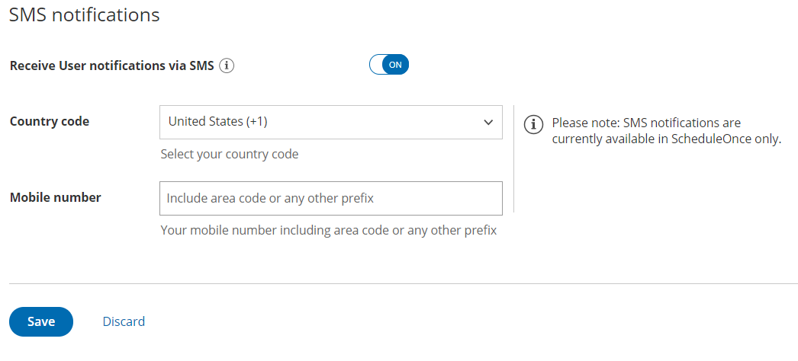
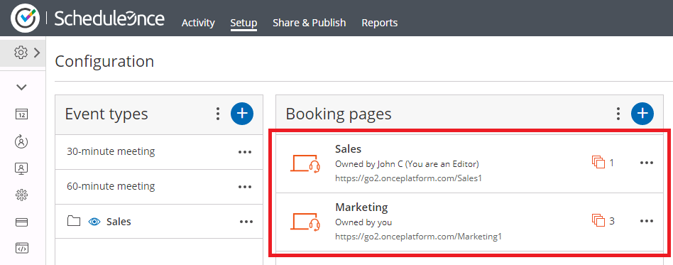
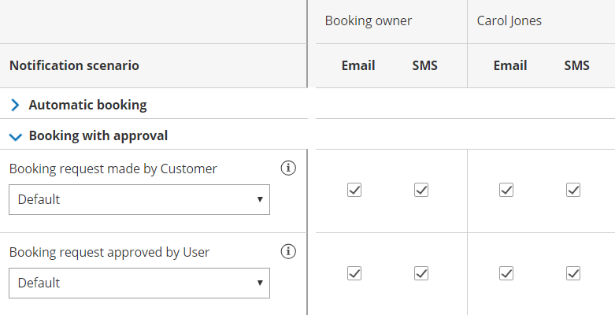
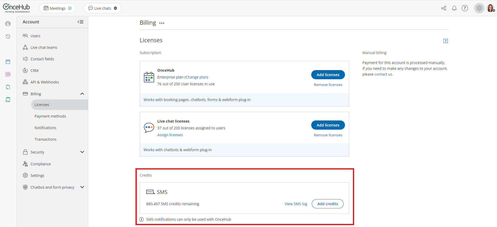

import { Aside } from '@astrojs/starlight/components';

SMS notifications are a quick and reliable way to keep on top of booking activity for yourself and other Users. Any OnceHub User can receive [SMS notifications](/getting-started-with-oncehub/introduction-to-oncehub/introduction-to-sms-notifications/ "Introduction to SMS notifications") related to Booking activity in their organization's account. You do not need an assigned product license to be an Editor on a Booking page and subscribe to booking notifications. [Learn more](/common-use-cases-for-users-without-a-scheduleonce-license/)

In this article, you'll learn about sending SMS notifications to Users. 

```
&lt;script id="snippet-prepend">
$(function()&#123;
  
  /*disable in widget*/
  if($('.w-documentation-article').length === 0)&#123;

     var ToC =
  "&lt;nav role='navigation' class='table-of-contents toc-top'><h4>In this article:" + "<ul>";
     var el,     title, link, header;
      //Define the heading levels you want to use in ascending order. Can add extra or remove unneeded.
     $(".hg-article-body h1, .hg-article-body h2, .hg-article-body h3, .hg-article-body h4").each(function() &#123;
              el = $(this);
              title = el.text();
                 if(title != '')&#123;
                anchorTitle = el.text().replace(/([~!@#$%^&*()_+=`&#123;&#125;\[\]\|\\:;'&lt;>,.\/\? ])+/g, '-').toLowerCase();
                link = "#" + anchorTitle;
                //Set all headers to a 0-nesting level.
                header = 'header-nesting-0';
                //Adjust header-nesting layers so that they point to the correct html tag. header-nesting-1 should match the second .hg-article-body h# listed above; header-nesting-2 should match the third, etc.
                if($(this).is('h2'))&#123;
                    header = 'header-nesting-1';
                &#125;else if($(this).is('h3'))&#123;
                    header = 'header-nesting-2'
                &#125;
                el.html('<a id="'+anchorTitle+'" class="toc-anchor">' + el.html());
                newLine =
      "<li class='"+header+"'>" +
        "<a class='article-anchor' href='" + link + "'>" +
          title +
        "" +
      "";


                ToC += newLine;
              &#125;
              &#125;);
     ToC +=
   "" +
  "";
    $("#snippet-prepend").before(ToC);
  &#125;
&#125;);

&lt;/script>
```

```
&lt;style>
/* CSS to style the TOC as it displays and the auto-created anchors
.toc-top styles the box for the TOC; adjust styles here to tweak look and feel */
  
.toc-top &#123;
  background-color: #FAFAFA; /* set to #fff or delete entirely for no background */
  border: 1px solid #C8C8C8; /* adjust the color hex here to change border color */
  box-shadow: 0 1px 1px rgba(0, 0, 0, 0.05) inset;
  margin-top: 24px;
  margin-bottom: 36px;
  min-height: 20px;
  padding: 13px 20px;
  max-width: 75%;
&#125;
.toc-top h4 &#123;
  font-size: 18px;
  line-height: 26px;
  margin: 0 0 8px;
  font-weight: 400;
&#125;
.toc-top ul &#123;
  padding: 0 0 0 15px !important;
  margin-bottom: 0;	
&#125;
.toc-top > ul &#123;
  margin-bottom: 13px!important;
&#125;
.toc-anchor &#123;
  display: block;
  height: 90px; 
  margin-top: -90px; 
  visibility: hidden;
&#125;

/* Set the indentation for the nesting levels. May need to be edited to match changes above. Increase or decrease the margin-left to get your desired level of indentation. */
.header-nesting-1 &#123;
    margin-left: 14px;
&#125;
.header-nesting-1:before &#123;
	background-image: url(https://dyzz9obi78pm5.cloudfront.net/app/image/id/5d31bcc88e121c9b25ba22c4/n/bulletv2.svg)!important;
&#125;
.header-nesting-2 &#123;
    margin-left: 28px;
&#125;
.header-nesting-2:before &#123;
	background-image: url(https://dyzz9obi78pm5.cloudfront.net/app/image/id/5d31be536e121cf22b0cc6ae/n/bulletv3.svg)!important;
&#125;
&lt;/style>
```

To receive SMS notifications on Booking activity for a specific [Booking page](/introduction-to-booking-pages/ "Introduction to Booking pages"), complete the following steps:

1.  Enable User notifications and add your mobile number to your profile.
2.  Make sure you are the [Owner or Editor](/booking-page-access-permissions/ "Booking page access permissions") of the Booking page.
3.  Subscribe to User SMS notifications in the **User notifications** section of the Booking page.
4.  Make sure you have SMS credits available.

# Adding your mobile number to your Profile

To receive SMS notifications, you must first add your mobile number to your Profile.

1.  Sign in to your OnceHub Account. 
2.  Go to **My profile** (your profile image or initials in the top right corner)  → **Profile settings → [SMS notifications](/managing-your-profile-in-oncehub#notifications/ "Profile: SMS notifications section")** (Figure 1).
    
    Figure 1: SMS Notifications
    
3.  Toggle the **Receive User notifications via SMS** field to **ON**.
4.  Select your **Country code** and enter your **Mobile number**, including the area code. 
5.  Click **Save.**

# Making sure you are the Booking page Owner or Editor

Booking notifications are unique for every [Booking page](/introduction-to-booking-pages/ "Introduction to Booking pages"). To receive Booking notifications for a Booking page, you must be either [the Owner or an Editor](/booking-page-ownership/ "Booking page ownership") of the Booking page. Booking page Owners automatically receive email notifications. Booking page Editors can receive notifications and make changes to the page. 

To see if you are an Owner or Editor of a Booking page, go to **Booking pages** in the bar on the left → check the relevant Booking page in the **Booking pages** section (Figure 2). You should see **Owned by you** or **You are an Editor** on the relevant Booking page. 

Figure 2: An Admin's setup page

If you are not a Booking page Owner or Editor, a [OnceHub Administrator](/user-type-member-vs-admin-team-manager/ "Differences between Administrator and Member") must grant you Editor permissions to that page. This can be done in two ways:

1.  Go to **Booking pages** in the bar on the left → **Booking pages → action menu (three dots) → Booking page access**. In this section, you can determine which Booking pages the specific User can access.
2.  Go to **Booking pages** in the bar on the left → select the relevant Booking page →** [Overview section](/booking-page-overview-section/ "Booking page: Overview section").** Here you can edit the Booking page's Owner and Editor. This method is only possible if the Administrator is able to edit that specific Booking page. 

[Learn more about Booking page access permissions](/booking-page-access-permissions/ "Booking page access permissions")

# Subscribing to User SMS notifications

If you are the Owner or an Editor of a Booking page, you can subscribe to SMS notifications for booking activity related to that page in the User notifications section. 

1.  Go to **Booking pages** in the bar on the left → select the relevant Booking page → **User notifications** on the left.   
2.  In the column labeled with your name, select the Notification scenarios you'd like to receive SMS notifications for by checking the relevant checkboxes (Figure 3).
    
    Figure 3: Selecting User notifications
    
3.  Click the **Save** button at the bottom when you're finished. 

If your name does not appear in the Notification scenarios list, you'll need to be added as a Booking page editor (see above).

# Ensuring you have SMS credits available

You need to have [SMS credits](/sms-pricing/ "SMS pricing") available to send SMS notifications. To view the SMS credits available in your account, click go to **Settings** (gear icon) in the  top right corner **→ [Billing](/introduction-to-billing/ "Introduction to Billing")** on the left **→ Licenses**.

  

