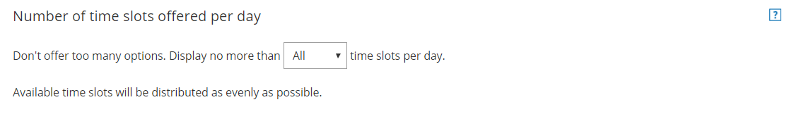

import { Aside } from '@astrojs/starlight/components';

You have the option to limit the number of slots you offer per day. There are a number of reasons to limit the maximum time slots offered per day, including:

*   Looking busier than you really are.
*   Making an effort not to overwhelm Customers with too many choices.
*   Preventing Customers from selecting adjacent time slots in [Booking with approval](/automatic-booking-or-booking-with-approval/ "Automatic booking or Booking with approval") mode.

If you want to limit the maximum number of available time slots per day, you can do so using the **Number of time slots offered per day** setting under under **Time slot settings** (Figure 1). 

Figure 1: Number of time slots offered per day

The location of the **Time slot settings** depends on whether or not your Booking page has any Event types associated with it. [Learn more about the location of the Time slot settings section](/location-of-time-slot-settings/ "Location of the Time slot settings section")

*   For Booking pages **associated** with Event types (recommended), go to **Booking pages** in the bar on the left → select the relevant **Event type →** **Time slot settings**.
*   For Booking pages **not associated** with Event types, go to **Booking pages** in the bar on the left → select the relevant **Booking page →** **Time slot settings**.

# Limiting the number of time slots

When you limit the number of time slots available per day, OnceHub distributes these time slots as evenly as possible across the availability set for that Booking page.

For example, say you have availability from 9 AM to 5 PM. You want to limit the number of time slots offered to 3 time slots per day. Time slots will be offered at 9 AM, 12 PM, and 3 PM. If someone books the 9 AM time slot, this time slot disappears and a new time slot will be offered to the next Customer at 9:30 AM. 

If you don’t want this setting to affect you, simply keep it at its maximum: **All** time slots.

**Important**

This setting **does not** limit the amount of appointments that can be booked on any given day. Rather, it affects the amount of time slots which a Customer may choose from when they select a time for their booking. If you want to put an absolute limit on the number of bookings per day, this is available through the [Workload rules settings](/workload-rules/ "Workload Rules").