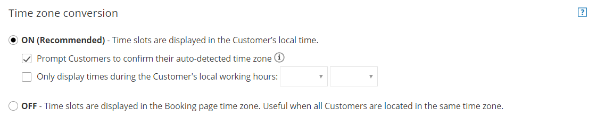
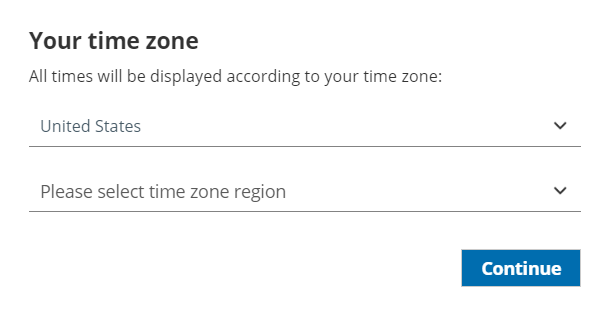

import { Aside } from '@astrojs/starlight/components';

If you're offering bookings to Customers in multiple time zones, you can use Time zone conversion settings when they book with you. 

Figure 1: Time zone conversion

In this article, you'll learn about using the Time zone conversion settings.

```
&lt;script id="snippet-prepend">
$(function()&#123;
  
  /*disable in widget*/
  if($('.w-documentation-article').length === 0)&#123;

     var ToC =
  "&lt;nav role='navigation' class='table-of-contents toc-top'><h4>In this article:" + "<ul>";
     var el,     title, link, header;
      //Define the heading levels you want to use in ascending order. Can add extra or remove unneeded.
     $(".hg-article-body h1, .hg-article-body h2, .hg-article-body h3, .hg-article-body h4").each(function() &#123;
              el = $(this);
              title = el.text();
                 if(title != '')&#123;
                anchorTitle = el.text().replace(/([~!@#$%^&*()_+=`&#123;&#125;\[\]\|\\:;'&lt;>,.\/\? ])+/g, '-').toLowerCase();
                link = "#" + anchorTitle;
                //Set all headers to a 0-nesting level.
                header = 'header-nesting-0';
                //Adjust header-nesting layers so that they point to the correct html tag. header-nesting-1 should match the second .hg-article-body h# listed above; header-nesting-2 should match the third, etc.
                if($(this).is('h2'))&#123;
                    header = 'header-nesting-1';
                &#125;else if($(this).is('h3'))&#123;
                    header = 'header-nesting-2'
                &#125;
                el.html('<a id="'+anchorTitle+'" class="toc-anchor">' + el.html());
                newLine =
      "<li class='"+header+"'>" +
        "<a class='article-anchor' href='" + link + "'>" +
          title +
        "" +
      "";


                ToC += newLine;
              &#125;
              &#125;);
     ToC +=
   "" +
  "";
    $("#snippet-prepend").before(ToC);
  &#125;
&#125;);

&lt;/script>
```

```
&lt;style>
/* CSS to style the TOC as it displays and the auto-created anchors
.toc-top styles the box for the TOC; adjust styles here to tweak look and feel */
  
.toc-top &#123;
  background-color: #FAFAFA; /* set to #fff or delete entirely for no background */
  border: 1px solid #C8C8C8; /* adjust the color hex here to change border color */
  box-shadow: 0 1px 1px rgba(0, 0, 0, 0.05) inset;
  margin-top: 24px;
  margin-bottom: 36px;
  min-height: 20px;
  padding: 13px 20px;
  max-width: 75%;
&#125;
.toc-top h4 &#123;
  font-size: 18px;
  line-height: 26px;
  margin: 0 0 8px;
  font-weight: 400;
&#125;
.toc-top ul &#123;
  padding: 0 0 0 15px !important;
  margin-bottom: 0;	
&#125;
.toc-top > ul &#123;
  margin-bottom: 13px!important;
&#125;
.toc-anchor &#123;
  display: block;
  height: 90px; 
  margin-top: -90px; 
  visibility: hidden;
&#125;

/* Set the indentation for the nesting levels. May need to be edited to match changes above. Increase or decrease the margin-left to get your desired level of indentation. */
.header-nesting-1 &#123;
    margin-left: 14px;
&#125;
.header-nesting-1:before &#123;
	background-image: url(https://dyzz9obi78pm5.cloudfront.net/app/image/id/5d31bcc88e121c9b25ba22c4/n/bulletv2.svg)!important;
&#125;
.header-nesting-2 &#123;
    margin-left: 28px;
&#125;
.header-nesting-2:before &#123;
	background-image: url(https://dyzz9obi78pm5.cloudfront.net/app/image/id/5d31be536e121cf22b0cc6ae/n/bulletv3.svg)!important;
&#125;
&lt;/style>
```

# Location of the Time zone conversion section

You can find **Time zone conversion** settings under **Time slot settings**. The location of the **Time slot settings** depends on whether or not your Booking page has any Event types associated with it. [Learn more about the location of the Time slot settings section](/location-of-time-slot-settings/ "Location of the Time slot settings section")

*   For Booking pages **associated** with Event types (recommended), go to **Booking pages** in the bar on the left → select the relevant **Event type →** **Time slot settings**.
*   For Booking pages **not associated** with Event types, go to **Booking pages** in the bar on the left → select the relevant **Booking page →** **Time slot settings**.

# Time zone conversion: ON

This is the default setting for time zone conversion. When you select this option, the Customer's time zone is automatically detected according to their IP address. 

When the Customer accesses your Booking page, they will see a confirmation pop-up asking them to verify that the detected time zone is correct (Figure 2). As a result, all time slots will be displayed to the Customer in their local time zone.

Figure 2: Time zone confirmation pop-up

When **ON** is selected, there are two additional options: 

### Prompt Customers to confirm their auto-detected time zone

*   When **checked** - Customers must always confirm their time zone.
*   When **unchecked** - Customers confirm their time zone only if auto-detection fails.

### Only display slots during the Customer's local working hours

This option is recommended if you're working with clients and prospects whose time zone is multiple hours apart from yours. When you select this option, the Customer will only see time slots that fall within the Customer's local working hours that you have defined. 

For example, say you're in the US Eastern time zone and have availability from 9am - 5pm. Some of your Customers are in the UK with a 5-hour time difference.

*   Without the working hours restriction, your UK Customers will see 2pm - 10pm availability in their local time zone.
*   With the working hours restricted to 9am - 5pm, they will only see 2pm - 5pm, which are the times that make more sense for their local working hours.

# Time zone conversion: OFF

Select this option if your Customers are all local and you're sure that no one will schedule from a time zone that is different from the one that you are in. In this case, the Customer will not be asked to verify a time zone and no time zone will be displayed to the customer. As a result, all time slots will be displayed in your chosen time zone.

You should also choose this option if your Booking page is offering appointments for a conference or other event. For instance, attendees might come from all over the world to a conference in New York. They might book the appointment ahead of time, from their home in another state or country. However, they need to book the appointment in Eastern Time only. Turning time zone conversion off will ensure they select only times relevant to the conference location. 

[Learn more about scheduling for conferences](/using-scheduleonce-to-schedule-for-conferences-trade-shows-and-other-events/ "Using ScheduleOnce to schedule for conferences, trade shows and other events")

**Note**

You cannot disable the time zone conversion when using dynamic rules or resource pools. If you would like to turn off the time zone conversion for a booking using dynamic rules or pooled availability, use the automatic time zone conversion feature and leave a note in the Master page instructing Customers to select the correct time zone manually.