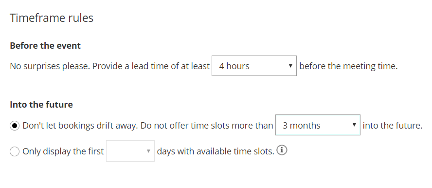
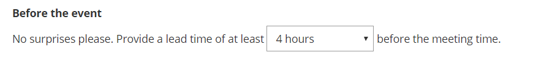
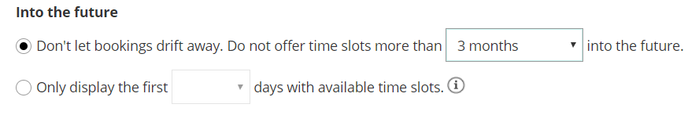

import { Aside } from '@astrojs/starlight/components';

**Timeframe rules** allow you to limit the timeframe for accepting bookings **Before an event** and **Into the future**.

Figure 1: Timeframe rules section

In this article, you'll learn about using Timeframe rules.

```
&lt;script id="snippet-prepend">
$(function()&#123;
  
  /*disable in widget*/
  if($('.w-documentation-article').length === 0)&#123;

     var ToC =
  "&lt;nav role='navigation' class='table-of-contents toc-top'><h4>In this article:" + "<ul>";
     var el,     title, link, header;
      //Define the heading levels you want to use in ascending order. Can add extra or remove unneeded.
     $(".hg-article-body h1, .hg-article-body h2, .hg-article-body h3, .hg-article-body h4").each(function() &#123;
              el = $(this);
              title = el.text();
                 if(title != '')&#123;
                anchorTitle = el.text().replace(/([~!@#$%^&*()_+=`&#123;&#125;\[\]\|\\:;'&lt;>,.\/\? ])+/g, '-').toLowerCase();
                link = "#" + anchorTitle;
                //Set all headers to a 0-nesting level.
                header = 'header-nesting-0';
                //Adjust header-nesting layers so that they point to the correct html tag. header-nesting-1 should match the second .hg-article-body h# listed above; header-nesting-2 should match the third, etc.
                if($(this).is('h2'))&#123;
                    header = 'header-nesting-1';
                &#125;else if($(this).is('h3'))&#123;
                    header = 'header-nesting-2'
                &#125;
                el.html('<a id="'+anchorTitle+'" class="toc-anchor">' + el.html());
                newLine =
      "<li class='"+header+"'>" +
        "<a class='article-anchor' href='" + link + "'>" +
          title +
        "" +
      "";


                ToC += newLine;
              &#125;
              &#125;);
     ToC +=
   "" +
  "";
    $("#snippet-prepend").before(ToC);
  &#125;
&#125;);

&lt;/script>
```

```
&lt;style>
/* CSS to style the TOC as it displays and the auto-created anchors
.toc-top styles the box for the TOC; adjust styles here to tweak look and feel */
  
.toc-top &#123;
  background-color: #FAFAFA; /* set to #fff or delete entirely for no background */
  border: 1px solid #C8C8C8; /* adjust the color hex here to change border color */
  box-shadow: 0 1px 1px rgba(0, 0, 0, 0.05) inset;
  margin-top: 24px;
  margin-bottom: 36px;
  min-height: 20px;
  padding: 13px 20px;
  max-width: 75%;
&#125;
.toc-top h4 &#123;
  font-size: 18px;
  line-height: 26px;
  margin: 0 0 8px;
  font-weight: 400;
&#125;
.toc-top ul &#123;
  padding: 0 0 0 15px !important;
  margin-bottom: 0;	
&#125;
.toc-top > ul &#123;
  margin-bottom: 13px!important;
&#125;
.toc-anchor &#123;
  display: block;
  height: 90px; 
  margin-top: -90px; 
  visibility: hidden;
&#125;

/* Set the indentation for the nesting levels. May need to be edited to match changes above. Increase or decrease the margin-left to get your desired level of indentation. */
.header-nesting-1 &#123;
    margin-left: 14px;
&#125;
.header-nesting-1:before &#123;
	background-image: url(https://dyzz9obi78pm5.cloudfront.net/app/image/id/5d31bcc88e121c9b25ba22c4/n/bulletv2.svg)!important;
&#125;
.header-nesting-2 &#123;
    margin-left: 28px;
&#125;
.header-nesting-2:before &#123;
	background-image: url(https://dyzz9obi78pm5.cloudfront.net/app/image/id/5d31be536e121cf22b0cc6ae/n/bulletv3.svg)!important;
&#125;
&lt;/style>
```

# Location of the Timeframe rules section

You can find **Timeframe rules** under **Time slot settings**. The location of the **Time slot settings** depends on whether or not your Booking page has any Event types associated with it. [Learn more about the location of the Time zone settings section](/location-of-time-slot-settings/ "Location of the Time slot settings section")

*   For Booking pages **associated** with Event types (recommended), go to **Booking pages** in the bar on the left → select the relevant **Event type →** **Time slot settings**.
*   For Booking pages **not associated** with Event types, go to go to **Booking pages** in the bar on the left → select the relevant **Booking page →** **Time slot settings**.

# Before the event

Figure 4: Before the event drop-down  This setting determines how much lead time you will have from the time a booking is made until the meeting time. For example, let’s say you create a lead time of three hours. A Customer who is on your Booking page at 1 PM will not be offered time slots before 4 PM. This setting provides for a lot of flexibility, ranging from a few minutes to a few days or weeks.

# Into the future

Figure 5: Into the future options

This setting determines how far in advance Customers can make bookings with you. You can limit Customers' choice to book into the future in one of two ways:

1.  **Count nominal time:** This time is counted independent of whether any slots are available or not in the specified period.
2.  **Only count days with available time slots:** This is based on your availability settings, minus blocked busy times and any previously scheduled meetings.

Use the radio buttons to select between the two methods.

## Nominal time method

Generally, this method is more useful for **longer periods like weeks and months.** The default for this setting is 18 months, and you can set it for as short as 12 hours. 

For example, when your **Into the future** setting is set to four weeks, we show your Customer the next four weeks regardless of whether you have any available slots during this period or not. Days where you do not have any availability on your calendar still count towards the total number of days shown. In this example, your Customer may see anything from 28 days to 0 days to choose from, depending on how much availability is on your calendar inside the specified time frame. 

## Available time slots method

Generally, this method is more useful for **shorter periods of several days.** Typical use cases where the availability-based method comes in handy include:

1.  **Business days:** Set the number of days your Customer can schedule in a way that skips weekends and holidays. Any blocked days in your calendar, or days with no availability, will not be counted towards the set number of days to display.
2.  **Allow your Customer to schedule in the next few days:** Limit your Customer's options to an exact number of days to choose from. Elegantly battle Customers' tendency to procrastinate!
3.  **Maximize your time utilization:** One of the ways to maximize time utilization is to fill up one day at a time, before opening another day for booking. Set the number of days to one to achieve this.

## How does it work?

We take the availability you specified in the [Recurring availability](/booking-page-recurring-availability-section/ "Booking page: Recurring availability section") and [Date-specific availability](/booking-page-date-specific-availability-section/ "Booking page: Date-specific availability section") sections of your Booking page, and deduct all your busy time (from your connected calendar or from events scheduled via OnceHub), all subject to your time slot rules. The result is that your Customer will see a specified number of days into the future that currently have available time slots. Any days with no open slots will **not** be counted: days with no availability, fully-booked days and days blocked due to time slots rules. Selection options are between 12 hours and 30 days. 

Consider the following example:

Your availability is set to Monday to Friday. On the upcoming Thursday, you have an all-day meeting in your connected calendar. The upcoming Friday is fully booked by OnceHub meetings. 

Your **Into the future** setting is set to two days of actual availability. A Customer that opens your Booking page on Wednesday will be able to choose between Wednesday and the following Monday. 

Let's see why:

*   Wednesday is shown because it has available slots.
*   Thursday is skipped because it is blocked by the all-day event in the connected calendar.
*   Friday is skipped because it is blocked by OnceHub events.
*   Saturday and Sunday are skipped because you did not specify availability on these days.
*   Monday is shown because it is the next day with available slots.

Setting actual availability ensures that your Customer is always offered the predefined number of available days to choose from.