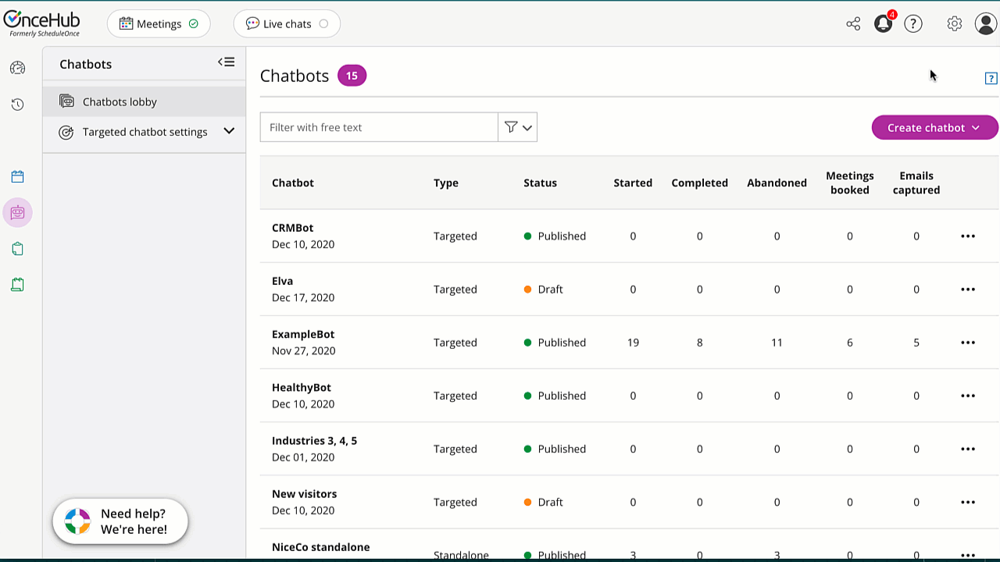
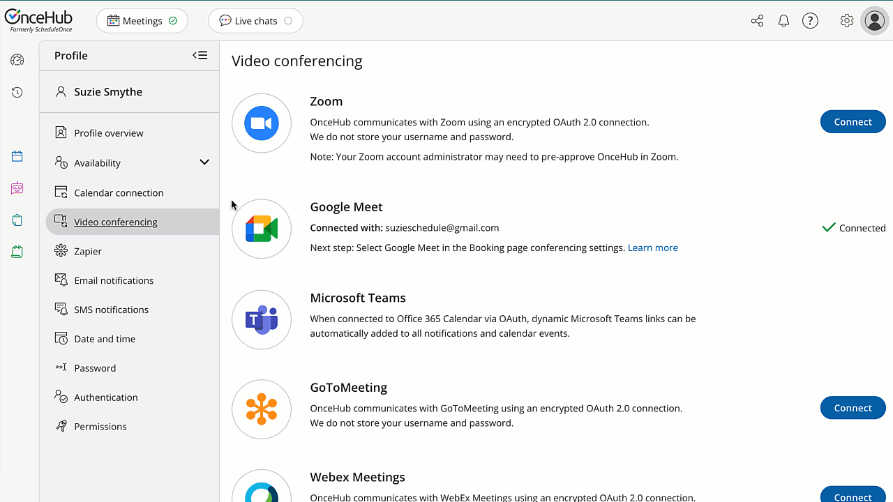
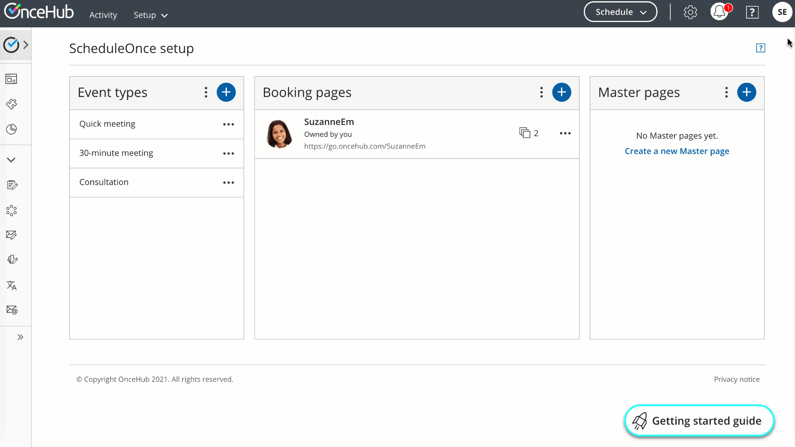
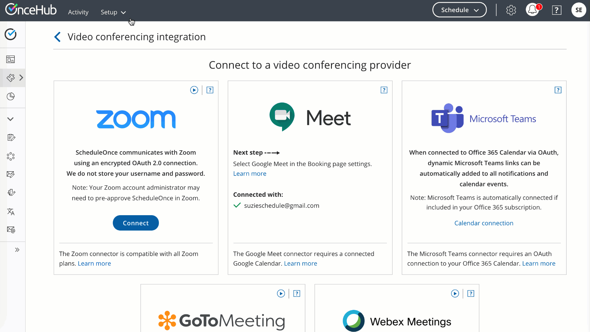
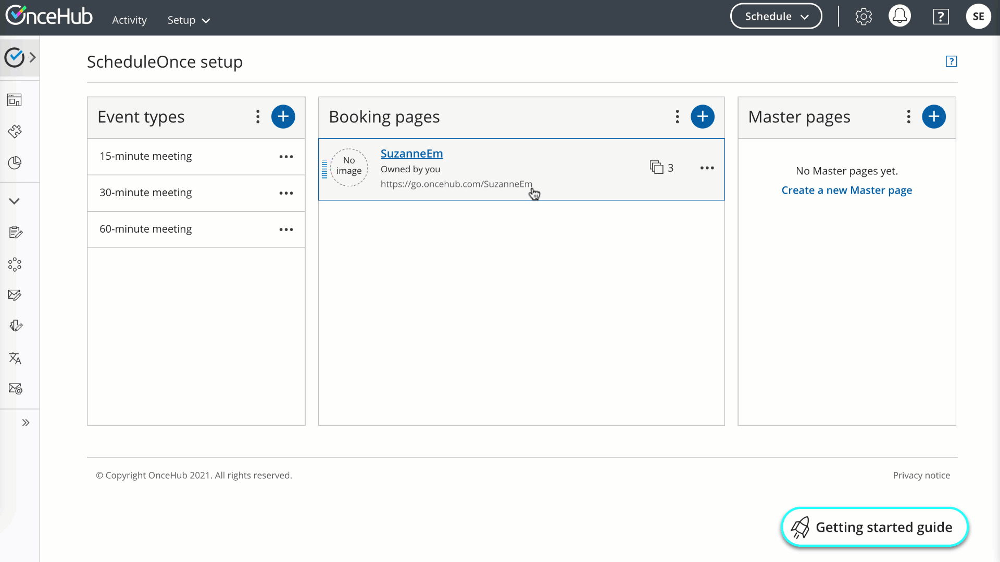
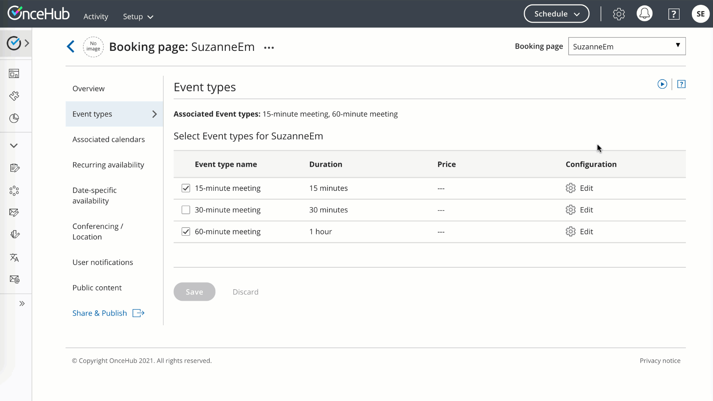
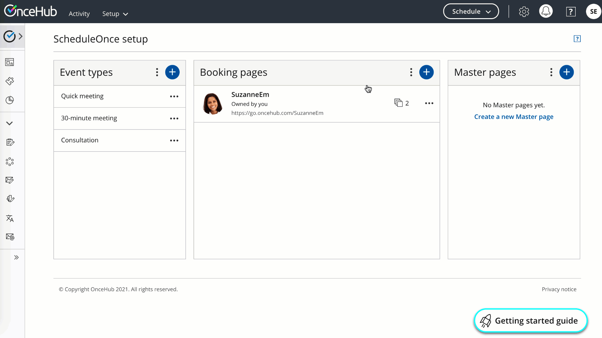

import { Aside } from '@astrojs/starlight/components';

Booking pages can be customized in many different ways. However, you only need to follow a few basic steps to start receiving bookings:

1.  Set up your meetings
2.  Customize your branding
3.  Share your link

# Step 1. Set up your meetings

## Set your availability

You may have already configured your availability in the onboarding wizard. If you're satisfied with the rules you set for your availability, you can skip this. 

Every User can set their own availability, which OnceHub applies to all the Booking pages they own. You can update your User availability in your profile by selecting your profile picture or initials in the top right-hand corner → **Profile settings** → **Availability** → **Scheduled meetings**.

Figure 1: Update your availability

[Learn more about your availability](/managing-your-profile-in-oncehub/)

## Connect your calendar 

With a connected calendar, OnceHub knows not to offer times you're busy to people booking with you. It also adds all booked appointments to your calendar automatically. 

If you didn't already connect your calendar in the onboarding wizard, you can update your OnceHub profile and integrate. In the top right-hand corner, select your profile picture or initials → **Profile settings** → **Availability** → **Calendar connection**.

Figure 2: Connect your calendar

By default, OnceHub reads busy time from your main calendar. If your connected account has multiple calendars—for instance, one for work and another for personal events—you can opt to have OnceHub read busy time from them as well.

Figure 3: Associated calendars retrieving busy time

## Connect your video conferencing

Booking Pages seamlessly integrates your booking activities with [Zoom](/integrate-your-video-conferencing-app-with-oncehub/), [Google Meet](/integrate-your-video-conferencing-app-with-oncehub/), [Microsoft Teams](/integrate-your-video-conferencing-app-with-oncehub/), [GoToMeeting](/integrate-your-video-conferencing-app-with-oncehub/), or [Webex Meetings](/integrate-your-video-conferencing-app-with-oncehub/) through all phases of the booking lifecycle. When a booking is made, video conferencing session details are integrated with all Booking Pages notifications and a video conferencing session will be created automatically. 

Your customer will receive all connection details in the scheduling confirmation email and calendar invite.

Figure 4: Connect to video conferencing

### 

If you're taking video meetings, you'll need to update your Booking page to reflect this. 

**Figure 5: Add video conferencing to your Booking page location**

## Adjust Event types

You can offer one or more Event types to the people booking with you. With your new account, you have three Event types ready-made: 

*   15-minute meeting
*   30-minute meeting
*   60-minute meeting

If you only want one or two, you can remove the extra from your Booking page. Hover over the left-hand menu and go to the Booking pages icon **→** **Booking pages** → your Booking page → **Event types**.

Figure 6: Adjust your Event types

If you'd like, you can adjust the Event types' names, time duration, and more by clicking Edit while you're adjusting the associated Event types at **Event types** → relevant Event type. 

To update the name, click on the three horizontal dots next to the Event type's name and select **Primary settings**. 

To update the time duration, go to **Time slot settings** → **Event type duration**.

Figure 7: Update your Event type settings

[Learn more about Event types](/introduction-to-event-types/)

# Step 2. Customize your branding

## Add customer-facing details

You can include a headshot, welcome message, and more by updating the Public content section at **Booking pages** → your Booking page → **Public content**. 

Figure 8: Add customer-facing details

# Step 3. Share your link

You can grab your link to share it by clicking the quick share icon in the top menu. 

Figure 9: Share your link

**That's it!** **You're all set to receive bookings.** 

# Want to learn more?

*   [Offer multiple locations or conferencing options from a single link](/introduction-to-master-pages/)
*   [Make date-specific exceptions to your availability](/booking-page-date-specific-availability-section/)
*   [Manage your bookings](/managing-bookings/)