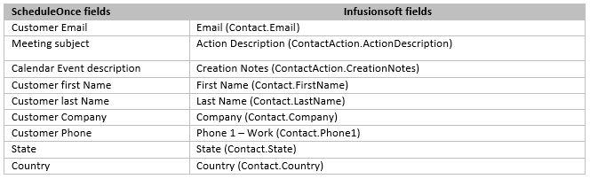

import { Aside } from '@astrojs/starlight/components';

The Infusionsoft connector setup wizard includes 5 steps:  [Creation](/infusionsoft-record-creation-update-and-assignment-rules/ "Infusionsoft record creation, update, and assignment rules"), [Classification](/infusionsoft-record-classification/ "Infusionsoft record classification"), [Tagging](/tagging-infusionsoft-contact-records-with-lifecycle-tags/ "Tagging Infusionsoft Contact records with Lifecycle tags"), Mapping, and [Tracking](/infusionsoft-embedding-infusionsoft-tracking-code-to-your-booking-forms/ "Embedding Infusionsoft tracking code to your Booking forms"). Only OnceHub Administrators can setup their Infusionsoft connector. To access the Infusionsoft connector setup wizard:

1.  Click the gear icon located in the top-right corner of the page.
2.  Select **Account Integrations** from the dropdown menu.
3.  Filter for **CRM**.
4.  Click on the **Infusionsoft (For Booking Pages)** tile.

**Important**You must be connected to your Infusionsoft account to be able to set up the connector.

  
The **Mapping** step includes default account-level mapping recommended by OnceHub and the option to map almost all OnceHub fields to Infusionsoft fields. You can further define your field mapping by adding an Event type-level mapping. This will override account-level mappings when the Event type is selected when customers make a booking.  
  
Note that bookings are created based on the default Infusionsoft account date format (_mm/dd/yyyy_). If your Infusionsoft account is set to _dd/mm/yyyy_, make sure to switch the date format to in the Mapping step.  
  
In this article, you will learn how to map OnceHub fields to Infusionsoft fields.

**Note**The same Infusionsoft field can be mapped to a OnceHub field in the account-level mapping and to multiple Event types in the Event type-level mapping. When a booking is made, the Infusionsoft field is mapped by default to the account-level field mapping, or to the Event type-level mapping when the mapped Event types are selected.

# Default mapping

OnceHub fields are mapped to Infusionsoft fields by default. We do recommend to keep the mapping as-is and not to remove mapped data from the integration. This will enable you to gather the basic customer and booking data in Infusionsoft.

The Customer email and Subject fields are mandatory fields in the OnceHub Booking form and cannot be unchecked. However, you can choose to map them to different Infusionsoft fields.

Other OnceHub fields can be mapped to different Infusionsoft fields and are not mandatory. You can remove them from the mapping by unchecking each field.

Default mapping:  

# Adding new OnceHub fields

You can add any OnceHub fields and map them to Infusionsoft fields. This allows you to map any data tracked in OnceHub to Appointment or Contact records.

1.  To add a OnceHub field to the mapping, click the Add OnceHub fields button.
2.  Select the OnceHub fields you want to add and click Add fields. The OnceHub field list includes all System fields and Custom fields organized by categories.
    
    **Important**OnceHub fields requiring Customer input must be set as mandatory fields on the Booking form. Otherwise, these fields will automatically be added to the Booking form at the time of the booking. 
    
    Especially notable is the **Your company** OnceHub field, which must be added manually to your booking forms in order to map to the **Company** **(Contact.Company)** field in Infusionsoft.  
      
    [Learn more about editing Booking forms](/creating-a-booking-form/)  
      
    [Learn more about adding Custom fields to the Booking form](/creating-and-editing-custom-fields/ "Creating and editing Custom fields")
    
3.  In the Mapping step, select an Infusionsoft field from the drop-down list.

The Infusionsoft fields include all the fields stored in Infusionsoft (Custom and standard fields) that are the same field type as the selected OnceHub field. [Learn more about the supported and non-supported Infusionsoft field types](/supported-and-non-supported-infusionsoft-field-types/ "Supported and non-supported Infusionsoft field types")

**Note**There is a two-way mapping between Infusionsoft and OnceHub. For this reason, you can only map one OnceHub field to one Infusionsoft field.  
  
 **-> OnceHub to Infusionsoft**  
When a booking is made, all data is mapped from OnceHub to Infusionsoft.  
**&lt;- Infusionsoft to OnceHub**  
When scheduling with existing Infusionsoft contacts using Personalized links (Infusionsoft ID), Customer data is mapped from Infusionsoft to OnceHub in order to prepopulate or skip the Booking form.