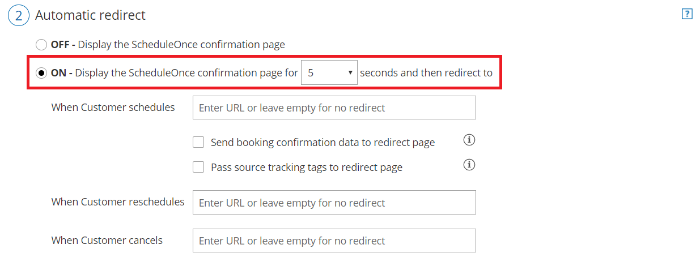

import { Aside } from '@astrojs/starlight/components';

Source tracking helps you understand your audience better by tracking the various sources of your bookings. By adding [UTM tags](https://en.wikipedia.org/wiki/UTM_parameters) (sometimes called UTM parameters or UTM code) to the specific URLs that you share in different places online, you can analyze which marketing campaign or outreach effort results in more bookings. 

For example, you might add a source tracking tag to the URL that you share with Customers via email marketing campaigns, but add a different source tracking tag to the URL that you publish on banner ads. By adding different UTM tags to URLs that you use in different contexts, you can track how many bookings are generated from each source, allowing you to focus your marketing resources on the most effective strategies for your business. OnceHub enables you to use source tracking in combination with Google Analytics or another third-party analytics tool. 

If you're using a chatbot installed on your website or providing a [general link](/using-general-links/) for booking pages (https://go.oncehub.com/YourLink), OnceHub stores the data for UTM tags used to access this page.  You can access this data in the **Details** pane of your Activity stream (see below for details). 

If you'd prefer to integrate booking pages into your own website and share a link to your website rather than a general link, you can still use UTM tags for this by [redirecting](/automatic-redirect/ "Automatic redirect") to your own landing page or custom confirmation page. OnceHub allows source tracking for any of our [Sharing](/how-to-share-links-in-emails-and-other-apps/ "How to share links in emails and other apps") and [Publishing](/website-embed/ "How to publish Booking pages on websites") options. However, OnceHub does not store the data internally for those UTM tags. 

In this article, you'll learn about UTM tags and how to enable source tracking. 

```
&lt;script id="snippet-prepend">
$(function()&#123;
  
  /*disable in widget*/
  if($('.w-documentation-article').length === 0)&#123;

     var ToC =
  "&lt;nav role='navigation' class='table-of-contents toc-top'><h4>In this article:" + "<ul>";
     var el,     title, link, header;
      //Define the heading levels you want to use in ascending order. Can add extra or remove unneeded.
     $(".hg-article-body h1, .hg-article-body h2, .hg-article-body h3, .hg-article-body h4").each(function() &#123;
              el = $(this);
              title = el.text();
                 if(title != '')&#123;
                anchorTitle = el.text().replace(/([~!@#$%^&*()_+=`&#123;&#125;\[\]\|\\:;'&lt;>,.\/\? ])+/g, '-').toLowerCase();
                link = "#" + anchorTitle;
                //Set all headers to a 0-nesting level.
                header = 'header-nesting-0';
                //Adjust header-nesting layers so that they point to the correct html tag. header-nesting-1 should match the second .hg-article-body h# listed above; header-nesting-2 should match the third, etc.
                if($(this).is('h2'))&#123;
                    header = 'header-nesting-1';
                &#125;else if($(this).is('h3'))&#123;
                    header = 'header-nesting-2'
                &#125;
                el.html('<a id="'+anchorTitle+'" class="toc-anchor">' + el.html());
                newLine =
      "<li class='"+header+"'>" +
        "<a class='article-anchor' href='" + link + "'>" +
          title +
        "" +
      "";


                ToC += newLine;
              &#125;
              &#125;);
     ToC +=
   "" +
  "";
    $("#snippet-prepend").before(ToC);
  &#125;
&#125;);

&lt;/script>
```

```
&lt;style>
/* CSS to style the TOC as it displays and the auto-created anchors
.toc-top styles the box for the TOC; adjust styles here to tweak look and feel */
  
.toc-top &#123;
  background-color: #FAFAFA; /* set to #fff or delete entirely for no background */
  border: 1px solid #C8C8C8; /* adjust the color hex here to change border color */
  box-shadow: 0 1px 1px rgba(0, 0, 0, 0.05) inset;
  margin-top: 24px;
  margin-bottom: 36px;
  min-height: 20px;
  padding: 13px 20px;
  max-width: 75%;
&#125;
.toc-top h4 &#123;
  font-size: 18px;
  line-height: 26px;
  margin: 0 0 8px;
  font-weight: 400;
&#125;
.toc-top ul &#123;
  padding: 0 0 0 15px !important;
  margin-bottom: 0;	
&#125;
.toc-top > ul &#123;
  margin-bottom: 13px!important;
&#125;
.toc-anchor &#123;
  display: block;
  height: 90px; 
  margin-top: -90px; 
  visibility: hidden;
&#125;

/* Set the indentation for the nesting levels. May need to be edited to match changes above. Increase or decrease the margin-left to get your desired level of indentation. */
.header-nesting-1 &#123;
    margin-left: 14px;
&#125;
.header-nesting-1:before &#123;
	background-image: url(https://dyzz9obi78pm5.cloudfront.net/app/image/id/5d31bcc88e121c9b25ba22c4/n/bulletv2.svg)!important;
&#125;
.header-nesting-2 &#123;
    margin-left: 28px;
&#125;
.header-nesting-2:before &#123;
	background-image: url(https://dyzz9obi78pm5.cloudfront.net/app/image/id/5d31be536e121cf22b0cc6ae/n/bulletv3.svg)!important;
&#125;
&lt;/style>
```

# UTM tags

UTMs (Urchin Tracking Modules) were originally created by Urchin Software (acquired by Google in 2005) as a tagging system for URLs. They have become one of the most widely used source tracking conventions for marketing analytics and are a powerful tool to incorporate in any data-driven marketing strategy.

The five standard UTM tags are:

*   utm_source: used for identifying the traffic source.
*   utm_medium: used for identifying the delivery method.
*   utm_campaign: used for keeping track of different campaigns.
*   utm_term: used for identifying keywords.
*   utm_content: used for split testing or separating two ads that go to the same URL.

[Learn more about UTM tags](https://support.google.com/analytics/answer/1033863#zippy=%2Cin-this-article)

**Note** The five standard UTM tag names are reserved terms in OnceHub, and cannot be used as [Custom field names](/creating-and-editing-custom-fields/ "Creating and editing Custom fields").

# UTM structure

UTM tags are added to the end of the URL, with the following syntax:

1.  Add "?" to the end of the URL.
2.  Add "=" followed by the value of each tag as defined according to your marketing analytics strategy.
3.  Add "&" to separate each parameter.

For example, here's an example booking page link with some UTM tags added:  
https://go.oncehub.com/EXAMPLEBOOKINGPAGE**?utm_source=**newsletter1**&utm_medium=**email**&utm_campaign=**conference

# View UTM tag activity through the Activity stream

If you're using a chatbot installed on your website or sending your customer a [general link](/using-general-links/) ( https://go.oncehub.com/YourLink ), OnceHub tracks UTM tags added to the URL automatically. You don't need to update your configuration within OnceHub; just add the UTM parameter(s) to the URL you provide to people scheduling with you. 

For example, if you have installed a chatbot on your website, the link you use in a Google Ad may be:    
https://www.yourwebsite.com?**utm_source=**google**&utm_medium=**cpc**&utm_campaign=**summer_sale

You can view UTM tag activity within the Details pane of your Activity stream. 

## Monitor effectiveness of campaigns with custom filters

To monitor the effectiveness of a campaign over time, you can save a [custom filter](/creating-custom-filters/) for a specific campaign. With a custom filter, you can access the data quickly and easily. 

Either view the activity within OnceHub's Activity stream, [share the custom filter with a colleague](/the-activity-stream-booking-management-how-to-send-a-filtered-view-of-the-stream-to-another-team-member/), or export the filter's activity to analyze the data on your end.

# Enabling source tracking for your private website

## 1\. Enable Automatic redirect

In order to turn on source tracking for bookings made through your private website, you must enable [Automatic redirect](/automatic-redirect/ "Automatic redirect"). OnceHub does not store source tracking information internally, and only facilitates the passing of your UTM tags to a third-party page. 

You must set up your own landing page or custom confirmation page that is configured for use with [web analytics](/using-booking-pages-with-web-analytics/ "Using ScheduleOnce with web analytics").

## 2\. Enable source tracking for the Event type

1.  For Booking pages **associated** with Event types, go to **Booking pages** in the bar on the left **→**  select the relevant **Event type **→**   Booking form and redirect** section.  
    For Booking pages **not associated** with Event types, go to **Booking pages** in the bar on the left **→** select the relevant **Booking page **→ **Booking form and redirect** section.
2.  In the **Booking form and redirect section**, turn Automatic redirect **ON** (Figure 1).
    
    Figure 1: Booking form and redirect section
    
3.  Enter the URL that you've configured for web analytics. You can add UTM tags to your Booking page links manually, or use a URL-building tool.
4.  Check the box to **Pass source tracking tags to redirect page**.
5.  Click **Save**. 
6.  If you use [Website integration](/website-embed/ "Introduction to publishing options"), go to the **Schedule button** in the top navigation menu and select **Publish on your website**. Select your publishing option. In the **Customer data** step, select **Customer data is passed via URL parameters.**

Source tracking is now enabled and you can now analyze the source tracking data for your bookings.

**Note**Source tracking is only passed to the redirect URL when a booking is scheduled. Source tracking is not passed to the redirect URL when a booking is canceled or rescheduled.