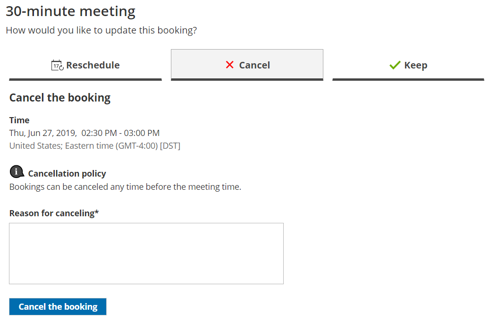

import { Aside } from '@astrojs/starlight/components';

Whether or not a Customer can cancel a [Panel meeting](/introduction-to-panel-meetings/ "Introduction to Panel meetings") is subject to the [Cancel/reschedule policy](/the-customer-cancelreschedule-policy/ "The Customer Cancel/reschedule policy") you've set on your [Booking page](/introduction-to-booking-pages/ "Introduction to Booking pages") or [Event type](/introduction-to-event-types/ "Introduction to Event types"). The Cancellation policy only applies to scheduled bookings.

In this article, you'll learn about the steps that a Customer takes to reschedule a Panel meeting.

# How Customers cancel Panel meetings

1.  The Customer clicks the **Cancel/reschedule** link in the scheduling email notification (Figure 1) or in the [calendar event](/customer-calendar-event-options/ "Customer calendar event options").  
    Figure 1: Booking confirmation email
2.  The [Cancel/reschedule page](/reschedule-the-customer-cancelreschedule-page/ "The Customer Cancel/Reschedule page") will open. 
3.  In the **Cancel** tab, the Customer clicks the **Cancel the booking** button (Figure 2). Depending on your [Cancel/reschedule policy](/the-customer-cancelreschedule-policy/ "The Customer Cancel/Reschedule policy"), the Customer can be asked to provide a reason for canceling.Figure 2: Cancel tab
4.  When a Customer cancels a Panel meeting, the following actions take place:
    *   The Customer receives a cancellation [email notification](/customer-notification-scenarios/ "Customer notification scenarios").
    *   The [Primary team member](/booking-owners/ "Primary team members") receives a cancellation email notification and all [Additional team members](/additional-team-members/ "Additional team members") are cc’d in this email.
    *   If the Primary team member is connected to a calendar, the event is automatically cancelled.
    *   All panelists see the cancelled [activity status](/understanding-activity-statuses/ "Understanding ScheduleOnce activity statuses") and details for the activity in their [Activity stream](/introduction-to-the-activity-stream/ "Introduction to the ScheduleOnce Activity stream").

**Note** When you use [Payment integration](/the-scheduleonce-connector-for-paypal/ "The ScheduleOnce connector for PayPal"), you can enable [automatic refunds](/automatic-refund-via-scheduleonce/ "Automatic refund via ScheduleOnce") when Customers cancel a Panel meeting. [Learn more about enabling automatic refunds](/automatic-refund-via-scheduleonce/ "Automatic refund via ScheduleOnce")