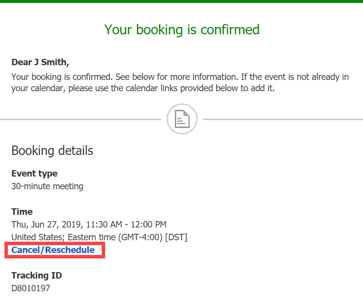
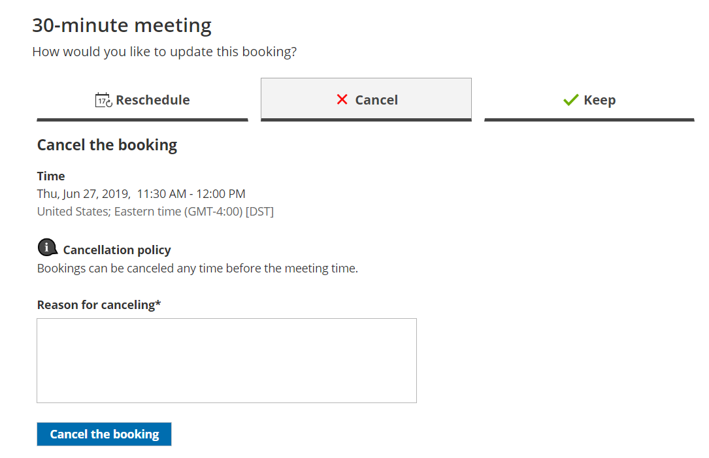

import { Aside } from '@astrojs/starlight/components';

Whether or not a Customer can cancel a booking is subject to the [cancellation policy](/the-customer-cancelreschedule-policy/ "The Customer Cancel/reschedule policy") you've set on your [Booking page](/introduction-to-booking-pages/ "Introduction to Booking pages") or [Event type](/introduction-to-event-types/ "Introduction to Event types"). The cancellation policy only applies to scheduled bookings.

In this article, you'll learn about the steps a Customer takes to cancel a single booking.

# How Customers cancel a single booking

1.  The Customer clicks the **Cancel/reschedule** link in the scheduling confirmation email (Figure 1) or in the [calendar event](/customer-calendar-event-options/ "Customer calendar event options").  
    Figure 1: Booking confirmation email
2.  The [Cancel/reschedule page](/reschedule-the-customer-cancelreschedule-page/ "The Customer Cancel/Reschedule page") will open.
3.  In the **Keep** tab, the Customer can review the details of the booking.
4.  In the **Cancel** tab, the Customer can click **Cancel the booking** to cancel the booking (Figure 2). Depending on your [Cancel/reschedule policy](/the-customer-cancelreschedule-policy/ "The Customer Cancel/Reschedule policy"), the Customer can be asked to provide a reason for canceling.  
    Figure 2: Canceling a booking
    
    **Note**When using [Payment integration](/the-scheduleonce-connector-for-paypal/ "The ScheduleOnce connector for PayPal"), you can enable [automatic refunds](/automatic-refund-via-scheduleonce/ "Automatic refund via ScheduleOnce") when Customers cancel a booking or one or more sessions in a package. This enables you to build trust and increase customer satisfaction. [Learn more about enabling automatic refunds](/automatic-refund-via-scheduleonce/ "Automatic refund via ScheduleOnce")
    
5.  Once the booking has been canceled, the Customer will receive a cancellation email notification, along with the Booking page Owner and [any additional stakeholders](/subscribing-to-booking-notifications/ "Subscribing to Booking notifications"). 

[Learn more about the effects of cancellation](/effect-of-cancellation/ "Effect of cancellation")

**Note**If you use [Payment integration](/the-scheduleonce-connector-for-paypal/ "The ScheduleOnce connector for PayPal"), you can enable [automatic refunds](/automatic-refund-via-scheduleonce/ "Automatic refund via ScheduleOnce") when Customers cancel a booking. [Learn more about enabling automatic refunds](/automatic-refund-via-scheduleonce/ "Automatic refund via ScheduleOnce")