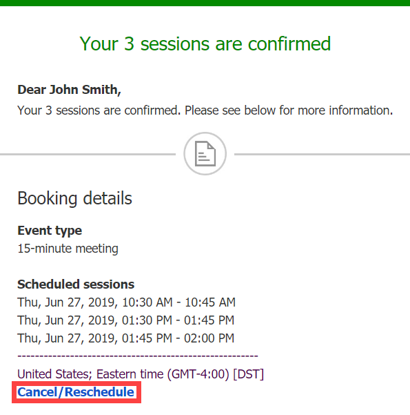

import { Aside } from '@astrojs/starlight/components';

Whether or not a Customer can cancel sessions in a package is subject to the [cancellation policy](/the-customer-cancelreschedule-policy/ "The Customer Cancel/reschedule policy") you've set on your [Booking page](/introduction-to-booking-pages/ "Introduction to Booking pages") or [Event type](/introduction-to-event-types/ "Introduction to Event types"). The cancellation policy only applies to scheduled bookings.

In this article, you'll learn about the steps that a Customer takes to cancel sessions in a package.

# How Customers cancel sessions in a package

1.  The Customer clicks the **Cancel/reschedule** link in the scheduling confirmation email (Figure 1) or the [calendar event](/customer-calendar-event-options/ "Customer calendar event options"). Figure 1: Booking confirmation email
2.  The [Cancel/reschedule page](/reschedule-the-customer-cancelreschedule-page/ "The Customer Cancel/Reschedule page") will open. 
3.  In the **Cancel** tab, the Customer selects the sessions that they want to cancel (Figure 2). Depending on your [Cancel/reschedule policy](/the-customer-cancelreschedule-policy/ "The Customer Cancel/Reschedule policy"), the Customer can be asked to provide a reason for canceling. Figure 2: Cancel tab
4.  Once the sessions have been cancelled, a cancellation email notification is sent to the Customer, the Booking owner, and any [additional stakeholders](/subscribing-to-booking-notifications/ "Access permissions for subscribing to Booking notifications"). 
5.  If the Customer added these events to their calendar, they will have to remove them manually.

[Learn more about the effects of cancellation](/effect-of-cancellation/ "Effect of cancellation")

**Note**If you use [Payment integration](/the-scheduleonce-connector-for-paypal/ "The ScheduleOnce connector for PayPal"), you can enable [automatic refunds](/automatic-refund-via-scheduleonce/ "Automatic refund via ScheduleOnce") when Customers cancel one or more sessions in a package. [Learn more about enabling automatic refunds](/automatic-refund-via-scheduleonce/ "Automatic refund via ScheduleOnce")