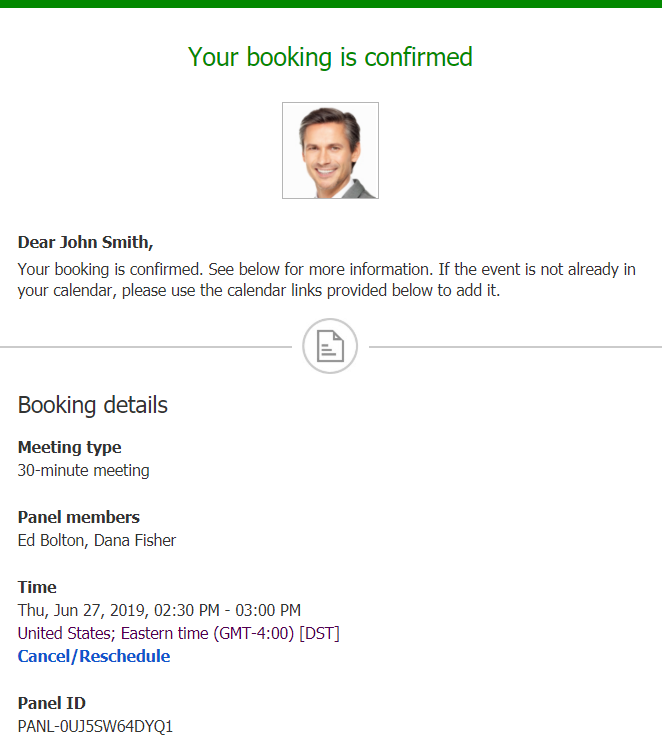

import { Aside } from '@astrojs/starlight/components';

Whether or not a Customer can reschedule a [Panel meeting](/introduction-to-panel-meetings/ "Introduction to Panel meetings") is subject to the [Cancel/reschedule policy](/the-customer-cancelreschedule-policy/ "The Customer Cancel/reschedule policy") you've set on your [Booking page](/introduction-to-booking-pages/ "Introduction to Booking pages") or [Event type](/introduction-to-event-types/ "Introduction to Event types"). The Reschedule policy only applies to scheduled bookings and rescheduled Panel meetings are always made with the original panelists and Event type.

In this article, you'll learn about the steps that a Customer takes to reschedule a Panel meeting.

# How Customers reschedule Panel meetings

1.  The Customer clicks the **Cancel/Reschedule** link in the scheduling email notification (Figure 1) or in the [calendar event](/customer-calendar-event-options/ "Customer calendar event options").  
    Figure 1: Booking confirmation email
2.  The [Cancel/reschedule page](/reschedule-the-customer-cancelreschedule-page/ "The Customer Cancel/Reschedule page") will open.
3.  In the **Reschedule** tab, the Customer clicks the **See available times** button (Figure 2).  
    Figure 2: Reschedule tab
4.  The Customer then selects a new date and time. 
5.  If your [Cancel/reschedule policy](/the-customer-cancelreschedule-policy/ "The Customer Cancel/Reschedule policy") asks for a reschedule reason, the Customer will be prompted to provide one.
6.  The [Booking form](/introduction-to-the-booking-form-redirect-section/ "Introduction to the Booking form and redirect section") step is skipped since all the required information was already provided by the Customer when they made the booking.
7.  When a Customer reschedules a Panel meeting, the following actions take place:
    *   The Customer receives an [email notification](/customer-notification-scenarios/ "Customer notification scenarios") with details about their rescheduled Panel meeting.
    *   The [Primary team member](/booking-owners/ "Primary team members") receives an [email notification](/user-notification-scenarios/ "User notification scenarios") with details about the rescheduled booking details. All [Additional team members](/additional-team-members/ "Additional team members") are cc’d in this email.
    *   If the Primary team member is connected to a calendar, the calendar event will be automatically updated to reflect the new times.
    *   All panelists see the updated [activity status](/understanding-activity-statuses/ "Understanding ScheduleOnce activity statuses") and details in their [Activity stream](/introduction-to-the-activity-stream/ "Introduction to the ScheduleOnce Activity stream").

**Note**If you use [Payment integration](/the-scheduleonce-connector-for-paypal/ "The ScheduleOnce connector for PayPal"), you can charge Customers a reschedule fee when they reschedule a booking. This enables you to generate an additional revenue stream and reduces unnecessary rescheduling activity.