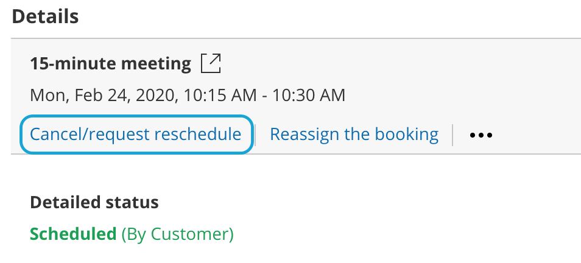
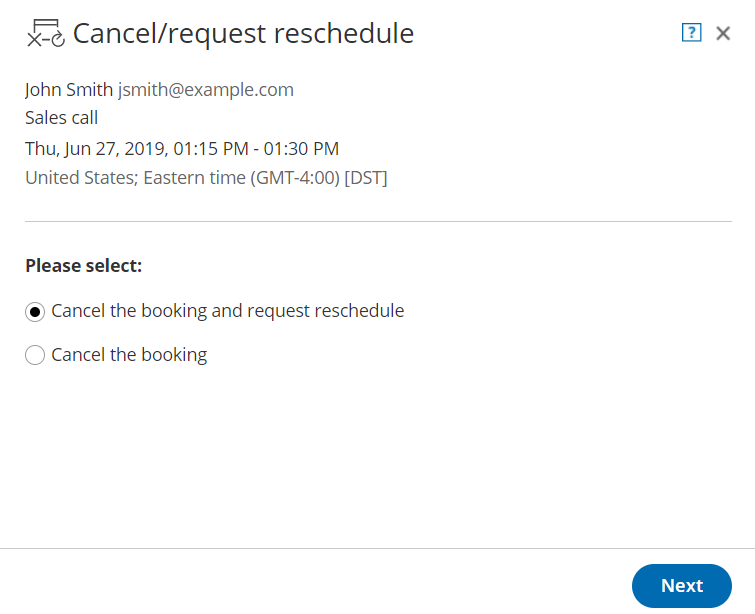
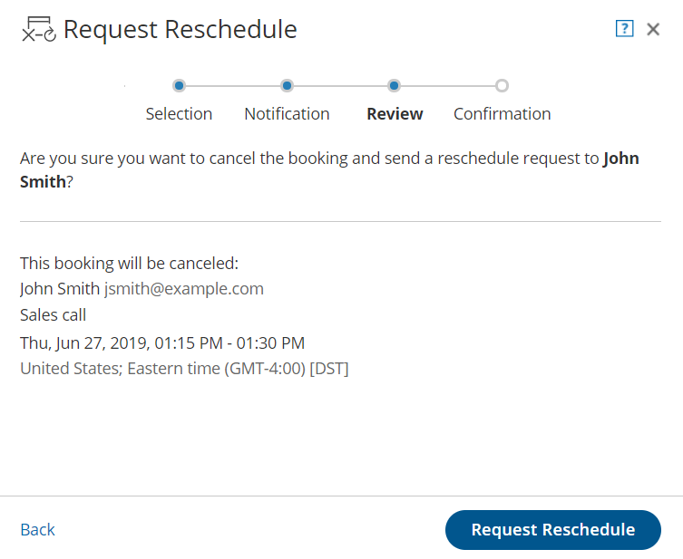

import { Aside } from '@astrojs/starlight/components';

**Tip**We recommend using [Event types](/introduction-to-event-types/ "Introduction to Event types") with your [Booking pages](/introduction-to-booking-pages/ "Introduction to Booking pages"). Event types allow you to offer several meeting types with different durations, price, and other properties.

When the [activity status](/understanding-activity-statuses/ "Understanding ScheduleOnce activity statuses") of a booking is **Scheduled**, **Rescheduled**, **No-show**, or **Completed**, the User can request to cancel or reschedule a booking directly from the [Activity stream](/introduction-to-the-activity-stream/ "Introduction to the Activity Stream").

**Note**You can cancel or reschedule directly from your calendar if you have connected your OnceHub Account to [Google Calendar](/user-action-cancel-or-reschedule-in-google-calendar/ "User action: Cancel or reschedule in Google Calendar") or [Exchange/Outlook Calendar](/reschedule-user-action-cancel-or-reschedule-from-within-exchange-calendar/ "User action: Cancel or reschedule in Exchange Calendar").

In this article, you'll learn how to cancel or request reschedule directly from the Activity stream when you use Booking pages which are not [associated with Event types](/adding-event-types-to-booking-pages/ "Adding Event types to Booking pages").

```
&lt;script id="snippet-prepend">
$(function()&#123;
  
  /*disable in widget*/
  if($('.w-documentation-article').length === 0)&#123;

     var ToC =
  "&lt;nav role='navigation' class='table-of-contents toc-top'><h4>In this article:" + "<ul>";
     var el,     title, link, header;
      //Define the heading levels you want to use in ascending order. Can add extra or remove unneeded.
     $(".hg-article-body h1, .hg-article-body h2, .hg-article-body h3, .hg-article-body h4").each(function() &#123;
              el = $(this);
              title = el.text();
                 if(title != '')&#123;
                anchorTitle = el.text().replace(/([~!@#$%^&*()_+=`&#123;&#125;\[\]\|\\:;'&lt;>,.\/\? ])+/g, '-').toLowerCase();
                link = "#" + anchorTitle;
                //Set all headers to a 0-nesting level.
                header = 'header-nesting-0';
                //Adjust header-nesting layers so that they point to the correct html tag. header-nesting-1 should match the second .hg-article-body h# listed above; header-nesting-2 should match the third, etc.
                if($(this).is('h2'))&#123;
                    header = 'header-nesting-1';
                &#125;else if($(this).is('h3'))&#123;
                    header = 'header-nesting-2'
                &#125;
                el.html('<a id="'+anchorTitle+'" class="toc-anchor">' + el.html());
                newLine =
      "<li class='"+header+"'>" +
        "<a class='article-anchor' href='" + link + "'>" +
          title +
        "" +
      "";


                ToC += newLine;
              &#125;
              &#125;);
     ToC +=
   "" +
  "";
    $("#snippet-prepend").before(ToC);
  &#125;
&#125;);

&lt;/script>
```

```
&lt;style>
/* CSS to style the TOC as it displays and the auto-created anchors
.toc-top styles the box for the TOC; adjust styles here to tweak look and feel */
  
.toc-top &#123;
  background-color: #FAFAFA; /* set to #fff or delete entirely for no background */
  border: 1px solid #C8C8C8; /* adjust the color hex here to change border color */
  box-shadow: 0 1px 1px rgba(0, 0, 0, 0.05) inset;
  margin-top: 24px;
  margin-bottom: 36px;
  min-height: 20px;
  padding: 13px 20px;
  max-width: 75%;
&#125;
.toc-top h4 &#123;
  font-size: 18px;
  line-height: 26px;
  margin: 0 0 8px;
  font-weight: 400;
&#125;
.toc-top ul &#123;
  padding: 0 0 0 15px !important;
  margin-bottom: 0;	
&#125;
.toc-top > ul &#123;
  margin-bottom: 13px!important;
&#125;
.toc-anchor &#123;
  display: block;
  height: 90px; 
  margin-top: -90px; 
  visibility: hidden;
&#125;

/* Set the indentation for the nesting levels. May need to be edited to match changes above. Increase or decrease the margin-left to get your desired level of indentation. */
.header-nesting-1 &#123;
    margin-left: 14px;
&#125;
.header-nesting-1:before &#123;
	background-image: url(https://dyzz9obi78pm5.cloudfront.net/app/image/id/5d31bcc88e121c9b25ba22c4/n/bulletv2.svg)!important;
&#125;
.header-nesting-2 &#123;
    margin-left: 28px;
&#125;
.header-nesting-2:before &#123;
	background-image: url(https://dyzz9obi78pm5.cloudfront.net/app/image/id/5d31be536e121cf22b0cc6ae/n/bulletv3.svg)!important;
&#125;
&lt;/style>
```

# Effects of canceling or rescheduling

When you request to reschedule from the Activity stream, the booking is canceled and a reschedule request email notification is sent to both the User and the Customer. To reschedule, the Customer clicks the **Reschedule now** button directly from the email notification, or the **Customer's cancel/reschedule link** in the [calendar event](/customer-calendar-event-options/ "Customer calendar event options"). [Learn more about the effects of rescheduling](/effect-of-rescheduling/ "Effect of rescheduling")

When you cancel a booking from the Activity stream, a cancellation email notification is sent to both the User and the Customer. 

[Learn more about the effects of cancellation](/effect-of-cancellation/ "Effect of cancellation")

# Requirements

To cancel a booking or request to reschedule from the Activity stream, you must be [the Owner, an Editor, or Viewer](/booking-page-access-permissions/ "Booking page access permissions") of the [Booking page](/introduction-to-booking-pages/ "Introduction to Booking pages") that the booking was made on.

# Rescheduling a booking made on a Booking page without Event types

1.  Select the activity in the Activity stream. 
2.  In the **Details** pane, select **Cancel/request reschedule**. (Figure 1).  
    Figure 1: Cancel/request reschedule button
3.  The **Cancel/request reschedule** pop-up will appear (Figure 2). Figure 2: Cancel/request new times pop-up
4.  Select **Cancel the booking and request reschedule**.
5.  Click **Next**.
6.  In the **Notification** step, you can add a reschedule reason that will be provided to the Customer.
7.  Click **Next**.
8.  In the **Review** step (Figure 3), you can confirm the details of the booking that you're about to cancel and request that the Customer reschedules.  
    Figure 3: Cancel/request reschedule pop-up—Review step
9.  Click **Request reschedule**. 
10.  The original booking will be canceled and the Customer will receive an email notification to reschedule. The [Booking page Owner](/booking-page-access-permissions/ "Booking page access permissions") and [any additional stakeholders](/subscribing-to-booking-notifications/ "Subscribing to Booking notifications") with also receive an email notification. [Learn more about notification scenarios](/notification-scenarios/ "Notification scenarios")

**Note**You can always decide to change your selection by clicking **Back** at any step of the Cancel/request new times process. 

To confirm the action, you must click the **Request reschedule** in the last step of the pop-up.

# Canceling a booking made on a Booking page without Event types

1.  Select the activity in the Activity stream. 
2.  In the **Details** pane, click the **Cancel/request reschedule** button (Figure 4).  
    Figure 4: Cancel/request new times button 
3.  The **Cancel/request reschedule** pop-up will appear.
4.  From the **Cancel/request reschedule** pop-up, select **Cancel the booking** (Figure 5).  
    Figure 5: Cancel/request reschedule pop-up
5.  Click **Next**. 
6.  In the **Notification** step, you can add a cancellation reason that will be provided to the Customer.
7.  Click **Next**.
8.  In the **Review** step, you can confirm the details of the booking that you're about to cancel.
9.  Click **Cancel booking**.
10.  The original booking will be canceled and the Customer will receive an email notification, along with the [Booking page Owner](/booking-page-access-permissions/ "Booking page access permissions") and [any additional stakeholders](/subscribing-to-booking-notifications/ "Subscribing to Booking notifications"). [Learn more about notification scenarios](/notification-scenarios/ "Notification scenarios")

**Note**You can always decide to change your selection by clicking **Back** at any step of the Cancel/request new times process. 

To confirm the action, you must click the **Cancel Booking** in the last step of the pop-up.