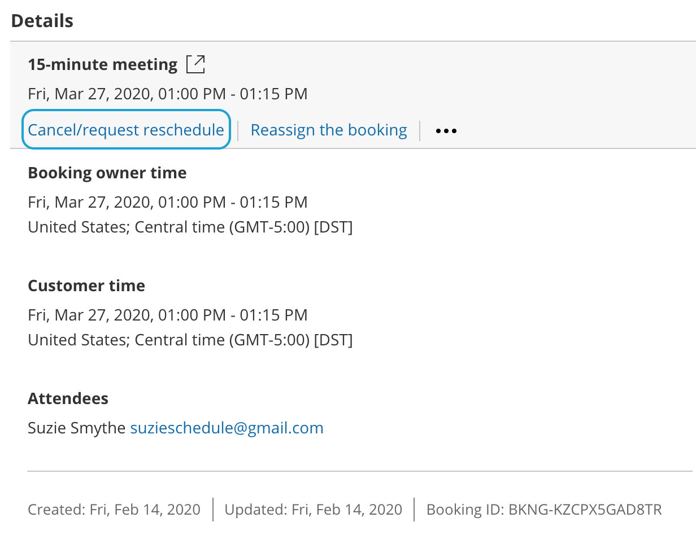
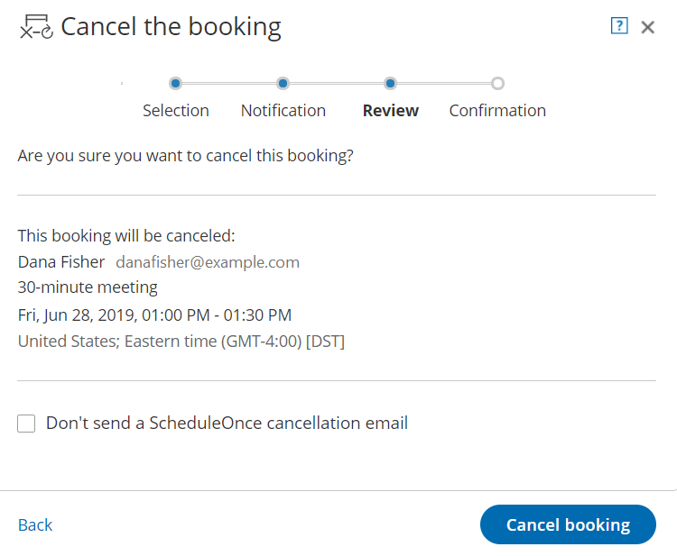

import { Aside } from '@astrojs/starlight/components';

When the [activity status](/understanding-activity-statuses/ "Understanding ScheduleOnce activity statuses") of a [Panel meeting](/introduction-to-panel-meetings/ "Introduction to Panel meetings") is **Scheduled**, **Rescheduled**, **No-show**, or **Completed**, the User can cancel the Panel meeting directly from the [Activity stream](/introduction-to-the-activity-stream/ "Introduction to the ScheduleOnce Activity stream").

When you cancel a Panel meeting, it affects all panelists and the Customer.

# Requirements

Any User who can see a Panel meeting activity in their Activity stream can cancel a Panel meeting.

# Canceling a Panel meeting

1.  Select the Panel meeting activity in the Activity stream.
2.  In the **Details** pane, click the **Cancel/request reschedule** button (Figure 1).Figure 1: Cancel/request reschedule button
3.  The **Cancel/request reschedule** pop-up will appear (Figure 2). Select **Cancel the booking.**
4.  Click **Next**.
5.  In the **Notification** step, you can add a cancellation reason that will be provided to the Customer.
6.  Click **Next**.
7.  In the **Review** step (Figure 3), you can confirm the details of the Panel meeting that you're about to cancel.Figure 3: Cancel/request reschedule pop-up—Review step
8.  By default, a cancellation email is always sent to your Customer. If you do not want to send a cancellation email to the Customer, check the **Don't send a OnceHub cancellation email** box. 
9.  Click **Cancel booking**. When a User cancels a Panel meeting, everyone involved is affected:
    *   By default, the Customer receives a cancellation [email notification](/customer-notification-scenarios/ "Customer notification scenarios").
    *   The [Primary team member](/booking-owners/ "Primary team members") receives a cancellation email notification and all [Additional team members](/additional-team-members/ "Additional team members") are cc’d in this email.
    *   The [activity status](/understanding-activity-statuses/ "Understanding ScheduleOnce activity statuses") is updated to Cancelled in the Activity stream for all panelists.
    *   If the Primary team member is connected to a calendar, the calendar event will automatically be cancelled.

**Note**

You can cancel or reschedule directly from your calendar if the Primary team member's OnceHub account is connected to [Google Calendar](/user-action-cancel-or-reschedule-in-google-calendar/ "User action: Cancel or reschedule in Google Calendar"), [Exchange Calendar](/reschedule-user-action-cancel-or-reschedule-from-within-exchange-calendar/ "User action: Cancel or reschedule in Exchange Calendar"), or [Outlook Calendar via the PC connector for Outlook](/user-action-cancel-or-reschedule-in-outlook-calendar/ "User action: Cancel or reschedule in Outlook Calendar").