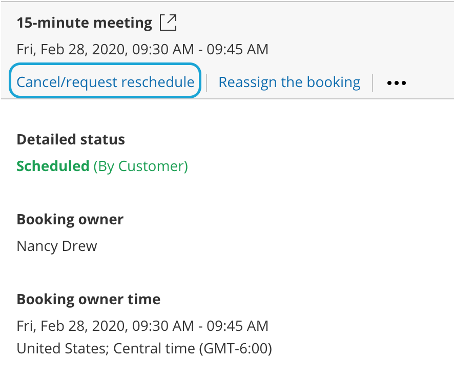
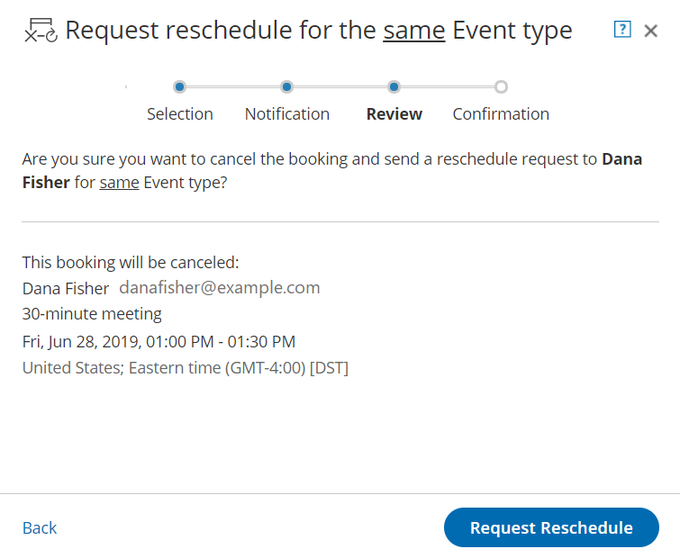

import { Aside } from '@astrojs/starlight/components';

When the activity status of a [Panel meeting](/introduction-to-panel-meetings/ "Introduction to Panel meetings") is **Scheduled**, **Rescheduled**, **No-show**, or **Completed**, the User can request to reschedule the Panel meeting directly from the [Activity stream](/introduction-to-the-activity-stream/ "Introduction to the ScheduleOnce Activity stream").

When you request a reschedule, the original Panel meeting is canceled for all panelists and a request to reschedule for a new time is sent to the Customer. If the Customer reschedules, the rescheduled meeting is always with the original panelists and [Event type](/introduction-to-event-types/ "Introduction to Event types"). 

In this article, you'll learn how to request to reschedule a Panel meeting directly from the Activity stream.

# Requirements

Any User who can see a Panel meeting activity in their Activity stream can request that a Customer reschedules.

# Requesting to reschedule a Panel meeting

1.  Select the Panel meeting activity in the Activity stream.
2.  In the **Details** pane, click the **Cancel/request reschedule** button (Figure 1).Figure 1: Cancel/request new times button
3.  The Cancel/request reschedule pop-up appears (Figure 2). Select **Cancel the booking and send a reschedule request for the same Event type.**  Figure 2: Cancel/request reschedule pop-up—Selection step
4.  Click **Next**.
5.  In the **Notification** step, you can add a reschedule reason that will be provided to the Customer.
6.  Click **Next**.
7.  In the **Review** step (Figure 3), you can confirm the details of the booking that you're about to cancel and request that the Customer reschedules.Figure 3:  Cancel/request reschedule pop-up—Review step
8.  Click **Request reschedule**.
9.  When a User requests to reschedule a Panel meeting, the following occurs:
    *   The original booking is canceled and the Customer will receive an [email notification](/customer-notification-scenarios/ "Customer notification scenarios") asking them to reschedule.
    *   The [Primary team member](/booking-owners/ "Primary team members") receives an email notifying them of the reschedule request and all [Additional team members](/additional-team-members/ "Additional team members") are cc’d in this email. 
    *   If the Primary team member is connected to a calendar, the event will be automatically cancelled. 
    *   In the Activity stream, the [activity status](/understanding-activity-statuses/ "Understanding ScheduleOnce activity statuses") is changed to Canceled (Reschedule requested by User) for all panelists.

**Note**

When using [Payment integration](/payment-integration-throughout-the-booking-lifecycle/ "Payment integration throughout the booking lifecycle") and the User requests a reschedule for any Event type, the original booking is canceled and refunded. The Customer will not be asked to pay a Reschedule fee for rescheduling. The Customer will be asked to pay the full Event type price when rescheduling, as if it was a new Booking.