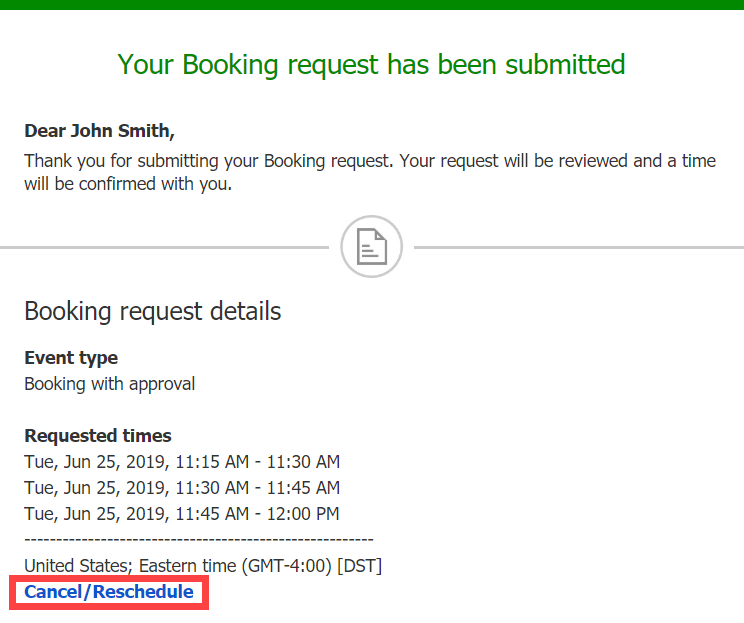
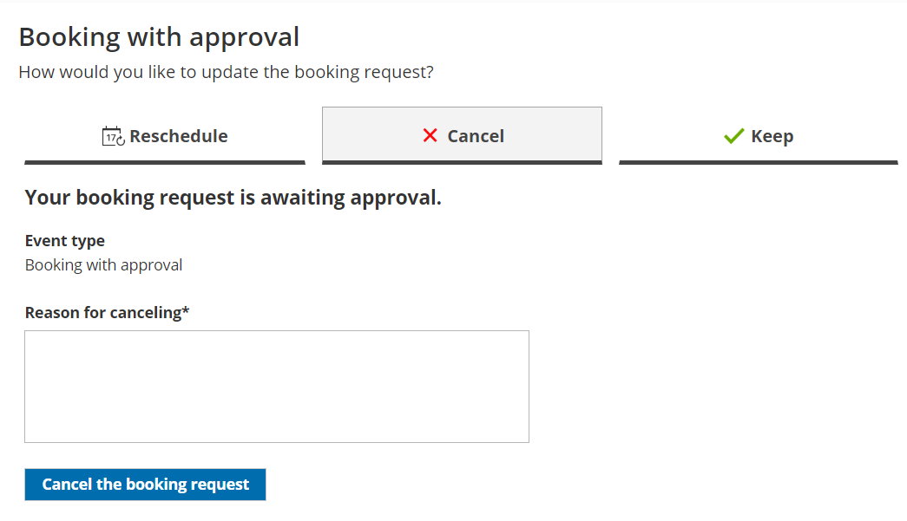

import { Aside } from '@astrojs/starlight/components';

A Customer can cancel a booking request at any time. Booking requests that have not been approved are not subject to the [cancellation policy](/the-customer-cancelreschedule-policy/ "The Customer Cancel/reschedule policy") set by the meeting organizer. The Cancellation policy applies only to scheduled or rescheduled bookings.

In this article, you'll learn about the steps that a Customer takes to cancel a booking request.

# How Customers cancel a booking request

1.  To cancel a booking request, the Customer clicks the **Cancel/reschedule** link in the scheduling confirmation email (Figure 1). Figure 1: Booking request confirmation email
2.  The [Cancel/reschedule page](/reschedule-the-customer-cancelreschedule-page/ "The Customer Cancel/Reschedule page") will open.
3.  The Customer can review the booking request details on the **Keep** tab.
4.  In the **Cancel** tab, the Customer clicks the **Cancel the booking request** button to cancel the booking request (Figure 2). The Customer also provides a reason for requesting new times if it is required by your [Cancel/reschedule policy](/the-customer-cancelreschedule-policy/ "The Customer Cancel/reschedule policy"). Figure 2: Cancel tab
5.  After cancellation, the Customer will receive a cancellation email notification, along with the [Booking page Owner](/booking-page-access-permissions/ "Booking page access permissions") and [any additional stakeholders](/subscribing-to-booking-notifications/ "Subscribing to Booking notifications"). 

[Learn more about the effects of cancellation](/effect-of-cancellation/ "Effect of cancellation")